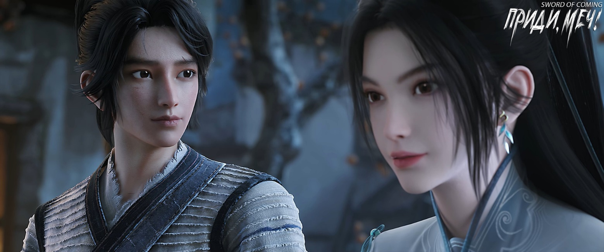

# Глава 36. Древняя книга

Лю Сяньян быстро вернулся с корзиной за спиной. Чэнь Пинъань как раз наблюдал у колодца за тем, как выкапывают и выносят землю. Лю Сяньян пнул его по заднице так, что тот чуть не уткнулся носом в грязь, но, когда обернулся и увидел обидчика, не стал сердиться. Лю Сяньян беспечно сказал:

— Дело сделано, мастер Жуань велел мне в эти дни честно оставаться здесь и никуда не убегать, днем копать колодец, вечером заниматься ковкой железа. Через полмесяца я стану его первым учеником в этом городке, кажется, это называется «ученик-основатель». Я принес тебе корзину, помогу собирать камни, начиная от кузницы и до крытого моста. Заранее предупреждаю, что с водяной ямой за Спиной Синего Быка помочь не смогу. Мастер Жуань сказал, что, если я в эти дни осмелюсь ступить хоть на полшага к северу или западу от крытого моста, он сломает мне ноги.

Лю Сяньян обнял Чэнь Пинъаня за шею и прошептал:

— Мастер Жуань сказал, что в городке ничего не пропадает. И еще добавил про странное правило для приезжих: они могут быть честными торговцами, мошенниками-обманщиками и даже нищими, собирающими хлам, но только не ворами и карманниками. Небесный Владыка здесь не дремлет, не закрывает глаза — все время следит за нами. Жутковато, правда? По крайней мере, мне не по себе.

Лю Сяньян внезапно погрозил:

— Эй, Чэнь, живи в моем доме сколько хочешь, но не вздумай продать мой драгоценный доспех до моего возвращения!

Чэнь Пинъань ударил кулаком в грудь Лю Сяньяна. Тот поспешно отпустил его и, потирая ушибленное место, и не сразу пришел в себя.

— Тощий, как бамбуковая палка, маленький волосатый обезьян, откуда у тебя столько силы?! — выругался он. — Неужели прогулки каждые три-пять дней на сто ли по горным тропам со стариком Яо или работа дровосеком в глухих горах могут так накачать мышцы?

Чэнь Пинъань засмеялся:

— В любом случае, даже с корзиной камней за спиной я добегу до городка быстрее тебя.

Лю Сяньян скосил глаза:

— Тогда давай посоревнуемся, кто дольше продержится под водой?

Подойдя к ручью, Чэнь Пинъань наклонился, закатывая штанины:

— Я не буду соревноваться в том, что зависит только от одного дыхания.

Перед тем как войти в воду, Чэнь Пинъань нарвал весенней травы у ручья и выстелил ею корзину, приговаривая, что после каждых двадцати собранных камней нужно подкладывать свежую траву. Лю Сяньян так разозлился, что хотел скинуть корзину со спины и отдать Чэнь Пинъаню, но тот не согласился:

— Если я буду нести корзину, то с твоим торопливым характером ты станешь просто кидать камни, а мне будет больно на это смотреть.

Лю Сяньян едва не бросил все прямо на месте: эти разноцветные камни тысячи лет не стоили ни гроша, как же они вдруг стали такими драгоценными и хрупкими для Чэнь Пинъаня? И он еще смеет жаловаться на недостаточно нежные руки господина Лю?

В конце концов Лю Сяньян неохотно зашел в воду собирать камни, и они с Чэнь Пинъанем, один слева, другой справа, принялись тщательно обследовать ручей. Вода здесь доходила в основном до колена, местами до пояса, а изредка встречались ямы глубиной в человеческий рост — обычно там, где собирались огромные валуны. В таких местах наступал черед Лю Сяньяна показать свое мастерство. Сперва он снимал корзину и передавал ее Чэнь Пинъаню, сидевшему на корточках на валуне, затем задерживал дыхание и нырял на дно, вытаскивая из огромных расщелин между камнями желанные камни змеиной желчи. Конечно, Чэнь Пинъань тоже мог это делать, но ему приходилось тратить намного больше времени и сил.

Не дойдя до крытого моста, они наполнили корзину почти на восемь десятых. Среди камней выделялся один темно-зеленый змеиный камень, который Лю Сяньян доставал со дна глубокой ямы трижды, прежде чем наконец вытащил его. Размером с ладонь, усеянный золотистыми крапинками, с узором, напоминающим водную рябь, он оказался твердым, мелкозернистым и очень тяжелым на ощупь. Когда Чэнь Пинъань погладил его, то почувствовал исходящее от камня сверкающее, острое ощущение. Даже слепой понял бы, что этот камень необычный.

В конце два юноши сидели плечом к плечу на большом валуне посреди ручья. Лю Сяньян, опираясь руками о камень и глядя на медленно текущую воду, спросил:

— Чэнь Пинъань, ты когда-нибудь думал о том, чтобы покинуть городок?

— Пока не думал. Чтобы отправиться в дальний путь, нужны деньги. И что станет с домом после отъезда? Некому присматривать за ним, вдруг он однажды рухнет? К тому же мне нужно регулярно пропалывать траву на могилах родителей.

Лю Сяньян безнадежно покачал головой:

— Почему ты вечно думаешь о таких бесполезных вещах? Неинтересно. Неудивительно, что Сун Цзисинь говорит, что у тебя судьба «демонической стены» — всю жизнь кружить в этом крошечном месте, не в силах выбраться.

Чэнь Пинъань повернул голову и с улыбкой спросил:

— Помнишь, о чем я тебе в прошлый раз рассказывал? О том дереве.

— Подумаешь, выросло дерево на могиле, что тут такого удивительного? — раздраженно ответил Лю Сяньян. — К тому же это могила предков другой ветви семьи Чэнь, она не имеет к тебе никакого отношения, ни на полмедного гроша!

Чэнь Пинъань сел, скрестив ноги, и тихо вздохнул:

— Интересно, много ли людей с фамилией Чэнь за пределами городка? 

— Не знаю, как за пределами, но в городке Чэней всего горстка, — возразил Лю Сяньян. — И кроме тебя, похоже, все они — домашние слуги четырех знатных родов и десяти кланов, из поколения в поколение остающиеся в рабском положении. Забавно то, что эти люди в больших домах гнут спину и кланяются, но стоит им выйти за ворота особняков, как они тут же меняются в лице и смотрят на всех свысока. Поэтому старик Яо прав: если ты, Чэнь Пинъань, однажды тоже пойдешь к ним в слуги, то ваша ветвь семьи Чэнь, не покинувшая городок, будет считаться полностью уничтоженной.

По словам старика Яо, изначально в городке существовало две ветви семьи Чэнь, но одна очень рано переселилась. Ветвь Чэнь Пинъаня когда-то процветала, но это «когда-то» было так давно, что даже старик Яо не мог точно сказать, сколько сотен лет прошло. Пятьсот лет? Восемьсот? Или тысяча? Позже она разделилась на несколько домов, людей становилось все меньше, удача, видимо, ушла вместе с переселившейся ветвью, родовая линия часто прерывалась, и за многими могилами стало некому присматривать. К тому же большинство холмов, где находились могилы, постепенно объявили запретными горами по приказу чиновников-надзирателей, присланных императорским двором.

Когда старик Яо в последний раз водил Чэнь Пинъаня в горы, он, проходя мимо одного из холмов, указал место захоронения предка другой ветви семьи Чэнь, отметив отличный фэншуй той горы. Что касается ветви Чэнь Пинъаня, старик Яо сказал, что даже небожители не смогли бы ее найти. За последние несколько сотен лет потомки этой ветви Чэнь были никчемными, сплошь бедняками, и единственным их достоинством оказалось упрямое нежелание идти в услужение к четырем знатным родам и десяти кланам.

Чэнь Пинъань однажды тайком отправился искать могилу того предка, но на месте увидел только сорняки да множество лисиц и зайцев, а саму могилу не нашел. Там росло одно незнакомое дерево, невысокое, намного ниже старой софоры в городке. Среди буйных сорняков, где бегали лисы и зайцы, оно одиноко возвышалось — единственное пышное дерево.

Чэнь Пинъань покачал головой:

— Перед смертью матушка взяла с меня клятву, что я могу стать нищим, даже умереть от голода, но не должен идти в слуги к этим богатым семьям.

— Но разве твоя мать перед смертью не взяла с тебя также клятву никогда не идти учеником в драконову печь? — выпалил Лю Сяньян.

Чэнь Пинъань помрачнел, но не стал возражать и не разозлился от этого укола.

Лю Сяньян почувствовал вину, но не был из тех, кто после ошибки готов сказать «прости», поэтому встал и сделал вид, будто ничего не произошло.

— Пошли копать колодец. Кстати, я поговорю с мастером Жуанем, постараюсь устроить тебя временным учеником, тогда тебе станет легче собирать камни.

— Не спеши, подождем, пока те две группы людей оставят надежду и покинут городок, а я пока присмотрю за твоим домом, — ответил Чэнь Пинъань.

— Как ты думаешь, почему я смогу избежать беды, став учеником мастера Жуаня? — с любопытством спросил Лю Сяньян.

Чэнь Пинъань задумался и неуверенно ответил:

— Это как внезапный дождь — нужно же где-то укрыться под крышей?

Лю Сяньян повернулся в сторону кузницы:

— Интересно, кто такой на самом деле мастер Жуань? Не выглядит особо сильным, сможет ли он справиться с теми двумя группами?

— Нельзя судить о человеке по внешности, — успокоил его Чэнь Пинъань.

— Ты, Чэнь Пинъань, выглядишь как бедняк, значит ли это, что ты бедняк?

Чэнь Пинъань только ухмыльнулся, не найдя что ответить.

— Помочь тебе донести корзину до крытого моста? — спросил Лю Сяньян, поднимаясь.

— Не нужно, она не тяжелая.

— Не забудь в следующий раз вернуть корзину.

Сказав это, Лю Сяньян спрыгнул с валуна и быстро зашагал по ручью, поднимая бесчисленные брызги. Чэнь Пинъань взвалил корзину на спину, осторожно спустился с валуна и, выбравшись на берег, медленно направился к крытому мосту.

Пройдя немного, он услышал позади шаги и, обернувшись, увидел Лю Сяньяна.

В теплых лучах ранней весны Лю Сяньян выхватил у Чэнь Пинъаня корзину, сам взвалил ее на спину и, обернувшись, язвительно сказал:

— Когда я издалека увидел, как ты несешь корзину, ты напоминал маленького кузнечика с большим камнем — жалкое зрелище. Так и быть, из доброты душевной помогу тебе донести ее до крытого моста.

Два юноши шли вместе под весенним ветром.

— Эй, Чэнь, когда я выучусь ремеслу, обязательно отправлюсь посмотреть мир! Женюсь на девушке красивее, чем Чжигуй, буду пить самое дорогое вино, жить в самом большом особняке и ездить на самой быстрой лошади! Хочу увидеть горы высотой до неба, реки, в тысячи раз больше нашего ручья. В общем, я, Лю Сяньян, точно не проведу всю жизнь здесь в ожидании смерти.

В весеннем ветре Лю Сяньян мечтал о будущем, а Чэнь Пинъань жевал травинку — один говорил, другой слушал.

※※※※

Чэнь Пинъань принес корзину с камнями во двор дома Лю Сяньяна, по обыкновению выбрал несколько самых приглянувшихся камней и отнес их в боковую комнату, остальные оставил у кухни. Заперев двери комнаты и ворота двора, он побежал в переулок Глиняных Кувшинов. У своего двора он увидел Нин Яо, греющуюся на солнце. Поздоровавшись с ней, он начал готовить лекарственный отвар.

Из соседнего двора доносились странные звуки рубки. Хотя Сун Цзисинь и жил, по мнению окружающих, без отца и матери, но все эти годы не знал нужды в еде и одежде, и даже более того — у него всегда водились деньги. Пусть он и не жил так хорошо, как молодые господа из домов четырех знатных родов, но не уступал прямым потомкам десяти кланов. Четыре сокровища кабинета ученого, изящные безделушки, утварь для чайной церемонии и множество невиданных Чэнь Пинъанем предметов роскоши то и дело появлялись в комнате Сун Цзисиня. На самом деле у него никогда не водилось настоящей грязной или тяжелой работы: квашеная капуста казалась слишком вонючей, поэтому он не разрешал служанке Чжигуй ее делать; рубить дрова считал чересчур утомительным, поэтому каждый год просто покупал связки дров и мешки отборного древесного угля.

Когда Чэнь Пинъань нес лекарственный отвар Нин Яо, из соседнего двора по-прежнему доносились прерывистые звуки рубки. Пока юная госпожа Нин пила лекарство, Чэнь Пинъань не удержался, подошел к стене двора и, привстав на цыпочки, заглянул туда Он увидел, как Чжигуй, держа кухонный нож, рубила «человека» — деревянную куклу. Чэнь Пинъань, много лет обжигавший керамику и срубивший бессчетное количество деревьев, сразу определил примерную ценность: дерево имело нефритовый оттенок, явно очень старое, а кукла покрывалась множеством красных и черных точек. Чжигуй уже изрубила и искрошила ее на множество кусков.

Чжигуй внезапно обернулась и заметила Чэнь Пинъаня. Ее лицо покрывали пот и грязь. Она подняла руку, вытерла лицо и через силу улыбнулась:

— А, ты вернулся. Я хотела одолжить у тебя топор для дров, но твоя гостья не захотела открыть мне дверь.

Чэнь Пинъань на мгновение опешил:

— Сейчас принесу тебе топор. Только поначалу не прикладывай слишком много силы — топор отличается от кухонного ножа, легко соскальзывает. Не поранься.

Чжигуй, сидя на маленькой скамеечке, совершенно измотанная, махнула рукой:

— Знаю-знаю, быстрее неси.

Чэнь Пинъань принес топор, а Чжигуй уже стояла у стены двора:

— Ты знаешь, что это за вещь? — с улыбкой спросила она.

— Не знаю.

Чжигуй не ответила, повернулась и снова села на маленькую скамеечку, с силой рубя. Глядя на ее неумелые, скованные движения и множество неправильных утомительных поз, Чэнь Пинъань очень переживал, однако раз она не просила о помощи, не стал навязываться.

Обернувшись, он заметил, что юной госпожи Нин уже нет во дворе. Чэнь Пинъань вспомнил кое о чем, быстро направился в комнату и положил один предмет на стол напротив Нин Яо.

Это оказался превосходного цвета камень змеиной желчи. Он был размером с ладонь, похожий на застывший мед, с изящным узором.

Нин Яо несколько удивилась.

— Юная госпожа Нин, это тебе подарок, — улыбнулся Чэнь Пинъань.

— Это твой самый любимый? — внезапно спросила Нин Яо, не выпуская из рук меч.

— Этот… наверное, четвертый по счету. Три лучших я уже спрятал, — смутился Чэнь Пинъань.

Только тогда Нин Яо приняла камень, зажав его двумя пальцами, и подняла над головой. Солнечный луч, проникающий через окно, осветил находку. Девушка запрокинула голову, прищурилась, внимательно разглядывая тонкие узоры на поверхности.

Она смотрела на камень. Чэнь Пинъань смотрел на нее.

※※※※

Глубокой ночью Чэнь Пинъань тайком пробрался в переулок Глиняных Кувшинов. Подобно дикому коту, он бесшумно проскользнул во двор дома Гу Цаня. В углу двора стоял большой чан для воды. Присев рядом, Чэнь Пинъань обнаружил, что аккуратно сложенные прежде камни змеиной желчи кто-то разбросал — видимо, этот человек раньше узнал об их ценности.

Гу Цань слыл единственным в городке чудаком, который собирал камни змеиной желчи. Находя их в ручье, он каждый раз приносил домой только один — тот, что больше всего приглянулся. За долгое время он собрал пятьдесят-шестьдесят камней, которыми закрывал щели в основании чана.

Чэнь Пинъань отодвинул потускневшие камешки и, убедившись, что дно чана не тронуто, облегченно вздохнул. Он начал осторожно разгребать землю правой рукой. Когда пальцы коснулись вощеной бумаги, сердце дрогнуло, и движения замедлились. Наконец он извлек сверток, похожий на книгу.

Спрятав сверток за пазуху, Чэнь Пинъань засыпал землю и внимательно осмотрел камни змеиной желчи. Оставшиеся оказались «мертвыми» — в отличие от недавно найденных в ручье, они заметно отличались цветом, узором и весом. Эти камни напоминали утомленных жизнью стариков, а те, что он достал, — новорожденных младенцев, полных жизненных сил.

Чэнь Пинъань решил покинуть переулок Глиняных Кувшинов со стороны своего дома. Когда он дошел до ворот двора дома Сун Цзисиня, послышался скрип открывающейся двери. Пришлось притвориться, что он стучится к себе домой.

— Юная госпожа Нин, вы спите? Я вернулся кое-что забрать! — крикнул он.

В доме зажегся свет, и Нин Яо открыла ему ворота.

По соседству служанка Чжигуй неторопливо вышла из дома, прижимая к груди толстую пожелтевшую книгу. Заметив смутные тени у дома Чэнь Пинъаня, она покачала головой, цокая языком, будто застала парочку любовников.

Чжигуй в одиночестве шла по переулку Глиняных Кувшинов, подпрыгивая и приплясывая. Ее золотисто-желтые двойные зрачки светились в ночи холодным священным светом. Стройная и грациозная, она напоминала водяного дракона, скользящего в узкой расщелине между камнями — казалось, стоит ей выбраться из переулка, как она обратится настоящим драконом.

Нин Яо впустила Чэнь Пинъаня во двор и даже в дом, но выглядела недовольной. Она сидела за столом, опираясь рукой на ножны и легонько постукивая пальцами по рукояти меча.

Убедившись, что Чжигуй ушла, Чэнь Пинъань смущенно объяснил:

— Я ходил забрать кое-что из дома Гу Цаня, но она как раз собиралась выходить, поэтому мне пришлось спрятаться здесь. Юная госпожа Нин, пожалуйста, не подумайте ничего такого.

— Что за вещь? — спросила Нин Яо.

Чэнь Пинъань поколебался и достал сверток в вощеной бумаге:

— Я и сам пока не знаю.

— Сначала сам посмотри, а потом решишь, стоит ли мне знать, — отвернулась Нин Яо.

Чэнь Пинъань кивнул, сел напротив и начал разворачивать слои вощеной бумаги. На стол сыпались крупинки земли, пока наконец не показалась древняя книга.

На обложке виднелись всего два иероглифа, из которых Чэнь Пинъань узнал только один — «гора».

Положив книгу на стол, он развернул ее к Нин Яо и с любопытством спросил:

— Юная госпожа Нин, как читается этот иероглиф?

— «Сотрясение», — ответила она, опустив взгляд.

Книга называлась «Сотрясающий горы».