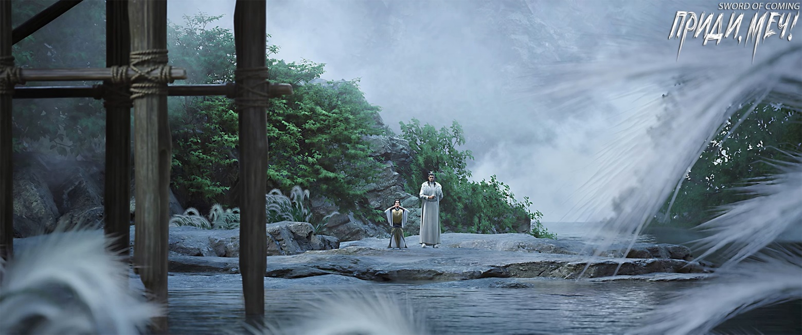
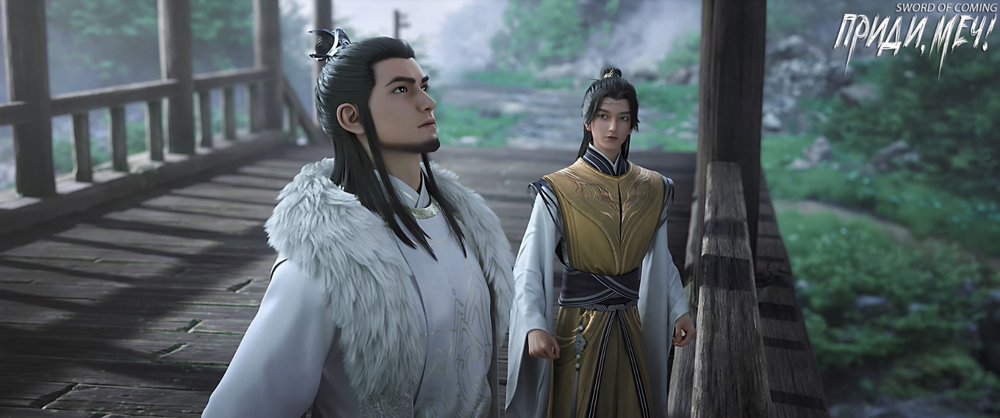
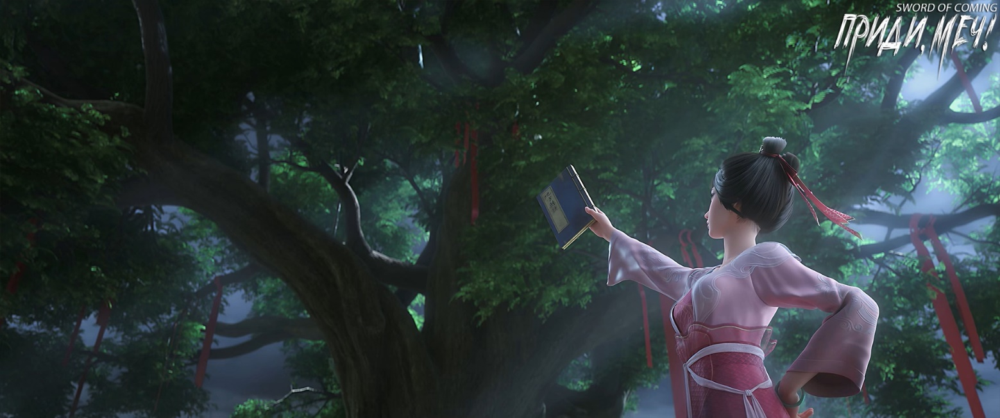

# Глава 39. Бранить софору

Чэнь Пинъань решил, что в будущем, когда будет искать камни днем, начнет со стороны Лю Сяньяна и двинется вверх по течению до крытого моста. Поэтому сегодня ночью он выбрал место для первого погружения еще выше по течению, подальше от крытого моста и той скалы, которую на местном диалекте называли «Спина Синего Быка». Именно там он впервые увидел девушку в зеленых одеждах и из-за этого пропустил встречу с Сун Цзисинем и надзирающим чиновником.

На другой стороне крытого моста высоко висела табличка с четырьмя иероглифами «Ветер рождается, вода поднимается».

Мужчина в белом халате с нефритовым поясом, формально являвшийся надзирателем печей, а на самом деле — самым влиятельным князем Дали, привел Сун Цзисиня к подножию ступеней крытого моста. Перед приходом Сун Цзисинь не только совершил омовение и переоделся в канцелярии, но и повесил на пояс благовонный мешочек и обычную нефритовую подвеску в форме дракона, тусклую и неприметную. А нефритовую подвеску «Старый Дракон Проливает Дождь», которая была гораздо лучше и по качеству, и по внешнему виду, и по значению, Сун Чанцзин строго приказал снять и категорически запретил носить.

Сун Цзисинь, держа в руках три палочки благовоний, стоял у подножия лестницы в растерянности.

Князь Дали Сун Чанцзин повернулся и протянул руку, слегка потер двумя пальцами кончики трех палочек благовоний, и они загорелись.

— После того как встанешь на колени, повернись лицом к табличке, сделай три земных поклона, воткни благовония в землю, и все, — небрежно сказал Сун Чанцзин.

Хотя Сун Цзисинь был полон сомнений, он все же последовал указаниям этого свалившегося с неба «дяди», встал на колени с благовониями и три раза поклонился.

Несмотря на небрежный тон Сун Чанцзина, когда Сун Цзисинь опустился на колени, лицо князя стало серьезным и крайне сложным. Глядя на место, где Сун Цзисинь кланялся, он выражал глубоко скрытую ненависть.

Воткнув три палочки благовоний в землю и поднявшись, Сун Цзисинь спросил:

— Здесь можно воскурять благовония?

— Это просто ритуал, не принимай близко к сердцу, — усмехнулся Сун Чанцзин. — Начиная с этого момента, сначала научись подыгрывать обстоятельствам, иначе в будущем ты можешь оказаться c обожженной головой и обгоревшим лбом[1].

Сун Чанцзин перестал улыбаться:

— Только не забывай, что этот мост — это место, где началось твое восхождение[2].

[1] «焦头烂额» — фразеологизм изначально относился к ситуации, когда люди, совершившие великие подвиги, были проигнорированы, в то время как те, кто совершил лишь небольшие достижения, получили признание. Позже описывал сокрушительное поражение или серьезный удар, или крайне затруднительное и неловкое положение. Иногда он описывает ситуацию, когда человек настолько занят, что не знает, что делать, и имеет преувеличенное значение.

[2] «龙兴之地» — дословно переводится как «земля, где поднимается дракон» или «место, где возвышается дракон». В традиционной китайской культуре дракон является символом императорской власти и величия, поэтому фраза часто используется для обозначения мест, связанных с зарождением власти или великих свершений.

Губы Сун Цзисиня посинели, возможно, от весеннего холода. Он притворно беззаботно сказал:

— Эти четыре иероглифа нельзя использовать как попало, верно?

Сун Чанцзин одной рукой похлопал себя по животу, другой придержал белый нефритовый пояс на талии и, рассмеявшись, сказал:

— В столице, конечно, так и есть, но здесь это неважно. Здесь нет ни дворцовых псов, ни бродячих собак из мира боевых искусств, никто не посмеет набрасываться на этого князя и искусать.

— Ты тоже боишься осуждения других? — с любопытством спросил Сун Цзисинь.

Мужчина ответил вопросом на вопрос:

— Этот князь уже победил всех соперников в династии Дали. Если бы он ничего не боялся, разве не был бы он даже более безмятежным, чем тот, кто сидит на троне дракона? Мальчишка, как ты думаешь, это имеет смысл?

Сун Цзисинь немного подумал и после колебаний все же решился спросить:

— Ты скрываешь свои способности и выжидаешь удобного момента[3] или вынашиваешь злые намерения для собственной выгоды?[4]

[3] «韬光养晦» — «скрывать свет, лелеять тьму» — означает скрывать свои таланты и способности, ждать подходящего момента. Часто имеет положительный смысл стратегического выжидания.

[4] «养寇自重» — буквально «растить бандитов для собственной значимости» — означает намеренно поддерживать врагов/проблемы, чтобы показать свою незаменимость или извлечь выгоду. Имеет негативный смысл.

Мужчина растерянно усмехнулся, указал пальцем на дерзкого Сун Цзисиня и, качая головой, сказал:

— Ты действительно осмеливаешься говорить эти крамольные слова, совершенно не понимая серьезности последствий. Когда ты прибудешь в столицу или отправишься в горы в какую-нибудь даосскую обитель, чтобы временно избежать неприятностей, этот князь советует тебе не быть таким безрассудным в словах и поступках, иначе ты точно навлечешь на себя большие неприятности.

— Я запомнил, — кивнул Сун Цзисинь.

Сун Чанцзин указал на табличку с золотыми иероглифами:

— Ветер поднимает волны, ветер поднимает волны — этот князь спрашивает тебя, как именно поднимаются волны?

— Не знаю, — прямо ответил Сун Цзисинь.

— Знать то, что знаешь, и знать то, чего не знаешь, — вот истинное знание [5]. Что за чушь собачья, эти книжники такие хитрые, даже перднуть не могут без девяти поворотов и восемнадцати изгибов, — пробормотал Сун Чанцзин.

[5] 知之为知之, 不知为不知, 是知也 — это цитата из древнекитайского философского текста «Лунь юй» (论语, «Аналекты Конфуция»). Означает признавать и принимать то, что вы действительно знаете или не знаете. Именно в этом и есть мудрость.

Однако, обращаясь к Сун Цзисиню, он заговорил более изысканно:

— Если этот князь не ошибается, за три тысячи лет в вашем городке, какое бы сильное наводнение ни случалось, уровень воды в ручье никогда не поднимался выше острия ржавого меча.

— Старики, живущие у колодца с железной цепью в переулке Цветущих Абрикосов, действительно часто рассказывали нам об этом под софорой. Неужели в этом есть скрытый смысл? — с недоумением спросил Сун Цзисинь.

Сун Чанцзин указал рукой вдаль, туда, где ручей вытекал из гор, и усмехнулся:

— В горах и лесах у змей есть свои тропы, в домах у мышей есть свои норы. А в реках и ручьях у водяных драконов — свои дороги.

Опустив руку, он терпеливо объяснил:

— Во многих местах династии Дали существовал обычай подвешивать мечи под мостами. Однако эти медные мечи, мечи из персикового дерева или талисманные мечи могли остановить горного или лесного дракона, входящего в реку, лишь единожды. Более того, многие люди, вешающие духовные мечи, обладали слабыми духовными силами, и их мечи не выдерживали даже одного прохода дракона по реке, а только раздражали драконоподобных существ в паводковых водах. Поэтому после наводнения разрушались даже те мосты, которые могли устоять, а мечи исчезали без следа. И только этот меч в этом месте…

Сун Чанцзин замолчал на половине фразы. Сун Цзисинь сдержался и не стал расспрашивать дальше.

Сун Чанцзин вздохнул и сказал:

— Только этот меч с первого дня, когда его повесили под мостом, не направляли против речных драконов. Мудрец использовал его, чтобы подавить выход из колодца, запирающего дракона. Так называемый выход — это глубокий пруд под мостом, предотвращающий слишком быстрое рассеивание и утечку драконьей ци, чтобы этот маленький мирок насильно не разорвало.

— Последний настоящий дракон под небесами действительно умер, или нет? — спросил Сун Цзисинь.

Сун Чанцзин усмехнулся:

— В той битве на истребление драконов более трех тысяч лет назад погибло бесчисленное множество практиков, даже мудрецы трех учений и мастера ста школ пали во множестве. Мальчишка, ты считаешь, что у них не хватало разума или что мудрецы, прожив столько лет, поглупели как собаки? Специально оставили последнего настоящего дракона, чтобы держать его как обычную птичку или рыбку?

— Возможно, они не могли полностью убить того настоящего дракона? — возразил Сун Цзисинь. — Они могли только использовать тактику промедления и метод постепенного поглощения. Хотя я не знаю первоначальных намерений и планов мудрецов тысячелетней давности, но могу догадаться, что тот настоящий дракон определенно не прост!

Сун Чанцзин покачал головой, а затем кивнул:

— Ты наполовину прав. Настоящий дракон несомненно мертв, но что касается его истинной личности и символического значения, слов «не прост» явно недостаточно.

Сун Цзисинь хотел что-то сказать, но сдержался.

— В общем, все планы Дали, все бесчисленные усилия — только ради «ветра, поднимающего волны», ради будущего великого похода на юг.

Мужчина первым поднялся по ступеням и медленно произнес:

— Если ты спросишь этого князя, почему мудрецы более трех тысяч лет назад решили истребить драконов, этот князь не сможет ответить. Но если ты спросишь, почему тебя оставили здесь и почему ты являешься благородным принцем прямой линии Дали, этот князь может рассказать тебе всю правду.

Сун Цзисинь опустил голову, скрыв выражение лица.

Поскольку Сун Цзисинь молчал, Сун Чанцзин не стал навязываться. Поднявшись на самую верхнюю ступень, он повернулся к городку:

— В будущем будь великодушнее. Затевать споры с такими, как Лю Сяньян, и даже иметь намерение убить — разве это не роняет твое достоинство?

Сун Цзисинь, сидя на верхней ступени, вместе с Сун Чанцзином смотрел на север и задал совершенно не относящийся к делу вопрос:

— Наша Дали находится на самом севере Восточного континента Водолея?

Сун Чанцзин кивнул:

— Да, нас считали северными варварами почти тысячу лет. Только сейчас, когда у нас достаточно сильный кулак, мы завоевали немного уважения.

Сун Цзисинь все еще держал голову опущенной, но его взгляд горел.

— Когда прибудешь в столицу, остерегайся человека по прозвищу «Вышитый Тигр», — спокойно сказал Сун Чанцзин.

Сун Цзисинь застыл в недоумении.

— Сейчас он государственный наставник нашего Дали и почитаемый учитель твоего единокровного младшего брата, — усмехнулся Сун Чанцзин. — То, что наша Дали за последние пятьдесят лет расширилась с семидесяти округов и восьмисот городов до ста сорока округов и тысячи пятисот городов, такое огромное расширение территории — наполовину его заслуга.

Сун Цзисинь резко поднял голову и посмотрел на него.

— Мальчик, ты правильно догадался.

Сун Чанцзин усмехнулся и тоже сел на ступени, положив руки на колени и глядя вдаль.

Другой герой, расширивший территории Дали, очевидно, находился и далеко на горизонте, и прямо перед глазами.

В этот момент Сун Цзисинь задрожал всем телом, кожа на голове онемела.

Они долго молчали, потом Сун Цзисинь внезапно сказал:

— Дядя, хотя у меня и были намерения убить Лю Сяньяна, и раньше я даже думал заключить сделку с Фу Наньхуа из Старого Города Дракона, чтобы он нашел способ убить его. Но я никогда не считал, что какой-то Лю Сяньян достоин быть со мной на равных, даже если у него есть древнее семейное наследие. Я хотел убить его только потому, что считал — его убийство не потребует от меня больших усилий, только и всего.

— Если так, то у тебя есть другие душевные узлы? — с интересом спросил Сун Чанцзин.

Сун Цзисинь потер шею и промолчал.

※※※※

Глубокой ночью городок погрузился в тишину.

По улицам все еще бродила девушка в легкой одежде с хрупкой фигурой. Проходя мимо колодца с железной цепью в переулке Цветущих Абрикосов, она скрипнула зубами; у мемориальной арки со злостью пнула каменную колонну. Наконец она пришла к старой раскидистой софоре. По словам стариков, возраст дерева не поддавался исчислению, и его сухие ветви, падая, никогда не задевали людей — настолько оно было одухотворенным.

Чжигуй, бесцеремонно явившаяся под дерево, презрительно относилась к этим россказням.

Она открыла древнюю книгу, одолженную у молодого господина, и начала «искать по рисункам»[6].

[6] «按图索骥», букв. «искать скакуна по рисунку» — обозначает поиск чего-либо по образцу.

Она называла имена одно за другим, как полководец на осеннем смотре войск.

Когда у нее пересохло во рту, она прекратила перекличку и, держа в одной руке «Записи местного уезда», которые Сун Цзисинь называл «книгой из-за стены», а другой указывая на софору, задрала голову и выругалась:

— Не стыдно ли вам не ценить оказанную честь?!

Стояла тишина, ответа не последовало.

Чжигуй топнула ногой и разразилась бранью:

— Четыре фамилии и десять кланов, начнем с Лу, Ли, Чжао, Сун! Вы, четыре великих фамилии, если у вас есть хоть капля разума, быстро скиньте как минимум по три листа от каждого рода. Если хоть одного листа не хватит, я, Ван Чжу, не оставлю вас в покое до конца жизни! Когда выйду отсюда, разберусь с каждым по очереди, неважно, молодые вы или старые, женщины или дети — все вы неблагодарные твари, забыли о благодеяниях и еще правыми себя считаете?!

Она ругалась, задыхаясь, одной рукой держась за талию:

— Эй ты, Сун! Кто самый большой герой династии Дали, благодаря которому ваша семья стала императорской? У вас что, нет понятия? Думаешь, можешь притворяться дураком передо мной? Верите или нет, как только я выйду отсюда, я сделаю так, что Дали будет носить фамилию Лу, Чжао или любую другую, но только не Сун!

— Десять великих кланов, по два листа софоры от каждого рода, остальные обычные семьи — минимум по одному листу. Конечно, если у кого-то хватит смелости поставить больше, то чем больше, тем лучше. В будущем я обязательно позабочусь о том, чтобы он получил полную чашу прибыли!

— Из десяти кланов — семья Цао, да, именно та семья Цао, которая породила этого ублюдка Цао Си! Этот щенок чего только мерзкого не делал, с самого детства, когда еще ходил в штанах с прорезью, уже был полон коварства! Помимо двух листьев софоры, вы должны дать мне еще один лист в качестве компенсации, иначе я, Ван Чжу, клянусь, что когда выйду отсюда, обязательно сделаю так, чтобы у Цао Си не осталось ни потомков, ни наследников! Как он посмел мочиться в колодец, как такой бессовестный негодяй мог стать истинным господином страны?!

— И еще этот клан Се, из вашей семьи вышел некий Се Ши, верно? Хм, у меня с ним есть некоторые связи. Если бы не я, его давно бы унесло наводнением, так разве не справедливо дать еще один лист софоры?

Вдалеке Ци Цзинчунь молча стоял под акацией и наблюдал за происходящим. Словно строгий отец, который умеет только наказывать своих детей розгами, он с некоторым бессилием смотрел на свое чадо, которое с возрастом становится все более избалованным.

Однако, когда он увидел, как Чжигуй листает книгу, а листья софоры один за другим слетают с ветвей и ложатся между страницами, Ци Цзинчунь почувствовал некоторое удовлетворение.

После долгих раздумий он лишь прошептал:

— После того как уедешь из дома, береги себя.

Чжигуй, словно что-то почувствовав, внезапно обернулась, но никого не увидела.

Она ощутила себя потерянной, покачала головой и, не желая больше углубляться в раздумья, повернулась и продолжила бранить софору.