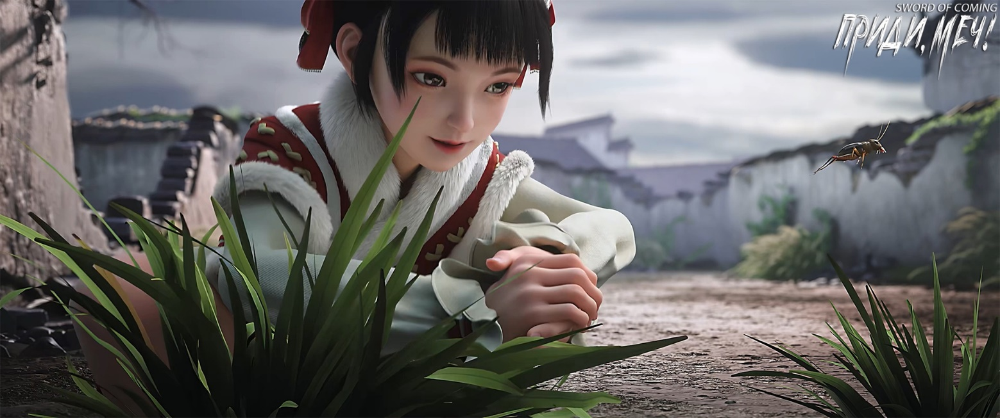
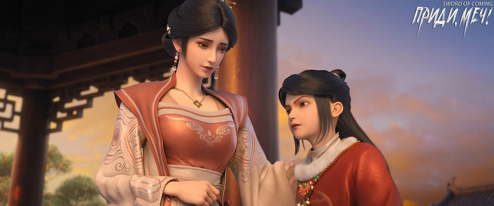
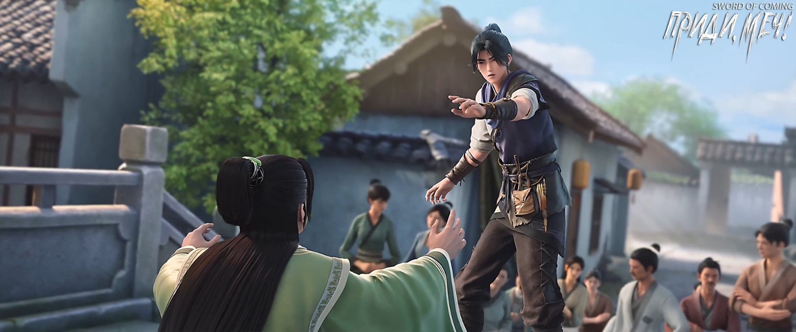
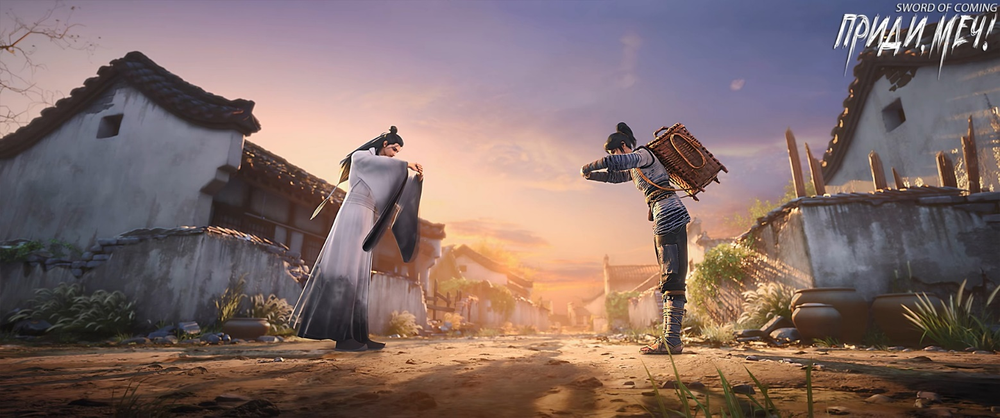

# Глава 40. Ответный подарок

Чэнь Пинъань, закинув за спину корзину, вышел на берег и направился к Спине Синего Быка. Ему показалось, что уровень воды в ручье немного понизился, хотя не был уверен, не иллюзия ли это.

Приближаясь к сине-зеленому утесу, он внезапно остановился — там стояло немало людей. Черты лица каждого были видны до мельчайших подробностей, и причиной тому было не сияние звезд, а белоснежный олень на Спине Синего Быка. Все тело оленя, кристально-прозрачное, испускало тонкие нити белого света, подобные водорослям, колышущимся в воде ручья.

Белый олень склонил голову, а маленькая девочка в большой красной стеганой куртке привстала на цыпочки и изо всех сил тянула руку, чтобы погладить его рога.

Рядом стояли двое молодых людей в даосских одеяниях — мужчина и женщина. В свете, исходящем от белого оленя, их кожа казалась белее снега и прозрачной, как кристалл. По сравнению с ними жители городка походили на глиняные фигурки, а эти двое чужеземных даосов — на изысканный фарфор, обожженный в печи. Поистине, между ними была разница как между небом и землей.

Фасон их даосских одеяний немного напоминал одеяние досточтимого даоса Лу, но во многом отличался. Главное различие заключалось в головных уборах: у достопочтенного Лу была заколка-корона в форме лотоса, а у этих двоих — высокие заколки, похожие на рыбьи хвосты.

Чэнь Пинъань замер, глядя на них. Мужчина и женщина, стоящие рядом с белым оленем, казались сошедшими с картин, изображающих богов и бессмертных. Казалось, в следующий момент они воспарят в небеса, и для них не составит труда достать звезды и луну.

Двое других стояли немного дальше. Одного из них Чэнь Пинъань узнал — дочь мастера-мечника Жуаня. На этот раз девушка в зеленом не несла с собой узелок с едой, а держала маленький вышитый платочек, на котором лежало несколько изящных и привлекательных пирожных. Она опустила голову в нерешительности, не зная, какое угощение выбрать первым. Рядом с ней стоял человек лет тридцати с длинным мечом за спиной и странным украшением на поясе.

Как только Чэнь Пинъань увидел их, почти все они тоже заметили его внезапное появление. Молодая даосская монахиня, немного удивившись, наклонилась и погладила по голове девочку в красной стеганой куртке, указывая в сторону Чэнь Пинъаня и что-то шепча. Девочка навострила уши, слушая вопросы небесной сестрицы, изо всех сил широко раскрыла глаза и пристально посмотрела вдаль. Смутно узнав Чэнь Пинъаня, она начала тараторить как горох из бамбуковой трубки, видимо, объясняя хозяйке белого оленя, кто такой Чэнь Пинъань и откуда он.

В этот момент Чэнь Пинъань тоже узнал эту девочку восьми-девяти лет. Впервые они встретились еще до того, как он отправился обжигать фарфор в драконовой печи. Тогда в переулке Глиняных Кувшинов он встретил маленькую девочку с косичками, заплетенными как рожки барашка. Несмотря на юный возраст, она держала в руках бумажного змея, а ее тонкие ножки, похожие на бамбуковые палочки, бежали быстро, словно ветер — это особенно врезалось в память Чэнь Пинъаня.

Позже он встречал ее еще несколько раз. Однажды случайно увидел, как она, склонившись над колодцем с железной цепью, тайком бросала туда камешки. Заметив Чэнь Пинъаня, девочка испуганно убежала, но, пробежав десяток шагов, вспомнила, что оставила лакомство на палочке у колодца. Не в силах побороть желание полакомиться, она вернулась. Туда и обратно она бежала так поспешно, что в итоге шлепнулась на землю. Поднявшись, схватила яблоко в карамели, но вдруг остановилась, открыла рот и вытащила шатающийся зуб. Положив его в карман, она, не плача и не капризничая, молча продолжила свой путь. От этой сцены у Чэнь Пинъаня на лбу выступил холодный пот.

В последний раз он видел ее в том месте, где среди буйной травы стояли разрушенные божественные статуи. Это случилось прошлой осенью на закате, когда Чэнь Пинъань, вернувшись из драконовой печи в городок, прогуливался и увидел, как она ловит сверчков, кувыркаясь, прыгая и бросаясь в траву. Заметив его, она явно узнала и снова умчалась прочь, словно легкий ветерок.

Позже Гу Цань рассказал Чэнь Пинъаню, что эта вечно грязная юная госпожа, хоть и выглядела беспризорницей, происходила из семьи Ли с улицы Благоденствия и Достатка, причем не из служанок. По какой-то причине она любила бродить одна, а домашние не препятствовали этому. В последний раз, рассказывая о ней, Гу Цань говорил с гордостью и презрением, что хоть она и быстро бегает, но очень глупая. Однажды они случайно вдвоем ловили рыбу в ручье, и эта дура провозилась целый день, поймав только одного краба. Даже ни одного пескаря не поймала, да и краба смогла схватить лишь потому, что тот крепко вцепился ей в палец клешней. Рассказывая об этом в комнате Чэнь Пинъаня, Гу Цань катался от смеха по деревянной кровати.

— Она действительно глупая, — говорил он. — Даже подняла руку, чтобы похвастаться передо мной, словно поймать одного краба — великое достижение. А главное, было очевидно, что она вот-вот расплачется от боли.

Красивый молодой даос взглянул на белого оленя и с улыбкой сказал юной даосской монахине:

— Старшая сестра Хэ, я говорил тебе быть осторожнее и не слишком баловать его. Прошло меньше декады, и пусть это всего лишь иллюзия, не мешающая его свободе, ты все равно не послушала. Что нам теперь делать, когда простые смертные увидели его?

Даосская монахиня обладала красотой, способной разрушить город. Выслушав рассказ маленькой девочки, с улыбкой ответила:

— Пусть все идет своим чередом.

Молодой даос нахмурился. Он поднял взгляд, посмотрел раз, затем внимательно всмотрелся снова, но так и не смог разглядеть в юноше с корзиной за спиной, обутом в соломенные сандалии, ничего выдающегося. Хотя их школа не считалась лучшей на Восточном континенте Водолея в искусстве физиогномики, поиска драконьих жил и определении ци, ее признавали весьма искусной. Раз юноше доверили забрать предмет силы и безопасно доставить горную реликвию обратно для передачи в высшую школу, он определенно не мог быть заурядным человеком. Однако, не разглядев в Чэнь Пинъане ничего особенного, даос оставил мысль пригласить его в школу. Он считал себя искусным в физиогномике и не сомневался в своем суждении.

Школа, к которой принадлежали эти двое, являлась одной из трех даосских школ Восточного континента Водолея и самой уважаемой главной школой даосизма на континенте. Когда они со старшей сестрой Хэ покинули горы, в качестве вознаграждения каждому дали драгоценную квоту на набор истинного ученика, который одновременно стал бы их личным учеником. Поэтому он не хотел разбрасываться этой возможностью и должен был отнестись к выбору со всей серьезностью.

Вся школа знала, что сестра Хэ совершенствовала свое сердце, поэтому ее небрежная фраза «пусть все идет своим чередом» могла означать, что она задумалась о принятии ученика.

Его и Хэ Сяолян[1] называли золотым отроком и нефритовой девой Восточного континента Водолея, самыми одаренными молодыми людьми среди даосов континента. Даже земные правители обращались с ними почтительно, оказывая такие же почести, как истинным господинам великих государств. Ведь они оставались самыми многообещающими талантами континента, имеющими шанс достичь пяти высших сфер совершенствования.

[1] Хэ Сяолян (贺小凉). Фамилия «Хе» означает «поздравлять», имя «Сяолян» — «небольшая прохлада, свежесть».

Хэ Сяолян взяла маленькую девочку за руку и вместе с ней спустилась со Спины Синего Быка. Разумный белый олень следовал за ними. Не только молодой даос, собрат по школе, замер в изумлении, но и могущественный военачальник с тигриной печатью на поясе и длинным мечом за спиной выразил удивление.

Увидев медленно приближающуюся молодую даосскую монахиню, Чэнь Пинъань почувствовал неловкость. Сейчас он не хотел иметь дела с этими небожителями из чужих краев, зная, что их простые симпатии и антипатии могут решить его судьбу — жизнь или смерть, честь или позор. К тому же удача обычно не благоволила ему, поэтому он еще больше боялся связываться с ними. Однако не стал в панике убегать, наоборот, спокойно прошел немного вперед, что со стороны выглядело вполне пристойно.

Белый олень слегка ускорил шаг, подбежал, обошел вокруг Чэнь Пинъаня и, опустив голову, сам потерся об него. Затем вернулся к хозяйке, она нежно погладила его по спине, и в следующий момент он превратился в лошадь.

Хэ Сяолян посмотрела на Чэнь Пинъаня, слегка вздохнула, с улыбкой что-то сказала, а затем опустила взгляд на девочку в красной стеганой куртке.

Девочка перевела на местный диалект городка, робко произнеся:

— Ты человек, который ценит благословение, но жаль, что у нас с тобой мало кармической связи, не стать нам товарищами по Дао.

Чэнь Пинъань молчал, не зная, что сказать, чтобы не показаться невежливым. С корзиной за спиной, в соломенных сандалиях и с подвернутыми штанинами он выглядел нелепо и смешно.

— Ты тоже знаешь о чудесных свойствах этих камней? — с улыбкой спросила Хэ Сяолян. — Чэнь Пинъань, не беспокойся, я просто спросила.

Маленькая девочка точно повторила ее слова, говоря быстро и звонко.

Чэнь Пинъань, поколебавшись, кивнул:

— Один достопочтенный даос намекнул мне, что нужно чаще приходить к ручью собирать камни и ловить рыбу.

Даже несмотря на то, что Чэнь Пинъань проникся симпатией к этой молодой даосской монахине, из осторожности он не раскрыл даже фамилию достопочтенного Лу. К тому же человеком, раскрывшим сокровенные тайны и указавшим на ценность камней змеиной желчи, была Нин Яо.

— Так ты тоже знаком с нашим младшим дядей-наставником Лу? — улыбнулась Хэ Сяолян.

Чэнь Пинъань остолбенел.

Хэ Сяолян понимающе улыбнулась и кратко объяснила:

— Строго говоря, младший дядюшка-наставник Лу не из нашей школы. Просто достопочтенный Лу много лет назад посетил нашу школу и подружился с одним из наших дядей-наставников, оставшись на несколько лет. Мы, младшее поколение, хорошо его знаем и привыкли называть младшим дядей-наставником.

Чэнь Пинъань широко улыбнулся, полностью избавившись от настороженности. К достопочтенному Лу он испытывал благодарность, которую не забудет всю жизнь.

Вспомнив кое-что, он наклонился, опустил корзину, достал один из камней, который сразу приглянулся ему — размером с куриное яйцо, зеленоватый, прозрачный как лед, совсем не похожий на другие камни змеиной желчи — и протянул его изящной, как орхидея, Хэ Сяолян:

— Достопочтенная, если встретите достопочтенного Лу, не могли бы вы передать ему этот камень?

Выслушав объяснение маленькой девочки, Хэ Сяолян немного подумала, приняла камень и медленно сказала:

— Перед тем как прийти сюда, я встретила уходящего младшего дядю-наставника. Он направлялся в государство Наньцзянь на важную церемонию в одной из даосских школ. Трудно сказать, когда мы встретимся в следующий раз, но как только увижу младшего дядю-наставника Лу, обязательно передам ему.

Чэнь Пинъань, слушая слова маленькой девочки, широко улыбнулся и поклонился в знак благодарности производившей очень хорошее впечатление молодой даосской монахине.

В отношении хороших и плохих незнакомцев Чэнь Пинъань всегда доверял своей интуиции. Как в случае с Фу Наньхуа, Цай Цзиньцзянь, так и с достопочтенным Лу и юной госпожой Нин.

Чэнь Пинъань достал еще один камень и снова протянул его Хэ Сяолян. Эта молодая даосская монахиня, которую на Восточном континенте Водолея называли первой по удаче среди молодого поколения даосов, не отказалась и с улыбкой приняла камень, не забыв поблагодарить.

— Я тоже хочу камушек, — тихо сказала девочка в красной стеганой куртке, теребя края одежды.

Чэнь Пинъань с улыбкой повернулся и начал выбирать камень для девочки из корзины.

Девочка подбежала к нему и осторожно спросила:

— Можно мне камень побольше?

— Если сможешь донести, подарю тебе самый большой, — улыбнулся Чэнь Пинъань. — Но от этого места до городка, а потом до дома путь неблизкий. К тому же большие камни в корзине не так хороши, как маленькие.

Она подумала и, положив руки на край корзины, сказала:

— Хорошо, тогда я выберу маленький, но красивый.

Чэнь Пинъань выбрал для нее влажно поблескивающий милый маленький камень цвета лотоса. Девочка зажала его в ладони, очень довольная.

Она вдруг наклонила голову, приоткрыла рот, указала на свои зубы, а затем хихикнула, глядя на Чэнь Пинъаня с гордым выражением лица. Видимо, хвасталась тем, что у нее выросли все зубы.

— В следующий раз пойдем вместе ловить сверчков, — радостно сказал Чэнь Пинъань.

Глаза девочки засияли, но быстро потускнели, и она с натянутой улыбкой кивнула.

Чэнь Пинъань взвалил корзину на спину, попрощался с Хэ Сяолян, помахал рукой девочке и побежал обратно в городок.

Хотя обе были феями, но ценность этой молодой даосской монахини было не сравнить с Цай Цзиньцзянь с горы Облачной Зари. Они различались как небесная эссенция золота и обычное мирское золото.

Когда она вместе с девочкой и белым оленем вернулась на Спину Синего Быка, молодой даос, отведя взгляд от удаляющейся спины Чэнь Пинъаня, вынес окончательный вердикт:

— Мелкая судьба — значит, мало благословения. Естественно, он не годится для великих свершений.

Даосских школ на Восточном континенте Водолея насчитывалось бесчисленное множество, и каждые тридцать лет выбирали пару «золотого отрока и нефритовой девы». Он и его старшая соученица Хэ Сяолян как раз и представляли прирожденную даосскую пару этого поколения. Однако произошло нечто удивительное — талант золотого отрока не уступал прежним, но удача нефритовой девы оказалась просто невероятной. При ее рождении один из благих знаков — белый олень — сам вышел из гор и болот, чтобы стать ее спутником. После этого на пути совершенствования она не встречала препятствий, все шло гладко, и некоторые даже утверждали, что она встретит свой первый барьер только после достижения пяти высших сфер.

Хэ Сяолян никак не прокомментировала пренебрежение младшего брата по школе к Чэнь Пинъаню, лишь улыбнулась.

В этот момент невысокий юноша прошел от глубокого пруда под крытым мостом к водной яме у подножия Спины Синего Быка, держа в руке всего один змеиный камень, который, как и белый олень прежде, ярко сиял в ночной темноте.

Юноша стоял на камне, выступающем из воды, держа в руке камень, подобный карманной луне. Он напоминал бессмертного, подпирающего небо и землю.

Две большие рыбы — синяя и красная, прирученные молодым даосом, не погружались в воду, а медленно плыли над ручьем.

Если бы Чэнь Пинъань увидел этого юношу, то узнал бы в нем внука бабушки Ма из переулка Цветущих Абрикосов.

Юноша с детства страдал слабоумием, и родители рано от него отказались. Бабушка Ма сама воспитывала внука. Он рос нелюдимым и часто в одиночестве залезал на крышу, чтобы смотреть на облака.

С малых лет юношу по фамилии Ма, который жил с бабушкой Ма, обижали до такой степени, что люди начали считать, будто даже наступить на него — значит испачкать ботинок. Этот несчастный ребенок улыбался только служанке Чжигуй из переулка Глиняных Кувшинов. Поэтому бабушка Ма особенно ненавидела эту служанку, считая ее бесстыжей лисой-соблазнительницей, которая сама заигрывала с ее драгоценным внуком.

Хэ Сяолян подошла к мужчине с длинным мечом за спиной и спросила:

— Что касается Ма Кусюаня[2], действительно нет возможности для компромисса?

[2] Ма Кусюань (马苦玄). Фамилия «Ма» означает «лошадь». Имя «Кусюань» — можно перевести как «горькая тайна» или «тяжелый и глубокий».

Мужчина холодно ответил:

— Если ваш младший дядя-наставник действительно хочет взять этого ребенка в ученики-основатели, почему сам не пришел? Какой бы громкой ни была его репутация, он со мной не сражался, почему я должен уступить ему? Если он недоволен, пусть придет на гору Истинного Воина [3] искать меня. Победит — пусть забирает мальчика.

[3] Гора Истинного Воина (真武山). Название связано с Сюань-у, также известным как Чжэньу (真武) или «Истинный воин» — одним из важнейших божеств в китайской мифологии и даосизме. Оно олицетворяет север, ассоциируется с зимой и изображается в виде черной черепахи и змеи (или черепахи-змеи). Считается покровителем севера и боевых искусств.

— Ничего страшного. Всего лишь заставим нашего младшего дядю-наставника лишний раз сбегать, к чему такие сложности? — с улыбкой произнес молодой даос. Его слова таили острую иглу в хлопке[4].

[4] «绵里藏针» — идиома, дословно «игла, спрятанная в хлопке», означает завуалированную колкость или язвительность в мягких словах.

Мужчина с мечом и тигриной печатью на поясе прищурил глаза:

— Вот как?

Хэ Сяолян почувствовала раздражение и взглянула на своего младшего собрата по школе. Молодой даос рассмеялся и, не вступая в словесную перепалку с тем человеком, просто поднял голову и сказал:

— Сегодня луна такая прекрасная.

Она немного растерялась. Когда дело касалось их младшего дяди-наставника, не только она и младший брат по школе, но, пожалуй, все молодые даосы континента испытывали гордость.

У крытого моста, внизу у ступеней, стоял босой монах с прямоугольным лицом, излучающим твердость и решимость. Этот монах-аскет не поднял головы, чтобы посмотреть на золотую табличку наверху, а смотрел на то место, где ранее Сун Цзисинь воткнул благовония. Сложив руки, он склонил голову и с состраданием произнес:

— Амитабха.

Низкорослый юноша Ма Кусюань вышел на берег и поднялся на Спину Синего Быка. Он посмотрел на двух молодых даосов, похожих на небожителей, затем на неразговорчивого мужчину с мечом и тигриной печатью на поясе, и наконец, впился взглядом в последнего, и процедил сквозь зубы:

— Я не хочу изучать никакие даосские пути к долголетию! Ты можешь научить меня убивать?!

— Я мечник из военного клана, с древних времен мы первые в Поднебесной по мастерству убийства! — надменно рассмеялся мужчина.

— Вот как? — с улыбкой ответил молодой даос.

Хэ Сяолян покачала головой, зная, что ситуация уже предрешена, и почувствовала, что подвела своего младшего дядю-наставника, ее сердце наполнилось чувством вины.

На мгновение на берегу реки, на Спине Синего Быка, атмосфера накалилась, словно мечи обнажились, а арбалеты натянулись. Маленькая девочка из семьи Ли в красной стеганой куртке поспешно спряталась за спиной небесной сестры.

— Если вы такие способные, идите и деритесь с моим отцом! — раздраженно сказала девушка в зеленой одежде, только что доевшая последний кусок пирожного.

— Как драться? — перестав хмуриться, с улыбкой спросил мужчина, имевший большую связь с девушкой и ее отцом.

— Жуань Сю, это уже похоже на издевательство над людьми, — пошутил молодой даос. — Твой отец — следующий мудрец, который заменит учителя Ци, он словно хозяин этого мира.

Жуань Сю в зеленом одеянии надула губы, промолчав в ответ.

Монах неторопливо поднялся на Спину Синего Быка.

— Ваша буддийская Пагода Грома, наша даосская Печать Небесного Наставника, а также небольшая Гробница Мечей военного клана и Нефритовая Табличка Гор конфуцианцев. Эти четыре священных предмета, гарантирующие победу, первоначально оставленные четырьмя мудрецами… — сказала Хэ Сяолян. — Не говоря уже о том, как конфуцианцы внутри своей школы плетут интриги друг против друга, давайте поговорим только о нас троих. Хотя на этот раз мы законно и обоснованно забираем свои вещи, но разве не будет неправильно, если мы действительно не поставим в известность господина Ци?

Монах хранил молчание.

— Да, это жестоко, но приказы свыше не обсуждают, — встревоженно ответил молодой даос. — Старшая сестра, не усложняй ситуацию, как говорится, «не рисуй змее ноги» [5].

[5] Идиома, означающая излишнее добавление деталей.

— Я здесь не для того, чтобы заводить друзей, — презрительно усмехнулся воин.

※※※※

Тем временем Чэнь Пинъань вернулся в переулок к дому Лю Сяньяна. На пороге стоял учитель Ци. Чэнь Пинъань подбежал к нему, но не успел заговорить, как Ци Цзинчунь протянул две личные печати.

— Чэнь Пинъань, это не подарок. У меня есть просьба, — улыбнулся он. — Если Академия Горного Утеса окажется в беде, помоги по мере сил. Конечно, специально узнавать новости об академии тебе не нужно.

Чэнь Пинъань ответил всего одним словом:

— Хорошо!

Ци Цзинчунь кивнул.

— Помни мои слова о принципе «благородный муж не спасает». Это не проверка твоей души, а искреннее напутствие.

— Учитель, за это не ручаюсь, — улыбнулся во весь рот Чэнь Пинъань.

Ци Цзинчунь открыл рот, но передумал и молча ушел.

Изначально он хотел сказать: если в будущем Академия Горного Утеса действительно столкнется с большими трудностями, а Чэнь Пинъань испытает угрызения совести, ему не стоит чувствовать вину. Достаточно просто сделать вид, что ничего не видел и не слышал. Но в глубине души Ци Цзинчунь испытывал необъяснимую надежду, причину которой не мог понять сам.

Размышляя об этом, бывший глава Академии Горного Утеса пришел к единственному выводу. Все дело в этом юноше по имени Чэнь Пинъань. Казалось, он был совершенно не таким, как остальные.

Поручишь ему невероятно сложное, почти невыполнимое дело — и даже зная, что он не справится, как ни старайся, можешь быть уверен: раз согласился — обязательно попытается. Если десяти усилий мало — найдет в себе силы приложить все двенадцать. Это внушало спокойствие. Именно такого человека Ци Цзинчунь искал долгие годы. Этот ученый, добровольно принявший изгнание, всегда чувствовал себя чужим в мире.

Когда Ци Цзинчунь собрался уходить, Чэнь Пинъань, с корзиной за спиной, с трудом сложил руки в приветственном поклоне. В переулке святой мудрец конфуцианцев сдержанно ответил таким же поклоном.