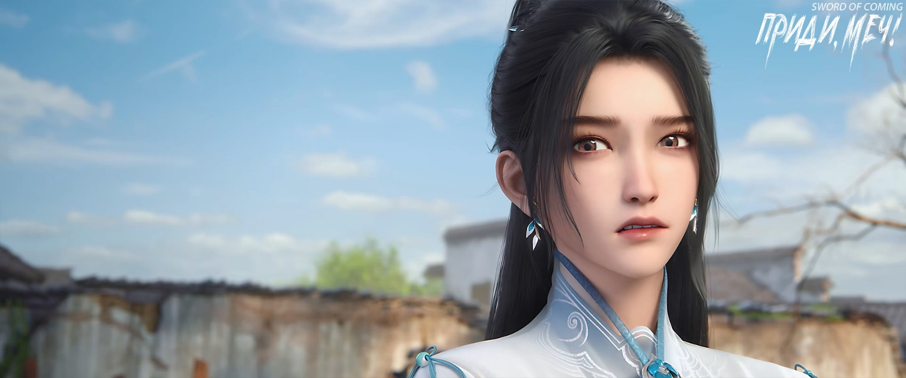

# Глава 42. Врожденный талант

В городке появлялось все больше незнакомых лиц из других мест, и дела в гостиницах и ресторанах шли в гору.

В то же время на улице Благоденствия и Достатка и в переулке Персиковых Листьев многие молодые люди из знатных семей начали тихо покидать городок. Среди них были как образованные и талантливые юноши, так и безвестные сыновья от наложниц или преданные слуги, родившиеся в семье. К ним относился и молодой господин Чжао Яо. Что касается мальчика Гу Цаня из переулка Глиняных Кувшинов, то его приметил Истинный Господин, Рассекающий Реку, Лю Чжимао — это было исключением.

Чэнь Пинъань взял у Лю Сяньяна корзину для рыбы и отправился к ручью за пределы городка. Когда вокруг было много людей, он, конечно, не практиковал ходьбу столбом из «Руководства Сотрясающего горы». Только выйдя из городка, где никого не было, он начинал повторять мысленно формулы, вспоминая шаги, позу и внутреннюю силу юной госпожи Нин во время выполнения упражнения. Он старался не упустить ни одной детали, снова и снова повторяя эти шесть шагов.

Когда Чэнь Пинъань впервые пытался подражать Нин Яо в доме в переулке Глиняных Кувшинов, он выглядел настолько неуклюже и нелепо, что казался хуже обычного человека. На самом деле в их восприятии возникло странное расхождение. Чэнь Пинъань всегда знал о своей особенности, которую заметил еще работая в гончарной мастерской — глаза были быстрыми, а руки медленными. Точнее говоря, из-за его исключительного зрения и наблюдательности руки и ноги просто не успевали за ними.

Это означало, что если бы кто-то другой попытался повторить шаги Нин Яо, то с первого раза мог бы достичь трех-четырех десятых сходства. Пусть грубо и неуклюже, но все же не настолько плохо, как у Чэнь Пинъаня с его одной-двумя десятыми. Именно потому, что он видел все слишком ясно и четко, был слишком требователен к каждому элементу, получалось чересчур натянуто. Когда руки и ноги не успевали, это выглядело особенно смешно, но под этими девятью десятыми несходства скрывалась одна драгоценная десятая истинного подобия.

Нин Яо не знала, что подражание ее движениям в упражнении «хождение столбом», даже если внешне было схоже на девять десятых, не могло сравниться даже с одной десятой истинного подобия. Ведь она была прирожденным материалом для мастера меча.

Впрочем, стоило заметить, что даже если бы кто-то достиг семи или восьми десятых истинного подобия, Нин Яо не сочла бы это чем-то выдающимся. Ее взгляд был устремлен лишь к далеким вершинам боевого пути, где редко ступала нога человека, и к тем немногим, кто мог встать с ней плечом к плечу на вершине искусства меча.

Чэнь Пинъань сидел на ступеньках под табличкой крытого моста, отдыхая и прикидывая: в сутках двадцать четыре часа, и даже если каждый день посвящать десять-двенадцать часов повторению упражнения «хождение столбом», максимум получится около трехсот повторений. За год выйдет сто тысяч, а чтобы достичь миллиона повторений, потребуется десять лет. Он повернул голову к прозрачному ручью, где было видно дно, и пробормотал:

— Продержаться десять лет — должно быть, я смогу, верно?

Хотя в последнее время Чэнь Пинъань не выказывал необычных эмоций, раскрытые достопочтенным Лу перед отъездом сокровенные тайны о коварных методах Цай Цзиньцзянь с горы Облачной Зари глубоко его тяготили. Была одна вещь, о которой Чэнь Пинъань не рассказал ни достопочтенному Лу, ни юной госпоже Нин. После того как Цай Цзиньцзянь ткнула его в межбровье и ударила в грудь, он уже тогда, еще в переулке Глиняных Кувшинов, смутно ощутил неладное в своем теле. Именно поэтому он так долго стоял у ворот своего двора, решаясь либо погибнуть, либо дать отпор Цай Цзиньцзянь.

Ведь тогда, по словам молодого даоса Лу Чэня, Чэнь Пинъань был слишком мрачным, совсем не похожим на юношу, который должен был быть полон жизненной силы. К вопросам жизни и смерти Чэнь Пинъань относился тогда легче, чем большинство людей.

Цай Цзиньцзянь, используя боевые искусства, насильно раскрыла меридианы Чэнь Пинъаня, превратив его тело в дом без ворот и дверей. И хотя теперь он мог вместить больше вещей, во время непогоды этот дом разрушался особенно сильно и быстро. Поэтому Лу Чэнь предсказал, что если не случится чего-то необычного и обойдется без серьезных болезней, Чэнь Пинъань проживет лишь до тридцати-сорока лет.

Затем Цай Цзиньцзянь нанесла удар в сердце Чэнь Пинъаня, разрушив основу его совершенствования. Сердце для совершенствующегося подобно важной крепости, и после разрушения городских ворот Цай Цзиньцзянь фактически заблокировала нормальное функционирование этого стратегического места. Это не только отрезало Чэнь Пинъаню путь к совершенствованию, но и ускорило процесс разрушения его тела.

Истинный ужас двух приемов Цай Цзиньцзянь заключался в том, что после того, как врата были широко распахнуты, Чэнь Пинъань не только утратил способность практиковать искусство долголетия, что означало невозможность использовать духовные техники для восстановления врат и укрепления основ, но и оказался в опасном положении. Даже если бы ему посчастливилось достичь успехов в боевых искусствах и укрепить тело через тренировки, для него это всегда было бы связано с огромным риском. Одна ошибка — и он попал бы в порочный круг, где «практика внешних боевых искусств легко привлекает зло», что не только не продлило бы жизнь, но и привело бы к печальной участи преждевременной смерти.

Сейчас Чэнь Пинъаню больше всего требовалось боевое искусство, которое могло бы медленно, но верно питать его жизненную энергию. Были ли приемы этого искусства острыми и властными, позволяло ли оно быстро продвигаться по пути боевых искусств — все это было не так важно.

Все надежды Чэнь Пинъаня были связаны с «Руководством Сотрясающего горы», которое Нин Яо считала недостойным внимания. Например, она упоминала, что после «ходьбы столбом» есть еще «стояние столбом — Меч в Печи» и «сон столбом — Тысяча Осеней».

Однако Чэнь Пинъань не осмеливался практиковать наугад. Тогда он лишь мельком взглянул на руководство, сдерживая желание изучить его подробнее. Он считал, что следовало дождаться, пока юная госпожа Нин проверит и подтвердит безопасность практики, и только потом начинать обучение.

Идя по правильному пути, даже с плохим восприятием, но с достаточным усердием и упорством, каждый день приносит прогресс; идя по неверному пути, чем умнее и усерднее человек, тем больше ошибок он совершает.

Эти слова принадлежали Лю Сяньяну. Конечно, он особо подчеркивал последнюю фразу: «Ты, Чэнь Пинъань, относишься к первому типу, молодой учитель Сун — этот умник — ко второму, и только я, Лю Сяньян, — настоящий гений, который и умен, и идет по верному пути».

Когда Лю Сяньян так хвастался, его случайно услышал проходивший мимо старик Яо. Старик, который всегда благоволил к Лю Сяньяну и считал его любимым учеником, почему-то был задет какими-то из этих слов. Впервые в жизни он пришел в ярость и задал Лю Сяньяну хорошую взбучку. После этого случая Лю Сяньян больше никогда не произносил слово «гений».

Чэнь Пинъань тяжело выдохнул и встал. Поднявшись по высоким ступеням и войдя на крытый мост, он заметил вдалеке группу людей. Четверо или пятеро стояли, словно охраняя некую девушку. Чэнь Пинъань видел только ее профиль — она сидела на перилах моста, ее ноги свободно свисали над поверхностью воды, глаза были закрыты, как будто она отдыхала. Ее пальцы были странно переплетены и изогнуты. У Чэнь Пинъаня создалось впечатление, что хотя ее глаза закрыты, она словно внимательно что-то рассматривала.

Чэнь Пинъань немного поколебался и, не пойдя дальше, повернулся, спустился по ступеням и, чтобы найти Лю Сяньяна, решил перейти ручей вброд. Сегодня за его спиной были две корзины, вложенные одна в другую. Меньшую он должен был вернуть в кузницу мастера Жуаня, ведь Лю Сяньян одолжил ее у них.

Вдалеке на крытом мосту группа людей, увидев, как бедно одетый юноша в соломенных сандалиях понятливо развернулся, молча переглянулась с улыбкой, опасаясь нарушить таинственное созерцание воды их «ровесницей».

Основы этой техники, без сомнения, происходили из буддизма. Позже она была принята, отобрана, объединена и усовершенствована многими школами совершенствования, и в итоге на одном пути появилось множество тропинок. Однако Восточный континент Водолея всегда считался местом упадка дхармы.

После нескольких бедствий уничтожения буддизма, охвативших половину континента, за последнюю тысячу лет буддийское учение постепенно ослабело, его влияние стало намного меньше, чем у двух других учений из «трех учений» — конфуцианства и даосизма. «Слышны лишь имена Истинных Господ и Небесных Наставников, неведомы защитники дхармы и великие добродетели» — таково было истинное положение дел на Восточном континенте Водолея. Впрочем, число даосских школ, получивших пользу от буддийского учения, было поистине неисчислимым.

Чэнь Пинъань, закатав штанины, перешел ручей вброд. Поднявшись на противоположный берег, он вдруг услышал со стороны крытого моста крики удивления и гневные восклицания, но, поразмыслив, решил не вмешиваться.

Добравшись до кузницы мастера Жуаня, он увидел все ту же бурную деятельность. Чэнь Пинъань не стал бродить без дела, а остановился у колодца и попросил кого-то передать весточку Лю Сяньяну.

Думая, что придется долго ждать, он неожиданно обнаружил, что Лю Сяньян прибежал очень быстро, потащил его к берегу ручья и, понизив голос, сказал:

— Давно тебя жду, почему так долго не приходил?

Чэнь Пинъань озадаченно спросил:

— Мастер Жуань торопит вернуть корзину?

Лю Сяньян закатил глаза:

— Что там какая-то дрянная корзина, у меня есть важное дело к тебе. Когда соберешь камни и вернешься во двор моего дома, дождись, пока придет та госпожа — та женщина, чей сын носит ярко-красную одежду, та пара матери и сына, которых мы встретили у входа в переулок Глиняных Кувшинов. Когда она придет, ничего не говори, просто отдай ей большой сундук, она даст тебе мешочек денег. Не забудь пересчитать при ней — двадцать пять медных монет, ни одной меньше!

Чэнь Пинъань потрясенно воскликнул:

— Лю Сяньян, ты с ума сошел?! Зачем продавать имущество чужим людям?!

Лю Сяньян крепко обхватил шею Чэнь Пинъаня и, выпучив глаза, отчитал его:

— Ни черта ты не понимаешь! Когда перед твоим старшим братом открывается блестящее будущее, почему бы его не использовать?

Чэнь Пинъань с недоверием на лице не мог поверить, что это искренние слова и намерения Лю Сяньяна.

— Та госпожа хочет купить наш фамильный драгоценный доспех, а господин со слугой желают заполучить «Канон Меча», — тихо сказал Лю Сяньян со вздохом. — Дед перед смертью наказал мне, что доспех в крайнем случае можно продать, конечно, не за бесценок. Но «Канон Меча», даже если придется умереть, ни в коем случае нельзя признавать, что он находится у нашей семьи Лю. Я согласился продать доспех госпоже, но помимо оговоренной цены выдвинул еще одно условие: после получения доспеха она должна убедить того крепкого старика не беспокоить меня какое-то время. На самом деле это просто способ выиграть время, пока я не стану учеником мастера Жуаня. Тогда все эти проблемы решатся сами собой.

— Почему бы тебе не потянуть время с той госпожой? — прямо спросил Чэнь Пинъань. — Не может же она прийти искать тебя в кузницу. К тому же она не сможет вломиться в дом и украсть доспех.

Лю Сяньян отпустил его, присел у ручья и, небрежно бросив камешек в воду, усмехнулся:

— В любом случае, доспех можно продать. Раз сейчас есть справедливая цена, разве это не хорошо? К тому же так ситуация станет безопаснее. Возможно, даже юной госпоже Нин не придется рисковать, так что это неплохой вариант.

Чэнь Пинъань тоже присел и поспешно возразил:

— Откуда ты знаешь, что цена справедливая? Что если потом пожалеешь?

Лю Сяньян повернулся с ухмылкой:

— Пожалею? Подумай хорошенько, мы столько лет знакомы. Когда это я, Лю Сяньян, делал что-то, о чем потом жалел?

Чэнь Пинъань почесал голову. Он чувствовал, что что-то не так, но был не силен в словах и не знал, как переубедить друга.

Всю свою жизнь Лю Сяньян жил свободно и непринужденно. Казалось, не было преград, которые могли бы его остановить, узлов, которые он не мог развязать, и дел, которые не мог завершить.

— Давай быстрее, — Лю Сяньян встал и пнул корзину за спиной Чэнь Пинъаня. — Я отнесу ее мастеру Жуаню, а потом, когда я официально стану учеником и буду подавать чай, приходи посмотреть церемонию.

Чэнь Пинъань медленно поднялся, хотел что-то сказать, но промолчал.

— Чэнь Пинъань, черт тебя дери[1], я что, продаю твою семейную реликвию? Или твою жену? — со смехом выругался Лю Сяньян.

[1] П/п:. (не)Культурное путешествие в нюансы китайских ругательств будет в конце главы.

Передавая корзину, Чэнь Пинъань предпринял еще одну попытку:

— Может, еще подумаешь?

Лю Сяньян, взяв корзину, отступил на несколько шагов и неожиданно высоко подпрыгнул, выполнив эффектный круговой удар ногой. Приземлившись уверенно, он самодовольно усмехнулся:

— Впечатляет, правда? Страшно?

— Черт бы тебя побрал, — раздраженно бросил Чэнь Пинъань.

Отойдя подальше от кузни Жуаня, погруженный в тяжелые мысли Чэнь Пинъань начал собирать камни в воде. То ли из-за рассеянности, то ли из-за обмелевшего ручья, сегодня улов был небольшим. Только когда он приблизился к крытому мосту, ему удалось собрать чуть больше двадцати камней змеиной желчи, и ни один из них не был достаточно хорош, чтобы привлечь внимание с первого взгляда.

Чэнь Пинъань снял корзину и рыболовный садок, положил их в траву у ручья, глубоко вдохнул и, повернувшись в воде, начал практиковать «хождение столбом».

После одного прохода туда и обратно сердце Чэнь Пинъаня сжалось — он увидел, что там, где спрятал корзины, сидит на корточках маленький юноша с зеленой травинкой в зубах. Это был внук бабушки Ма из переулка Цветущих Абрикосов. С детства его считали дурачком, а поскольку бабушка Ма оставила крайне неприятное впечатление у молодежи его возраста своей скупостью и придирчивостью, ее драгоценный внук стал козлом отпущения. Раньше каждый раз, когда он выходил на улицу, его преследовали и издевались над ним. Стоило ему надеть новую одежду или обувь, не проходило и получаса, как сверстники или ребята постарше пачкали их в пыли. Представьте себе — новые сапоги, только что купленные бабушкой Ма в лавке, после того как внук выходил в них на улицу, тут же затаптывались десятком человек, каждый из которых считал своим долгом наступить на них. Какие сапоги могли остаться новыми, когда ребенок возвращался домой?

Этот странный мальчишка, чье настоящее имя было Ма Кусюань и которое все давно забыли, никогда не жаловался бабушке Ма на обидчиков, не рыдал и не умолял о пощаде. Он всегда сохранял безразличное выражение лица и холодный взгляд. Поэтому дети из переулка Цветущих Абрикосов не любили играть с этим маленьким дурачком. Ма Кусюань рано научился играть сам с собой — больше всего ему нравилось смотреть на облака на горизонте с земляных холмов или крыш.

Чэнь Пинъань никогда не издевался над Ма Кусюанем, но и не жалел этого сверстника. Он даже не задумывался о том, что два человека с похожей бедой могли бы попытаться согреться вместе. Чэнь Пинъань всегда чувствовал, что такие люди, как Ма Кусюань, не только не глупы, но в глубине души очень похожи на Сун Цзисиня, а может, даже превосходят его.

Они, казалось, никогда не разговаривали, но всегда чего-то ждали, словно безмолвно обращаясь к небесам: «Вы мне много задолжали, и рано или поздно я заберу все назад». Если небеса задолжали медную монету, Сун Цзисинь, вероятно, хотел бы получить обратно лян серебра, а Ма Кусюань — даже лян золота! Чэнь Пинъань не считал это плохим, просто ему самому такое не нравилось.

Теперь этот юноша не походил на прежнего дурачка. Он четко произнес с улыбкой:

— Ты ведь Чэнь Пинъань из переулка Глиняных Кувшинов, живешь по соседству с Чжигуй?

— Что-то нужно? — кивнул Чэнь Пинъань.

Ма Кусюань улыбнулся и, указав на корзину Чэнь Пинъаня, предупредил:

— Возможно, ты не заметил, но уровень воды сильно упал, и хорошие камни остались только в омуте под крытым мостом и в водоеме Спины Синего Быка. В других местах их нет. Как те, что в твоей корзине — они не удержат эту энергию, камень быстро изменится. Некоторым повезет стать хорошими точильными камнями, другие могут стать тушечницами для ученых. Конечно, это тоже хорошие вещи, и продать их за высокую цену будет несложно, только вот… ладно, даже если скажу, ты вряд ли поймешь.

Чэнь Пинъань с улыбкой промычал в знак согласия, не сказав ничего больше.

— Ты только что практиковал боевые искусства в ручье? — внезапно спросил Ма Кусюань.

Чэнь Пинъань снова промолчал.

Глаза Ма Кусюаня заблестели, и он рассмеялся:

— Оказывается, ты тоже не глуп! И правильно, ты похож на меня, мы одного поля ягоды.

— Я пойду, — сказал Чэнь Пинъань, обходя Ма Кусюаня, взвалил корзину на спину и поднялся на берег.

— Стойка плохая, много ошибок, сколько ни тренируйся, ничего путного не выйдет, — тихо покачал головой Ма Кусюань, сидя на корточках вдалеке и выплевывая изжеванную травинку. — Забрал наш воинский талисман? — спросил Ма Кусюань, не поворачивая головы.

— Впредь не забывай сначала называть меня учителем, — раздался позади смех мужчины.

— Можно мне взглянуть на ту Маленькую Гробницу Мечей? — спросил Ма Кусюань, проигнорировав замечание и обернувшись.

Мужчина был тем самым мастером военной школы с мечом за спиной и тигриной печатью, который утверждал, что пришел с горы Истинного Воина. Он как-то заявил, что хочет сразиться с младшим дядей-наставником из школы золотого отрока и нефритовой девы.

— Еще не время, — покачал головой мужчина. Затем он раздраженно добавил: — Зачем ты намеренно нарушил ее созерцание воды? Ты знаешь, что такие поступки делают людей смертельными врагами на всю жизнь!

— Путь совершенствования труден. Если она не выдержит даже такого испытания, как смеет мечтать о беззаботном бессмертии? — равнодушно ответил Ма Кусюань.

— Ты еще даже не вступил на путь, а уже такие громкие слова говоришь, не боишься язык прикусить?! — рассмеялся от гнева мужчина.

— Когда в будущем на пути совершенствования я встречу такую возможность прорыва, я заранее предупрежу ту девушку, и тогда, учитель, ты не вмешивайся, пусть она попробует помешать мне, — в последний раз оскалился Ма Кусюань, показав белоснежные зубы.

Мужчина вздохнул:

— Знаешь ли ты, что в мире возможности бывают большими и малыми, удача — глубокой и поверхностной, а природные данные — высокими и низкими? Если ты будешь всегда мерить других по своим меркам, однажды встретишь того, чей кулак сильнее, совершенствование глубже, а уровень выше. Когда такой человек будет не в духе и одним ударом разрушит твой мост к бессмертию, как ты поступишь?

— Тогда я приму свою судьбу! — с улыбкой ответил Ма Кусюань.

— Впредь я больше не буду рассуждать с тобой о принципах — все равно что играть на цине перед быком[2], — самоиронично произнес мужчина.

[2] «对牛弹琴» — дословно: «играть на цине перед быком», аналог «метать бисер перед свиньями».

— А тот парень из переулка Глиняных Кувшинов, как он понял особенности камней в воде? И еще начал практиковать кулачное искусство? — внезапно спросил Ма Кусюань.

Мужчина вдруг стал строгим:

— Ма Кусюань! Учителю все равно, какой у тебя своенравный характер, но одно ты должен накрепко запомнить — мы истинные мастера меча военной школы! Совершенствуем меч, чтобы преодолеть десять тысяч методов, следовать своему сердцу и стремиться к непобедимости. Но категорически запрещается убивать невинных, издеваться над простолюдинами, а тем более в будущем на пути меча из зависти ставить подножки своим собратьям!

— Учитель, ты слишком много думаешь, — потянулся Ма Кусюань. — Даже если тот парень из переулка Глиняных Кувшинов станет невероятно силен, пока он меня не трогает, мне нет до него дела. В конце концов, какого бы уровня ни достигли люди в этом городке, они всего лишь ступеньки на моем пути. Зависть? Да я не успеваю их благодарить!

— С тобой невозможно говорить. Боюсь, на горе Истинного Воина теперь не будет покоя, — беспомощно произнес мужчина.

— А какое место ты занимаешь на горе Истинного Воина? — с любопытством спросил Ма Кусюань.

— Не будем об этом, неловко, — усмехнулся мужчина.

— Знал бы раньше, повременил бы с принятием ученичества, — закатил глаза Ма Кусюань.

Мужчина лишь рассмеялся в ответ. Была одна вещь, которую он не прояснил своему ученику: в мире существует много видов талантов и природных дарований. Тот юноша в соломенных сандалиях, выполняя казавшиеся простыми шесть шагов хождения столбом, на самом деле всем телом излучал дух кулачного искусства.

※※※※

П/п.: Когда парни «ругаются», они используют фразу «你大爷的», что дословно переводится «Твой старший дядя!». Аналог нашего «Черт бы тебя побрал!» или «Елки-палки!». Есть аналогичное междометие, с тем же переводом, но в чуть более мягком варианте «你大爷», и герои используют оба.

Это изначально пекинское диалектное выражение эволюционировало в интернет-сленг, превратившись в повседневную реплику. Оно утратило агрессивный подтекст и теперь используется среди друзей как способ выразить легкое недовольство или иронию, хотя формально все еще считается грубым словом. Это выражение не самое грубое, но все же считается вульгарными и неуважительными. Их использование зависит от контекста и отношений между говорящими. Возможно, в определенных ситуациях они могут быть шутливыми, но в официальной обстановке неприемлемы.

Почему «старший дядя» (причем по отцовской линии), а не бабушка, мать или дедушка? В традиционной китайской семье старший дядя (особенно брат отца) занимал важное место в иерархии. Упоминание его в ругательстве — это провокация, задевающая мужскую линию рода, что считалось особенно унизительным. Использование именно «дядя», а не «дед», связано с тем, что дед (爷爷) — фигура более уважаемая и «сакральная». Насмешка над ним была бы слишком грубой даже для ругательства и считалось бы табу даже в конфликтах. Бабушка (奶奶) в китайской культуре реже становится мишенью ругательств из-за традиционного уважения к женским старшим родственницам.

Фраза возникла как эвфемизм для замены более вульгарных выражений вроде (他妈的 — «твоя мать»). Выбор «дядя» вместо «мать» смягчил прямолинейность оскорбления, сохранив намек на неуважение к семье. Дядя же — фигура менее «сакральная», что позволяет использовать его для игривой провокации без пересечения границ жесткого табу. Сегодня «你大爷» часто используется как междометие среди друзей, утратив изначальную агрессию.