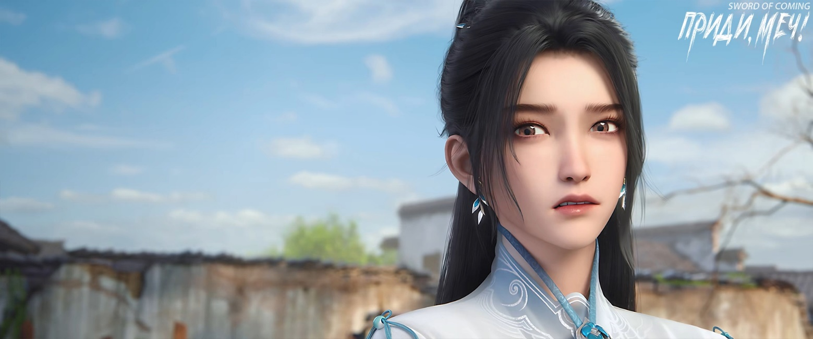
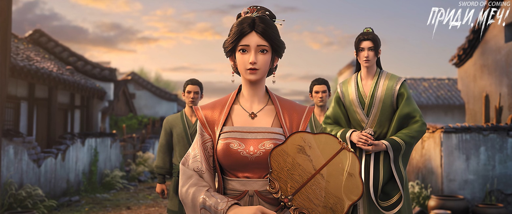
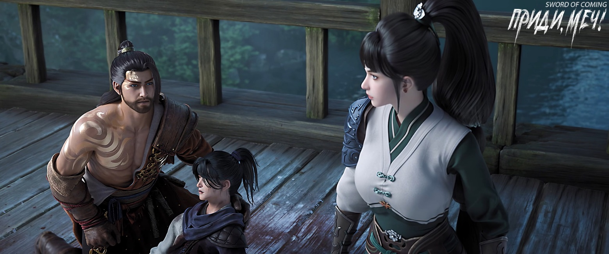

# Глава 43. Юноша и старый пес

Чэнь Пинъань не сразу направился в усадьбу Лю Сяньяна, а сначала вернулся в переулок Глиняных Кувшинов, чтобы рассказать Нин Яо о его планах.

Выслушав его, Нин Яо не стала высказывать своего мнения, лишь сказала, что это дело между ними, а она только берет деньги и помогает избежать беды. Если Лю Сяньян сможет избежать несчастья без ее вмешательства, она вернет те три мешочка медных монет из эссенции золота.

— Дело не в деньгах, — сказал Чэнь Пинъань.

— Что же, ты хочешь поговорить со мной о чувствах? Мы уже настолько близки? — холодно ответила Нин Яо.

Чэнь Пинъань чуть не подавился от этих слов и лишь присел на пороге, почесывая голову.

Нин Яо искоса взглянула на принесенные Чэнь Пинъанем сладости на столе — были там и недорогие финиковые пирожные из клейкого риса, и относительно дорогие пирожные «капли росы». Очевидно, это было лучшее угощение, что он мог себе позволить. У Нин Яо впервые появилось чувство мягкости и вины. Она вдруг подумала, что ведет себя не очень порядочно — ест его еду, живет в его доме, а когда случается беда, не только не может помочь, но еще и подливает масла в огонь. Поэтому она спросила:

— А может быть, Лю Сяньян получил реальные угрозы в кузнице, и поэтому был вынужден продать тот иссиня-черный бородавчатый доспех[1]? Например, в мастерской могли прятаться приспешники четырех фамилий и десяти кланов, которые тайно проучили Лю Сяньяна?

[1] 瘊子甲 (досл. «бородавчатый доспех») — название связано с характерной выпуклой текстурой поверхности, напоминающей бородавки. Такой доспех изготавливали методом холодной ковки этнические меньшинства эпохи Сун.

Чэнь Пинъань немного подумал и покачал головой:

— Нет, Лю Сяньян точно не из тех, кто сдается под угрозами. Когда я впервые встретил его, даже избитый бандой с улицы Благоденствия и Достатка до кровавой рвоты, он не произнес ни слова покорности, просто терпел, хотя его чуть не забили до смерти. За эти годы характер Лю Сяньяна не изменился.

— Молодая кровь горяча, храбрость от пыла, верность слову ценится выше жизни и смерти, — снова спросила Нин Яо. — На самом деле в переулках всегда хватало таких странствующих воинов, я сама повидала немало на своем пути. Но когда перед ним окажется большая выгода, другой соблазн — сможет ли Лю Сяньян сохранить свою истинную природу?

Чэнь Пинъань снова погрузился в раздумья, и наконец твердо сказал:

— Лю Сяньян не станет транжирой только потому, что кто-то что-то ему предложил, он очень близок со своим дедом. Разве что, как он говорит, его дед перед смертью наказал ему, что драгоценный доспех можно продать, но не за бесценок, а «Канон Меча» обязательно должен остаться в семье Лю, чтобы передать потомкам.

— Насколько я знаю, тот бородавчатый доспех хоть и хорошего качества, но не считается особо редким, — сказала Нин Яо. — А вот «Канон Меча», раз гора Истинного Ян давно на него зарится и даже отправила двух человек на поиски этого сокровища, явно считая его уже своим, значит, это действительно стоящая вещь. Поэтому решение продать доспех и оставить «Канон Меча» вполне логично.

Чэнь Пинъань кивнул.

— Для подстраховки я пойду с тобой в дом Лю Сяньяна, — холодно произнесла Нин Яо, поглаживая зеленые ножны. — Сначала разберемся с той женщиной. Раз Лю Сяньян сам сказал, что хочет продать, то пусть забирают сундук с доспехом. Потом мы вместе пойдем в кузницу мастера Жуаня, встретимся с Лю Сяньяном и спросим, что он на самом деле думает. Если это действительно предсмертное завещание его деда, нам не стоит вмешиваться — у каждой семьи свои проблемы, не твое дело — не лезь. Если нет — пусть расскажет о своих трудностях, в крайнем случае я отобью этот сундук обратно!

— Юная госпожа Нин, с твоим здоровьем все в порядке? — обеспокоенно спросил Чэнь Пинъань.

— Если бы пришлось иметь дело со старой горной обезьяной с горы Истинного Ян, я бы точно потерпела неудачу, но с той женщиной в этом городке мне хватит и одной руки, — холодно усмехнулась Нин Яо.

— Горная обезьяна? — с любопытством спросил Чэнь Пинъань.

— Это потомок древних свирепых зверей, оставшихся в этом мире, — небрежно ответила Нин Яо. — Его истинный облик — гигантская обезьяна размером с гору. Говорят, когда он принимает свою истинную форму, то может вырвать целую гору и унести ее на спине. Впрочем, это все слухи, ведь никто этого по-настоящему не видел. Гора Истинного Ян несколько сотен лет сдерживала себя, у них действительно глубокие корни. Хотя их школа не занимает высокого положения на Восточном континенте Водолея, ее нельзя недооценивать, поэтому лучше не вступать с ними в конфликт. А если уж вступим в конфликт…

— А что, если все же вступим? — осторожно спросил Чэнь Пинъань.

Нин Яо встала, большим пальцем слегка выдвинула клинок из ножен и посмотрела на Чэнь Пинъаня как на идиота:

— А что тут думать? Зарубим их!

Чэнь Пинъань сглотнул.

Затем Чэнь Пинъань с корзиной за спиной и Нин Яо, снова надевшая широкополую шляпу и подпоясанная узким мечом в зеленых ножнах, медленно направились к родовому дому Лю Сяньяна.

Нин Яо покосилась на корзину Чэнь Пинъаня.

— Почему сегодня так мало?

Чэнь Пинъань вздохнул:

— Ма Кусюань, внук бабушки Ма из переулка Цветущих Абрикосов, мой ровесник, теперь словно совсем другой человек. По его словам, фэншуй городка изменился, и камни в ручье все хуже удерживают ци.

Нин Яо помрачнела.

— Он прав, в этом городке грядут перемены, — серьезно сказала она. — Тебе лучше поскорее разобраться с этим делом и уйти отсюда. Даже если потом вернешься — это лучше, чем все время оставаться здесь.

Чэнь Пинъань не был упрямцем, который учится только на своих ошибках. Выросший в одиночестве, он хорошо понимал людские отношения и умел расставлять приоритеты.

— Конечно, — кивнул он с улыбкой. — Как только увижу, что Лю Сяньян выпил чай признания ученичества с мастером Жуанем, сразу уйду отсюда. И хорошо бы к тому времени мастер Жуань согласился выковать меч для тебя.

Глядя на его радостное лицо, Нин Яо удивилась:

— Чужие дела тебя так радуют? Говорят, что ты чрезмерно добр — почему ты не согласен?

Видимо, считая, что они уже достаточно близки, Чэнь Пинъань ответил прямо и уверенно:

— Лю Сяньян, Гу Цань и ты, юная госпожа Нин — подумай, из всех людей в Поднебесной мне небезразличны только трое. Какой же я чрезмерно добрый?

— А какое место среди этих троих занимаю я? — с улыбкой спросила Нин Яо.

— Пока третье, — искренне и смущенно ответил Чэнь Пинъань.

Нин Яо сняла меч, небрежно взяла его в руку и легонько похлопала ножнами по плечу Чэнь Пинъаня.

— Чэнь Пинъань, благодари меня за то, что оставляю тебя в живых, — произнесла она с натянутой улыбкой.

— Тебе не надоело варить лекарственные отвары? — непонимающе спросил Чэнь Пинъань.

Нин Яо на миг растерялась, потом поняла его мысль:

— Чэнь Пинъань, я вдруг поняла, что ты и во внешнем мире сможешь неплохо жить.

— Было бы так же хорошо, как сейчас, — искренне ответил Чэнь Пинъань, совершенно не жадный до денег.

Нин Яо промолчала, лишь слегка покачивая узкий меч в зеленых ножнах, словно деревенская девушка, качающая цветущую ветвь.

Когда они дошли до поворота к дому Лю Сяньяна, внезапно выскочила черная тень. Нин Яо чуть не выхватила меч, но вовремя сдержалась. Оказалось, это была желтая собака, которая ласково крутилась вокруг Чэнь Пинъаня. Он наклонился, погладил ее по голове, выпрямился и с улыбкой сказал:

— Это Лайфу[2], собака соседей Лю Сяньяна. Много лет уже здесь живет, очень трусливая. Раньше мы с Лю Сяньяном часто брали ее с собой в горы, она только и делала, что плелась за нами. Лю Сяньян всегда ругал ее за то, что она не может поймать ни горного зайца, ни фазана, говорил, что она хуже кошки. Вот кошка Ма Кусюаня, говорят, часто приносит домой диких кур и змей. Но Лайфу уже стар, ему лет десять, совсем пожилой.

[2] Лайфу (来福). Имя может значить «Приходящее счастье» или «Приносящий удачу».

Сказав это, Чэнь Пинъань снова не удержался, наклонился и погладил голову Лайфу.

— В таком возрасте нужно уступать старости, верно? — мягко произнес он. — Не волнуйся, когда я заработаю много денег, ты точно не будешь голодать.

Нин Яо покачала головой — она не могла разделить эти чувства, хотя за время своих странствий повидала много людей и событий.

У нее были предубеждения против этих чужих земель, но чем больше она путешествовала, тем слабее они становились, хоть и не исчезли совсем.

Она видела буддийских монахов, которые в ненастную ночь босиком твердым шагом шли с чашей для подаяний, распевая сутры. Видела бедных студентов, направлявшихся на столичные экзамены: в разрушенном храме они нежно подводили брови лисице-оборотню в человеческом обличье и, даже зная, что их виски уже тронула седина, не жалели об этом, отправляясь дальше в путь.

Видела молодого даоса с титулом Небесного Наставника, который в одиночку проходил через древние поля сражений и места массовых захоронений. Он читал молитвы безгранично благословенному Небесному Достопочтенному[3], не жалея собственной силы совершенствования, чтобы указать путь к освобождению одиноким душам и диким призракам. Видела чиновника средних лет, который, только заступив на должность, запретил непристойные храмы Царя Драконов. А потом с потрескавшимися в кровь губами стоял у высохшего русла реки, установив алтарь с благовониями, хрипло читал «Молитву Царю Драконов о дожде»[4], и в конце концов ради народа своего округа встал на колени перед храмом Царя Драконов, прося прощения.

[3] «福生无量天尊» — это даосское благословение или молитвенная формула, которую можно перевести как: «Да будет безграничное счастье и благословение, Небесный Владыка» или «Безгранично благословенный Небесный Достопочтенный».

[4] Царь Драконов (龙王) — в китайской культуре считается божеством, что управляет водной стихией и отвечает за дожди. В древнем Китае во время засухи люди часто проводили специальные ритуалы и читали молитвы, обращаясь к Царю Драконов с просьбой о ниспослании дождя для орошения полей и преодоления засухи. Такие молитвы называются «祈雨文», что буквально переводится как «текст молитвы о дожде».

Видела древних старцев — верных подданных прошлой династии. Они не желали брать с собой сыновей, служивших новой династии, а брали только маленьких внуков, изучающих начальную грамоту. Поднимались на возвышенности сочинять стихи и, глядя на разрушенные горы и реки родины, со слезами на глазах рассказывали любимым внукам, как раньше назывались области и уезды, чьи имена теперь изменены. Видела одинокую лодку, скользящую по тысячеверстному ущелью, где среди обезьяньих криков на обоих берегах ученый муж, полный энтузиазма, дойдя до волнующего места в книге, издавал громкий крик к небесам. Видела красавицу, способную погубить царство: в закрытых доспехах, после того как рассеялся пороховой дым, она скакала на коне и пила вино — прекраснейшая из прекрасных.

На всем пути, среди всех этих встреч и прозрений, стремление Нин Яо к Дао оставалось твердым как скала, без малейших колебаний.

И теперь Нин Яо увидела еще одну сцену: одинокий юноша из бедного переулка, с корзиной за спиной и садком для рыбы, гладит старую собаку по голове, полный надежд на будущее.

Вскоре после того, как они пришли в дом Лю Сяньяна, кто-то постучал в ворота. Чэнь Пинъань и Нин Яо переглянулись, затем Чэнь Пинъань пошел открывать. Нин Яо осталась стоять в дверях комнаты, лишь мельком взглянув на длинный меч, спокойно лежащий на шкафу.

Это был Лу Чжэнчунь во главе с той женщиной и двумя верными слугами семьи Лу.

— Ты друг Лю Сяньяна, Чэнь Пинъань, верно? — тихо спросил Лу Чжэнчунь с добрым выражением лица. — Мы пришли забрать сундук, Лю Сяньян должен был предупредить тебя. Так что можешь спокойно взять эти деньги. Кроме того, наша госпожа обещает выполнить все условия Лю Сяньяна и в будущем передаст ему все до последней мелочи.

Чэнь Пинъань принял мешочек с деньгами и отступил в сторону. Величественная женщина первой вошла во двор, за ней последовал Лу Чжэнчунь с двумя слугами. Женщина сама открыла красный лакированный деревянный сундук, уже стоявший в главном зале, присела и провела рукой по уродливому на вид драгоценному доспеху. В ее глазах на мгновение появилось отрешенное выражение, затем — едва скрываемый пыл и желание, но она быстро подавила эти эмоции. Вернув себе обычное выражение лица, она встала и дала знак Лу Чжэнчуню, что можно забирать сундук. Он был не тяжелым, ведь внутри были только доспехи.

Женщина последней покинула комнату, у порога обернулась и посмотрела на Чэнь Пинъаня.

— Лю Сяньян действительно считает тебя другом, — улыбнулась она.

Не понимая скрытого смысла, Чэнь Пинъань молча проводил их со двора.

Наконец Чэнь Пинъань стоял снаружи, не желая двигаться с места. Нин Яо подошла к нему.

Женщина, идущая позади троих во главе с Лу Чжэнчунем, дойдя до конца переулка, обернулась и, увидев стоящих плечом к плечу юношу и девушку, с загадочной улыбкой произнесла:

— Молодость — это прекрасно, но нужно еще оставаться в живых.

※※※※

На крытом мосту, перекинутом через ручей, высокий юноша Лю Сяньян лежал в луже крови. Его тело содрогалось, он постоянно отхаркивал кровь.

Но на этот раз он уже не мог услышать, как некий тощий смуглый паренек раз за разом надрывно кричит: «Человек умирает!»[5]

[5] П/п.: Кто забыл — это отсылка к ситуации из прошлого, когда Сяньяна, тогда еще ребенка, чуть не забили до смерти, и Пинъань его спас, крича эту фразу.

У северных ступеней моста толпились люди, бурно обсуждая происходящее, но наблюдая за событиями издалека. Никто не осмеливался приблизиться к Лю Сяньяну, боясь навлечь на себя беду.

Двое быстро вошли на мост. Мужчина присел, нащупал пульс на запястье Лю Сяньяна, его лицо становилось все мрачнее.

Жуань Сю в зеленом одеянии, полная ненависти, процедила сквозь зубы:

— Одним ударом разбить грудную клетку — какая жестокость!

Мужчина молчал.

Жуань Сю с собранными в конский хвост волосами гневно воскликнула:

— Отец! Ты так и будешь смотреть, как Лю Сяньяна забивают до смерти? Лю Сяньян наполовину твой ученик!

Мужчина, не отпуская запястья Лю Сяньяна, бесстрастно произнес:

— Откуда мне было знать, что достопочтенная гора Истинного Ян в этот раз так пренебрежет правилами.

— Если ты не вмешаешься, я вмешаюсь! — резко встала Жуань Сю.

Мужчина медленно поднял голову:

— Жуань Сю, ты хочешь, чтобы отец собирал твой труп?

— Я, Жуань Сю, умею не только ковать! Я и убивать умею! — решительно шагнула вперед Жуань Сю.

На лице мужчины мелькнула ярость, подобная грому. Отчасти из-за безрассудства дочери, но больше из-за жестокого удара того старого примата с горы Истинного Ян.

Мужчина подумал: раз он еще официально не занял место Ци Цзинчуня, может быть, это значит, что и ему не обязательно действовать по правилам?

Жуань Сю внезапно остановилась, увидев худощавого юношу, который как безумный бежал к ним с другого конца моста.

Она узнала эту знакомую фигуру в соломенных сандалиях, с лицом бесстрастным и спокойным, как древний колодец.

Они мгновенно разминулись. Жуань Сю хотела что-то сказать, но не смогла произнести ни слова, и без причины почувствовала такую обиду, что слезы потекли по щекам.

Когда Чэнь Пинъань сел рядом и схватил его за руку, у Лю Сяньяна, чье зрение уже затуманилось, словно прибавилось сил. Он попытался выдавить улыбку и прерывисто произнес:

— Та женщина сказала, если я не отдам драгоценный доспех, она убьет тебя… Она сказала, что раз они с сыном вдвоем пришли в наш городок, то изгнания одного — это цена, которую она может себе позволить. Я испугался, очень испугался, что она действительно убьет тебя… То, что я говорил тебе раньше, не совсем ложь, дед действительно говорил мне эти слова, поэтому я подумал — продать так продать, ничего страшного… Но только что она снова послала за мной людей, сказала, что тот старик обезумел, услышав, что у меня нет «Канона Меча», и решил сначала убить тебя, а потом меня. Я так волновался за тебя, хотел предупредить… Просто бежал сюда всю дорогу, а потом этот старый ублюдок ударил меня кулаком… Немного больно, правда…

Чэнь Пинъань, опустив голову, осторожно вытер кровь с уголка рта Лю Сяньяна. Его смуглое худое лицо было крепко сморщено.

— Не бойся, все будет хорошо, поверь мне, — тихо сказал он. — Не говори больше, я отведу тебя домой…

Силы, которые Лю Сяньян собрал с таким трудом, постепенно исчезали, его взгляд затуманился.

— Я не жалею, и ты себя не вини, правда… Просто… Мне немного страшно, оказывается, я тоже боюсь смерти, — пробормотал он. — Наконец Лю Сяньян изо всех сил сжал руку своего единственного друга и всхлипнул: — Чэнь Пинъань, я действительно очень боюсь смерти.

Чэнь Пинъань сидел на земле, одной рукой крепко сжимая руку Лю Сяньяна, другой опираясь кулаком о колено. Тяжело дыша, он отчаянно хватал воздух.

Совсем юный Чэнь Пинъань в этот момент был похож на старого пса. Его глаза покраснели. Когда он захотел потребовать справедливости у Небесного Владыки, он стал еще больше походить на собаку[6]. Чэнь Пинъань не хотел быть таким, не хотел быть таким всю свою жизнь!

[6] П/п.: Собака является символом низости в китайской культуре. Образ «старого пса» символизирует униженное положение, вынужденное смирение перед судьбой.