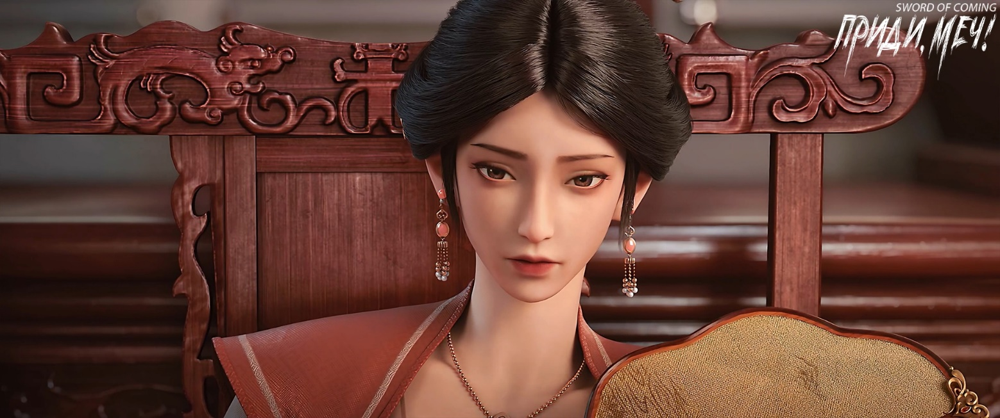

# Глава 44. Когда вода спадает, камни обнажатся

П/п.: Идиома в названии главы «水落石出» означает, что правда в конце концов выйдет наружу. Часто используется для обозначения разрешения загадки, раскрытия тайн или прояснения сложных обстоятельств. Аналог: «все тайное становится явным».

※※※※

В маленькой и изящной усадьбе семьи Лу на улице Благоденствия и Достатка скрывался целый мир. Даже госпожа Сюй из города Чистого Ветра считала, что это было подобно созданию храма в раковине улитки — все было доведено до совершенства, и больше требовать было нечего.

В беседке у озера госпожа Сюй, только что успешно заполучившая бородавчатый доспех семьи Лю, сидела в блаженном настроении, небрежно облокотившись о перила. Видимо, настроение у нее было настолько хорошим, что даже присутствие этой назойливой мухи Лу Чжэнчуня на ступенях беседки не слишком ее раздражало.

Ее сын, одетый в ярко-красный халат, стоял на длинной скамье и бросал корм в маленькое озеро, где собралось около сотни карпов с красными спинами, создавая впечатляющую картину красных волн.

Госпожа Сюй обратилась к Лу Чжэнчуню:

— Тебе не нужно стоять здесь в ожидании приказов. Когда это дело будет закончено, ты отправишься с нами в город Чистого Ветра. Помимо того, что мой муж примет тебя в ученики, мы также удовлетворим несколько неразумную просьбу твоего деда и обязательно гарантируем, что однажды ты достигнешь пятого уровня среднего ранга. Знаешь, такое обещание — самое ценное, поэтому твой дед — настоящая старая лиса.

Сказав это, госпожа Сюй сама рассмеялась:

— На мой взгляд, если бы твой дед управлял семьей Лу, династия Лу не рухнула бы так быстро. Даже высокомерный князь Дали Сун Чанцзин признал, что смог добиться успеха в уничтожении государства всего за год, и половина этих заслуг принадлежит императорской семье Лу. Конечно, вашей городской ветви семьи Лу не очень повезло — с основной ветвью семьи Лу вы не разделили славу, но разделили падение. Поэтому сейчас, когда город Чистого Ветра дает тебе такую редкую возможность, не упусти ее, держись за нее крепко.

Лу Чжэнчунь низко поклонился, подняв сложенные руки выше головы, и со слезами благодарности произнес:

— Лу Чжэнчунь никогда не забудет великой милости госпожи Сюй. Когда я прибуду в прославленный город Чистого Ветра, я буду служить госпоже Сюй как вол или лошадь и клянусь, что всю жизнь буду верен только госпоже!

Госпожа Сюй из города Чистого Ветра очаровательно улыбнулась, прищурила глаза и мягко сказала:

— Такие искренние слова… Смотри, не дай услышать их моему мужу, твоему будущему наставнику. Хотя, может быть, ты захочешь повторить их и перед ним?

Возможно, после того как Лу Чжэнчунь встал на колени перед Лю Сяньяном в переулке Глиняных Кувшинов, он больше не испытывал неловкости по этому поводу. Услышав язвительные слова госпожи Сюй, он немедленно опустился на колени, распластавшись на верхней ступени беседки, и дрожащим голосом произнес:

— Лу Чжэнчунь никогда не забудет своих корней!

Госпожа Сюй усмехнулась и небрежно махнула рукой, прогоняя его:

— Хорошо, вставай. В городе Чистого Ветра совершенствование отнимает больше всего времени. Время покажет, забудешь ты свои корни или нет — когда вода спадет, камни обнажатся.

Лу Чжэнчунь, пятясь, покинул беседку и только спустившись по ступеням медленно повернулся. Этот некогда первейший повеса городка, державший всех в страхе, перед госпожой Сюй, казалось, никогда не мог выпрямить спину.

За пределами городка семья Лу, некогда правящий род великой династии, после сокрушительного удара пограничных войск Дали потеряла свою силу и не могла оправиться. В ближайшее время им будет трудно восстановить былое величие. Все — от высших до низших, как прямые потомки, так и боковые ветви и дальние родственники — были вынуждены поджать хвост. Иначе город Чистого Ветра со своим положением и репутацией никогда бы не осмелился так бесцеремонно захватить усадьбу семьи Лу в городке, слово горлица занявшая гнездо сороки[1], и помыкать отпрысками семьи Лу.

[1] «鸠占鹊巢» — дословно: горлица занимает гнездо сороки. Означает: незаконно присвоить чужое имущество.

Даже для хозяина и слуги с горы Истинного Ян это было бы затруднительно. Теперь, когда семья Лу оказалась подобна дракону на мелководье[2], времена были тяжелые, и им приходилось унижаться.

[2] «龙游浅滩» — дословно: дракон плавает на мелководье. Означает: талантливый человек в стесненных обстоятельствах.

Мальчик в красном халате презрительно усмехнулся:

— Вот уж действительно прирожденный раб и прихвостень. Матушка, зачем вам такой никчемный человек? Неужели вы правда позволите отцу взять его в ученики и даже обещаете ему достижение пятого уровня среднего ранга? Когда это пятый уровень среднего ранга стал таким дешевым?

Госпожа Сюй улыбнулась:

— Хотя Лу Чжэнчунь и отвратителен, в нем есть что-то стоящее. У него обычные способности, и стать учеником внешнего круга для него уже большая удача. Но в конце концов, этот молодой человек всего лишь небольшое дополнение к большой сделке, он не сможет вызвать даже малейшего волнения. Что касается внешней стороны, я обещала городской семье Лу так много: согласилась, чтобы бежавшие члены императорской семьи Лу, родственники императора и знать могли найти убежище в городе Чистого Ветра и пустить там корни. Город Чистого Ветра будет относиться к ним с уважением, принимать как почетных гостей, и даже выделит большую территорию в городе как личные владения семьи Лу сроком на сто лет…

Мальчик, закончив кормить рыб, внезапно выбежал из беседки, собрал горсть камней и вернулся. Затем он облокотился о перила и начал с силой бросать камни в карпов, получая от этого огромное удовольствие. Повернув голову, он спросил:

— Матушка, наши поиски бородавчатого доспеха в городке — это просто предлог, чтобы отвести глаза? Это уловка нашей семьи Сюй из города Чистого Ветра, чтобы взять под контроль семью Лу? Ведь мертвая сороконожка не сразу коченеет[3]. Говорят, что среди этой огромной своры бездомных псов только членов императорской семьи больше трех тысяч, а если добавить евнухов, слуг, вассалов и старых сановников, которые не хотят подчиняться семье Сун из Дали, это сильно поможет росту населения нашего города Чистого Ветра. Выходит, здесь теперь настоящий центр распространения новостей для павшей семьи Лу?

[3] «百足之虫死而不僵» — дословно: сороконожка умирает, но не сразу коченеет. Идиома описывает ситуацию, когда что-то или кто-то, несмотря на серьезные проблемы или даже гибель, продолжает существовать или оказывать влияние. Образ многоножки используется потому, что даже после смерти она какое-то время может продолжать двигаться из-за множества ног.

Госпожа Сюй с удовлетворением улыбнулась:

— То, что ты смог додуматься до этого, показывает, что мой сын очень умен, но все же ты ошибаешься.

Мальчик нахмурился, ожидая ответа.

Госпожа Сюй подмигнула:

— В том бородавчатом доспехе скрыта тайна. Проще говоря, он не уступает тому «Канону Меча».

Мальчик с силой бросил камень, попав в спину одному из карпов. Брызнула кровь, и несчастная рыба отчаянно забилась на поверхности воды.

Глаза мальчика загорелись:

— Отец лучше всех владеет искусством нападения, его сила убийства не намного уступает Сун Чанцзину из Дали. Жаль только, что его всегда сдерживала врожденная слабость тела. Больше всего он боится противников, готовых к обмену ударами, поэтому не смог прославиться и стал посмешищем — даже свои в городе Чистого Ветра смеют насмехаться над нами за спиной. Матушка, значит ли это, что когда отец получит этот драгоценный доспех, он сможет и атаковать, и защищаться, и сравняться в силе с Сун Чанцзином?

Госпожа Сюй покачала головой.

Мальчик в красном халате с силой ударил по перилам и гневно воскликнул:

— Не держи меня в неведении! — Он оскалил зубы, готовый укусить, словно тигренок или детеныш леопарда.

Госпожа Сюй никогда не считала неуместным, когда сын повышал на нее голос. В конце концов, при его рождении некий мудрец дал высокую оценку, произнеся предсказание: «Он обладает чертами тигра и волка, качествами правителя».

Госпожа Сюй терпеливо объяснила:

— Когда твой отец получит драгоценный доспех и постигнет его тайны, он сможет подняться еще выше. Какая защита нужна, когда одна сила превосходит десять умений — просто сокрушить врага одним ударом!

Мальчик расхохотался, переполненный радостью:

— Убивать, убивать, убивать! Пусть отец начнет прямо с нашего города Чистого Ветра! Самые отвратительные дела — те, что творят свои же!

Отсмеявшись, мальчик быстро успокоился и, внезапно вспомнив что-то, спросил:

— Матушка, ты так играешь с горой Истинного Ян, действительно дурача эту обезьяну. Но не боишься ли ты, что эта глупая обезьяна, когда опомнится и покинет городок, нападет на нас? И еще кое-что я никак не могу понять. У этого Лю давно был скупщик фарфора, у него отличный врожденный потенциал, плюс драгоценный доспех и «Канон Меча» — такое сокровище редко встретишь. Даже я вынужден признать, что к нему стоит отнестись с уважением. Почему же скупщик фарфора все не появляется? Это позволило тебе ловить рыбу в мутной воде, а старая обезьяна с горы Истинного Ян помогла нам разобраться с беспорядком. После того как он одним ударом убил Лю Сяньяна, все успокоилось. Гора Истинного Ян взяла на себя все неприятности, а у нашего города Чистого Ветра появилось пространство для маневра.

Госпожа Сюй уверенно ответила:

— Тысячелетняя Горная Обезьяна, Двигающая Горы, с горы Истинного Ян хоть и не очень умен, но не настолько глуп, чтобы позволить мне водить себя за нос. На самом деле он давно догадался о моем плане использовать чужой нож для убийства. Почему старая обезьяна согласился зажать нос и самостоятельно прыгнуть в ловушку — причины довольно сложные. Тут и самонадеянность горы Истинного Ян, не боящейся навлечь на себя беду, и некая тайная история, о которой никто не знает. Тебе пока не нужно об этом беспокоиться.

Она погрузилась в раздумья, снова обдумывая свой план, пытаясь найти возможные упущения, чтобы избежать бесконечных проблем в будущем.

Скупщик фарфора юноши Лю Сяньяна некогда был одной из сил, активно поддерживавших династию Лу. После падения династии они потеряли все, но до этого действительно были одним из лучших знатных родов в мирском царстве у подножия гор. Иначе они не смогли бы, даже после подтверждения потенциала Лю Сяньяна как заготовки для мастера меча, потратить огромные деньги, чтобы оставить его в городке, выкупив следующие девять лет его жизни.

Когда гора Истинного Ян каким-то образом узнала об этом, они попытались купить фарфор судьбы Лю Сяньяна. Один из патриархов горы Истинного Ян лично предложил баснословную цену, но эта обедневшая семья, словно приняв неправильное лекарство, наотрез отказалась, заявив, что уже перепродала его кому-то другому. А кому именно и какого происхождения был покупатель — об этом они хранили молчание.

Позже озадаченная гора Истинного Ян услышала слухи о том, что их заклятый враг, сад Ветра и Грома, воспользовался ситуацией и, опередив их, получил преимущество. Естественно, та семья не осмелилась сказать в лицо мастеру меча с горы Истинного Ян, что продала вещь их врагу из сада Ветра и Грома.

Кто же сообщил горе Истинного Ян о наследственном бородавчатом доспехе семьи Лю, «Каноне Меча» и новости о том, что сад Ветра и Грома получил фарфор судьбы Лю Сяньяна? Ответ был не за горами, а прямо перед глазами. Это была госпожа Сюй из города Чистого Ветра, хотя, конечно, действовавшая за кулисами. Более того, она была главным организатором. Лично отправившись в городок и потратив огромные средства, она, естественно, хотела гарантировать, что эта сделка как минимум окупится. Иначе положение ее ветви в городе Чистого Ветра резко ухудшилось бы, оказалось бы под угрозой, не говоря уже о мечтах единолично управлять городом.

В действительности, в городке скрывались драконы и затаились тигры, ими нельзя было пренебрегать. Не говоря уже о клонящейся к закату семье Лу, остальные три великих рода — разве не были они могущественными силами на карте Восточного континента Водолея?

На самом деле, истинная сила четырех фамилий и десяти кланов заключалась не в том, скольких местных мастеров, владеющих искусными техниками, они контролировали. Эти главы семей и почтенные предки уже не могли покинуть свои места. Старая поговорка гласит: дерево пересадишь — погибнет, человека переселишь — оживет. Но увы, они были подобны персиковым деревьям в переулке Персиковых Листьев и старой софоре в центре городка — пересади их, и они умрут, без надежды на следующую жизнь. Поэтому, несмотря на великие способности, они не могли их использовать.

Сила этих семей заключалась в том, сколько драконовых печей они контролировали и сколькими домами управляли, потому что это напрямую определяло, сколько фарфора судьбы они могли ежегодно поставлять внешнему миру. Когда появлялся многообещающий практик, скупщик фарфора, сделавший правильную ставку, если не был слишком стеснен в средствах, обычно давал дополнительный «красный конверт». Кроме того, это означало, что обе стороны устанавливали духовную связь, которая, конечно, была весомее простого знакомства.

Госпожа Сюй внезапно с чувством сказала своему сыну:

— Никогда не недооценивай никого, даже такую мелкую сошку, как Лу Чжэнчунь, который гнет спину, как собака. Думаешь, придя в городок, можно легко заполучить все эти возможности и сокровища? Это не так. Фу Наньхуа из Старого Города Дракона почти утратил свое сердце Дао, Цай Цзиньцзянь с горы Облачной Зари и вовсе исчезла, неизвестно, жива ли. Еще один талантливый молодой человек у крытого моста, казалось бы, достиг просветления во время созерцания воды, но его душевное состояние было разрушено — словно кто-то силой пробил огромную дыру на дне озера его души, заставив воду уйти. Подобные происшествия на этом не закончатся, напротив, их будет все больше. Поэтому на пути совершенствования нет беззаботных людей.

Мальчик подумал:

— Осторожное управление кораблем позволяет ему плавать десять тысяч лет[4]. Матушка, я буду осторожен.

[4] «小心驶得万年船». Идиома подчеркивает, что осторожность и предусмотрительность — залог долгосрочного успеха и безопасности. Аналог: «Тише едешь — дальше будешь».

Госпожа Сюй кивнула:

— Так будет лучше всего.

Бросив последний камень, мальчик спросил:

— А что все-таки с Ци Цзинчунем?

Госпожа Сюй, что случалось редко, рассердилась и строго отчитала:

— Как ты смеешь! Называй его учитель Ци!

Мальчик опешил и послушно поправился:

— У учителя Ци проблемы?

Госпожа Сюй помедлила и медленно произнесла:

— Наставник учителя Ци не только совершал обряды в Храме Литературы, но и был вторым помощником главы конфуцианской религии.

Мальчик остолбенел.

Это означало, что наставник Ци Цзинчуня был четвертой по значимости фигурой за всю долгую историю конфуцианства?

Это было невообразимо. Если бы кто-то похвастался, что такой мудрец в гневе мог бы одним пинком полностью разрушить самую большую гору Восточного континента Водолея, мальчик не сказал бы, что полностью верит, но определенно бы засомневался.

Госпожа Сюй с тревогой тихо сказала:

— Только теперь положение этого мудреца из мудрецов… даже хуже, чем у разрушенных идолов в этом городке.

Мальчик сглотнул и небрежно спросил:

— А как быть с другом Лю Сяньяна?

Госпожа Сюй задумалась:

— Ты о том сироте по фамилии Чэнь из переулка Глиняных Кувшинов?

Мальчик кивнул.

Госпожа Сюй усмехнулась:

— Разве ты сам не назвал его букашкой при первой встрече? Пусть сам о себе заботится.
