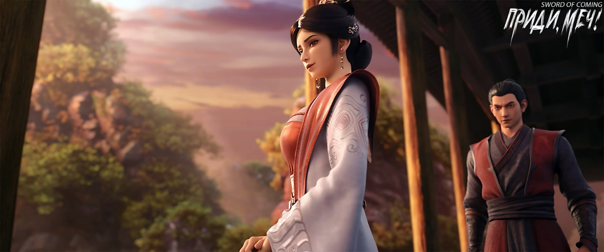
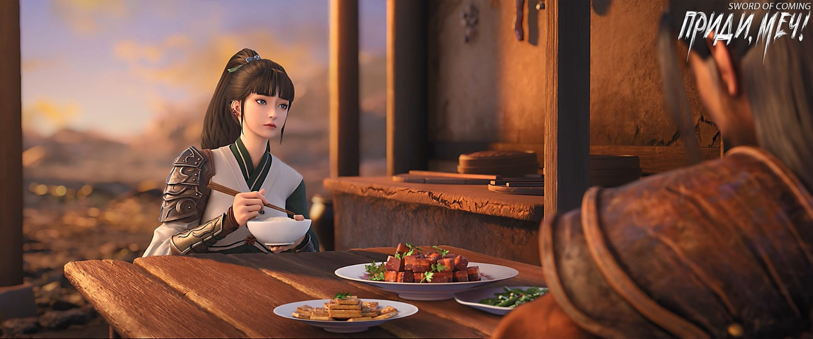
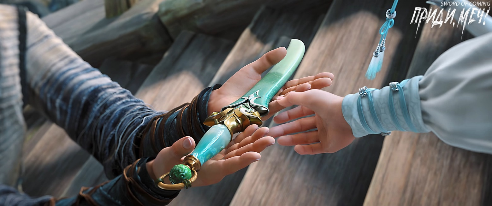

# Глава 46. Нож для прижимания одежды

Вскоре после того как Чэнь Пинъань покинул комнату, Жуань Сю топнула ногой и хотела броситься за ним, но мужчина, из просто мастера Жуаня ставший уважаемым мастером Жуанем, окликнул ее. Он серьезно сказал:

— Сюсю! Если ты сейчас вмешаешься, то только навредишь и погубишь этого Чэнь Пинъаня — вот тогда уже точно не будет пути назад.

Жуань Сю не повернулась, лишь резко мотнула головой, отчего ее блестящий черный хвост красиво взметнулся в воздухе. Ее взгляд стал острым, а тон почти укоризненным:

— Отец, ты ведь и в историю с Лю Сяньяном не вмешивался. И чем это кончилось?

Мужчина запнулся, но все же удержался от раскрытия «небесных тайн» и твердо произнес:

— Поверь отцу, сейчас лучшая помощь, которую ты можешь оказать тому юноше — рассказать ему правила и секреты этого малого мира, чтобы он старался действовать в рамках установленного порядка. Время, место и люди[1] — нужно использовать любое преимущество.

[1] 天时地利人和 — классическая триада факторов успеха: Небесное время — благоприятный момент. Земная выгода — выгодное положение. Человеческая гармония — поддержка людей.

Жуань Сю была в замешательстве и нерешительности. Мужчина махнул рукой и терпеливо продолжил:

— Дернешь за волосок — придет в движение все тело[2]. Ты — дочь Жуань Цюна. Даже если тот мальчишка из переулка Глиняных Кувшинов швырнет в пруд валун, всплеск будет мал — старого ублюдка на дне не потревожит. Значит, останется пространство для маневра. Но ты, Жуань Сю, — иной случай. Запомни, при важных делах нужно сохранять спокойствие. Сколько раз твердил — читай больше! Даже юнец из бедного переулка превосходит тебя в уравновешенности, а ведь ты совершенствующийся человек!

[2] «牵一发而动全身». Образно «одно небольшое действие может повлечь за собой серьезные последствия».

Мужчина, едва произнеся последнюю фразу, тут же пожалел об этом. Ничего не поделаешь — когда дело касалось его дочери, он никак не мог удержаться от последней фразы, которая все портила. К счастью, на этот раз Жуань Сю, казалось, не почувствовала себя обиженной. Она быстро выбежала из комнаты, оставив мужчину наедине со сложными чувствами.

Жуань Цюн взял стул и сел, проверив пульс Лю Сяньяна. Пульс был беспорядочным, как спутанная пенька — крайне скверное состояние. Его настроение и без того было неважным, а теперь лицо стало еще мрачнее, и он принялся ворчать:

— И что это Ци Цзинчунь делает? Гора Истинного Ян действует так своевольно — даже если нельзя по правилам изгнать их за пределы, можно хотя бы преподать урок, наказать для примера другим. Если нельзя убить, что плохого в том, чтобы хотя бы побить? Иначе в эти края будут постоянно прибывать новички, начнется еще большая неразбериха, разве не превратится все в хаос? Что, думает, раз через несколько дней уходить с должности, можно оставить мне полный бардак? Где же хваленая ответственность ученого человека…

Хромой старый управляющий сидел рядом, уставившись в одну точку, абсолютно не вмешиваясь, чтобы не навлечь на себя беду. Он лишь осмеливался про себя думать:

«Где же то самое спокойствие при важных делах?»

Закончив ворчать, Жуань Цюн вздохнул:

— То, что Ци Цзинчунь так связан по рукам и ногам — тоже неизбежность. Предыдущие слова можешь пропустить мимо ушей, но эту фразу не упусти.

Старый управляющий лавки семьи Ян, который все это время внимательно подслушивал, услышав это, мысленно восхитился:

«Недаром он будущий мудрец, который будет охранять священную обитель — его лицо уже может защитить от летящих мечей».

Жуань Цюн внезапно повернулся к управляющему Яну и спросил:

— Говорят, что выданная замуж дочь — что выплеснутая вода. Но она еще замуж не вышла, а уже держит чужую сторону?

Управляющий Ян, который долго сдерживался, не мог больше молчать, иначе это не соответствовало бы его несгибаемому характеру. Набравшись смелости, он сказал:

— Мастер Жуань, может быть, это из-за того, что у старика слабое зрение? Но мне кажется, что тот юноша не особо-то и любит вашу Сюсю.

Жуань Цюн посмотрел на управляющего Яна с жалостью и решительно заявил:

— Можешь не сомневаться, у тебя действительно слабое зрение!

Управляющий Ян тоже посмотрел на Жуань Цюна с сочувствием. Оба замолчали.

У колодца Жуань Сю догнала Чэнь Пинъаня, но молчала, словно не зная, как начать разговор.

Чэнь Пинъань улыбнулся ей. Он вспомнил их первую встречу на Спине Синего Быка — тогда он думал, что она немая или просто не знает местного диалекта. Теперь же он понял, что она просто неразговорчива.

Следуя за Чэнь Пинъанем к крытому мосту, Жуань Сю наконец набралась храбрости и сказала:

— Чэнь Пинъань, меня зовут Жуань Сю, а мой отец — Жуань Цюн, он мастер по отливке мечей. С детства я помогала отцу ковать железо и отливать мечи. В этот раз мы прибыли в ваш городок потому, что отец сказал — это поручение школы, да и местная земля и вода лучше всего подходят для создания печи для мечей, поэтому мы и ввязались в эту мутные воды. На самом деле я понимаю — отец хочет найти для меня счастливую возможность. Он просто очень гордый, как и твой друг Лю Сяньян. На самом деле отец очень хочет взять его в ученики. Ты, возможно, не знаешь, но если отец в будущем решит основать здесь свою школу, выбор первого ученика очень важен. Поэтому он не то чтобы бросил его умирать, не вини его…

Чэнь Пинъань покачал головой:

— Я не виню твоего отца, — тут он сделал паузу, вытер тыльной стороной ладони подбородок и с горечью сказал. — Знаю, что не должен винить других, но на самом деле очень злюсь, очень злюсь на твоего отца за то, что он не взял Лю Сяньяна в ученики раньше, злюсь, что когда с Лю Сяньяном случилась беда, никто не вмешался. Даже зная, что это неправильно, я все равно очень зол.

Жуань Сю кивнула:

— Это естественно для человека.

Чэнь Пинъань не хотел больше тратить здесь время и спросил:

— Юная госпожа Жуань, у вас ко мне какое-то дело?

Жуань Сю осторожно спросила:

— Ты ведь не собираешься сейчас идти мстить людям с горы Истинного Ян?

Чэнь Пинъань промолчал, не отрицая и не подтверждая.

Жуань Сю, которая и так не была сильна в красноречии, решила говорить все, что приходит в голову:

— Не будь таким опрометчивым! Гора Истинного Ян — известная и могущественная школа нашего Восточного континента Водолея. А статус той старой обезьяны равен статусу патриарха горы Истинного Ян. Даже если старая обезьяна не может использовать здесь духовные и божественные способности, справиться с тобой ему будет очень просто! К тому же после того, как он тяжело ранил Лю Сяньяна, учитель Ци обязательно накажет его, так что можешь не беспокоиться, что это происшествие будет проигнорировано…

Чэнь Пинъань прервал речь Жуань Сю:

— То наказание, о котором вы говорите, юная госпожа Жуань, — это когда убийцу просто выгонят из городка?

Жуань Сю онемела.

Чэнь Пинъань улыбнулся и, наоборот, принялся утешать Жуань Сю, глядя на нее искренним взглядом, чистым, как вода горного ручья:

— Юная госпожа Жуань, я ценю вашу доброту. Конечно же, я не настолько глуп, чтобы броситься напрямую и биться насмерть с таким небожителем.

Жуань Сю вздохнула с облегчением и по привычке похлопала себя по груди. Возможно, осознав, что этот жест слишком ребяческий и не подобает благородной девушке, она смущенно улыбнулась.

Чэнь Пинъань тоже улыбнулся и сказал:

— В прошлый раз я подарил тебе только три рыбы — это было слишком скупо с моей стороны.

Жуань Сю слегка покраснела и тут же с беспокойством спросила:

— Твоя левая рука?

Чэнь Пинъань поднял тщательно перебинтованную левую руку:

— Ничего страшного, уже не беспокоит.

Жуань Сю собралась с мыслями и медленно произнесла:

— Чэнь Пинъань, только не действуй опрометчиво. Сейчас положение учителя Ци в школе довольно сложное, и когда он будет передавать дела моему отцу, вполне возможно, что в городке произойдут кардинальные перемены. Хорошие или плохие — пока неизвестно, поэтому лучше сохранять спокойствие, чем действовать.

Чэнь Пинъань кивнул:

— Хорошо.

Жуань Сю почему-то занервничала. В конце концов, она сама была очень встревожена. По своему характеру она сейчас должна была бы броситься на ту старую обезьяну с горы Истинного Ян, но вместо этого увещевала Чэнь Пинъаня не рисковать, что противоречило ее натуре. Проблема была в том, что, как она и сказала, общая ситуация действительно требовала спокойствия, а не действий — это подсказывала ей интуиция. Если бы она, Жуань Сю, безрассудно отправилась требовать объяснений и даже вызвала бы серьезные проблемы, ее отец не остался бы в стороне и, скорее всего, смог бы все уладить. Но этот Чэнь Пинъань мог полагаться только на себя.

Чэнь Пинъань попрощался с Жуань Сю и направился к крытому мосту.

Только расставшись с одной девушкой, он встретил другую.

На каменных ступенях у южного конца крытого моста сидела девушка, перед которой лежали скрещенные меч и клинок. Ее лицо было строгим. На ней было темно-изумрудное платье, узкие брови сходились в напряженной складке, губы плотно сжаты. Рядом стояли два парчовых мешочка, расшитых золотыми нитями.

Чэнь Пинъань быстро подбежал к мосту, и как только достиг подножия ступеней, Нин Яо бросила ему два мешочка с медными монетами со словами:

— Возвращаю.

Чэнь Пинъань стоял у подножия лестницы, поймав обеими руками мешочки с деньгами, не зная, что сказать.

Нин Яо с суровым лицом произнесла:

— Я обещала обеспечить безопасность Лю Сяньяна, но не смогла этого сделать. Я, Нин Яо, подвела и тебя, Чэнь Пинъань, и Лю Сяньяна!

Нин Яо прекрасно понимала, что в этом городке юношу с обычным телом, чью грудь разбил одним ударом бессмертный, никто не мог спасти. Более того, если бы у Лю Сяньяна был хоть малейший шанс на спасение, то Чэнь Пинъань, со своим характером доброго простака, ни за что не отошел бы от кузницы ни на шаг, даже если бы ему грозило обезглавливание.

Чэнь Пинъань поднялся по ступеням и присел недалеко от нее, протягивая оба мешочка с деньгами обратно Нин Яо, и тихо сказал:

— Юная госпожа Нин, оставьте деньги себе. Вместе с тем мешочком, что спрятан у меня дома в переулке Глиняных Кувшинов — забирай все, мне они больше не нужны. Если можно, надеюсь, ты сможешь потратить их, чтобы нанять кого-нибудь присматривать за домами моей и Лю Сяньяна семей.

Нин Яо не взяла мешочки и рассмеялась от гнева:

— Может, тебе еще помочь каждый новый год развешивать парные надписи и изображения духов-хранителей?

Чэнь Пинъань с серьезным лицом ответил:

— Если можно, было бы замечательно.

Нин Яо чуть не задохнулась от ярости и выругалась:

— Что, в детстве тебя коровий хвост по морде ударил, и теперь ты имеешь право творить глупости?! Я с ума сойду! В общем, Чэнь Пинъань, не лезь в это дело! Думаешь, с твоими жалкими навыками ты сможешь справиться с обезьяной с горы Истинного Ян? За развалюхой Лю Сяньяна сам присматривай, и дурацкие надписи тоже сам покупай! Я, Нин Яо, не служанка!

Чэнь Пинъань посмотрел на Нин Яо и сказал:

— Юная госпожа Нин, хоть я и знаю вас недолго, но в одном я уверен: если бы вы были уверены, что сможете отомстить за Лю Сяньяна, вы бы ни за что не вернули мне эти деньги, по крайней мере, не сейчас.

Чэнь Пинъань положил деньги на ступеньку между ними:

— Юная госпожа Нин, сейчас такое время — думаете, у меня есть настроение говорить с вами любезности? Между вами, мной и Лю Сяньяном была просто сделка, вы же не собирались нас обманывать, просто случилось такое бедствие, кто мог предвидеть? Нет никаких причин, чтобы вы рисковали жизнью. Поверьте, не только я, Чэнь Пинъань, не хочу этого видеть, но и этот дурак Лю Сяньян тоже не хотел бы. Если бы он мог говорить, он бы сказал, что это мужское дело, женщинам не стоит вмешиваться… — Чэнь Пинъань вдруг ухмыльнулся: — Конечно, я не осмелюсь так говорить с юной госпожой Нин.

Нин Яо положила руки на меч в белых ножнах и прищурилась:

— Я сказала только половину. Чувство вины — это одно, но с тех пор как я сбежала из дома, я, Нин Яо, странствуя по свету, никогда не обходила препятствия стороной! — Нин Яо показала большим пальцем на свое сердце: — Здесь тоже!

Чэнь Пинъань сказал:

— Юная госпожа Нин, прежде чем что-то предпринять, можете дать мне время найти трех человек? После этого каждый будет действовать сам по себе!

Нин Яо спросила:

— Сколько времени нужно?

Чэнь Пинъань без колебаний ответил:

— Максимум полдня!

Нин Яо снова спросила:

— Кроме Ци Цзинчуня, кто еще двое?

Чэнь Пинъань покачал головой:

— Не спрашивайте, юная госпожа Нин.

Нин Яо нахмурилась:

— Канцелярия по надзору за гончарным производством этим заниматься не станет. Ты действительно думаешь, что это мелкое дело вроде кражи кур или уличной драки?

Когда Чэнь Пинъань собрался встать, Нин Яо строго сказала:

— Забери деньги!

Чэнь Пинъаню пришлось сначала подобрать их.

Нин Яо окликнула:

— Чэнь Пинъань! Подожди, сначала повернись спиной.

После того как Чэнь Пинъань отвернулся, она внезапно наклонилась, приподняла подол одежды и достала привязанный к голени старинный короткий нож. Встав, она протянула его Чэнь Пинъаню и сказала необычайно серьезным тоном:

— Это особый нож для разглаживания одежды[3] из моей родины, такой есть у каждой женщины. В критической ситуации приходится действовать по обстоятельствам, так что я не буду придерживаться местных обычаев. Но не забывай — я одалживаю тебе этот нож, а не дарю!

[3] П/п.: Подробности в конце главы.

Чэнь Пинъань был несколько озадачен, но протянул руку за ножом.

Нин Яо рассердилась:

— Двумя руками! Неужели не знаешь элементарных правил приличия?!

Чэнь Пинъань поспешно поднял вторую руку, все еще не понимая.

Нин Яо раздраженно сказала:

— Ты думаешь, несколькими осколками фарфора можно убить ту горную обезьяну? Цай Цзиньцзянь всего лишь немного продвинулась по пути совершенствования, а уж тем более та старая тварь с горы Истинного Ян от природы необычна, с толстой шкурой. Не то что осколки — даже обычное оружие бессмертных не сможет причинить ему ни малейшего вреда, в лучшем случае оставит пару царапин, какой в этом смысл? Ни черта не поможет!

Чэнь Пинъань держал нож обеими руками и не зная, куда его деть, сделал странное лицо.

Нин Яо сверкнула глазами:

— Собираешься человека зарезать, а мне выругаться нельзя?!

Чэнь Пинъань не нашел что ответить и, сам не зная почему, сел на ступени, подняв голову к южному небу.

Нин Яо стояла рядом с ним.

— Действительно может быть смерть, — в последний раз попытался отговорить Чэнь Пинъань.

Нин Яо скрестила руки на груди. На одном боку у нее висел меч, на другом — клинок. С безразличным выражением лица она произнесла:

— Мертвецов я видела больше, чем ты живых людей. — Затем намеренно небрежным тоном добавила: — Тот нож для разглаживания одежды можешь привязать к руке и спрятать в рукаве.

— Хорошо, — кивнул Чэнь Пинъань.

Он с силой хлопнул себя по колену, встал и вдруг сказал:

— Я очень рад, что познакомился с вами.

Нин Яо резко повернулась и первой пошла по крытому мосту. Девушка, полная героического духа, с длинным мечом в белых ножнах и узким клинком в светло-зеленых. В этот момент ее силуэт стал самым прекрасным зрелищем, которое Чэнь Пинъань когда-либо видел в своей жизни.

В этот миг Чэнь Пинъань подумал, что даже если ему удастся покинуть городок, он никогда не увидит сцены более волнующей, чем эта.

«Жизнь прожита не зря», — подумал он. После разговора с даосом Лу он стал более осторожным и начал бояться смерти, но теперь, как и прежде, этот страх полностью исчез. Умереть так умереть.

※※※※

П/п:. Мне стало интересно, что за аксессуар такой и нет ли в нем чего-то необычного. Информации в сети не так много, но кое-что все равно удалось накопать.

压衣刀 — «нож для прижимания/выравнивания одежды».

Согласно энциклопедиям, первичное назначение такого ножа — практическое. Утилитарный предмет для бытовых целей — разглаживание складок ткани, фиксация элементов одежды (например, в традиционных ханьфу или ципао). Появился в эпоху Мин-Цин как аксессуар аристократии, так как шелковые и парчовые одежды требовали особого ухода. Позже распространился среди простых людей.

Также имел свою символику: У мужчин — элемент статуса (часто богато украшался). У женщин — знак совершеннолетия (дарился в 15–16 лет), оберег от злых духов. В кризисных ситуациях — оружие самообороны, особенно для женщин.

Теперь немного в контексте романа: Скрытое ношение (на голени под одеждой) и формулировка «в чрезвычайной ситуации действовать по обстоятельствам» указывают на приоритет боевой функции. Упоминание «не забыть вернуть» подчеркивает символическую ценность предмета, связанную с личностью Нин Яо и ее культурой.

Также была подчеркнута особая церемониальность передачи ножа двумя руками. Использование двух рук при принятии предмета в китайской культуре — это жест, который несет в себе глубокий символический смысл. Почтение к дающему: Две руки символизируют, что вы полностью сосредоточены на человеке и цените его жест. Это подчеркивает, что дар (или даже временная передача) — важное действие. Смирение: Принимающий демонстрирует, что не считает себя выше дарителя. В конфуцианстве это связано с идеей ли (礼) — ритуала, поддерживающего гармонию в обществе. Открытость: Две руки, в отличие от одной, показывают, что у принимающего нет скрытых намерений. Уважение и почтение к самому предмету: Если вещь ценная, священная или символическая, две руки подчеркивают ее значимость. Нож как символ: не просто оружие, а часть идентичности рода Нин Яо. Принятие его одной рукой воспринимается как пренебрежение к ее традициям.