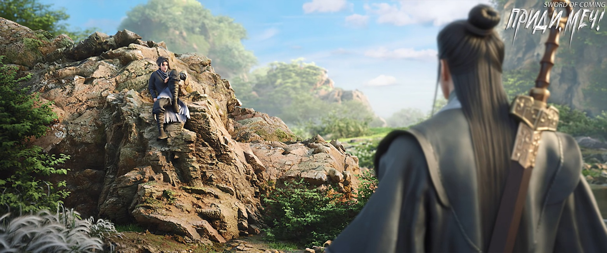
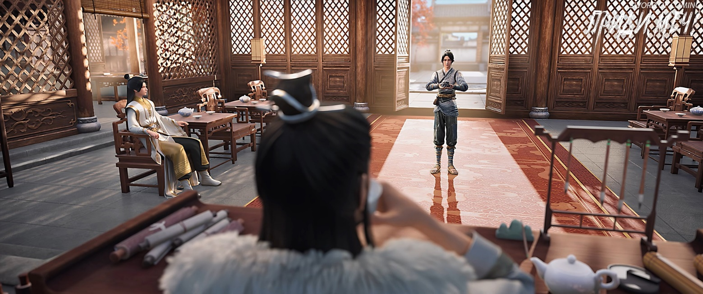
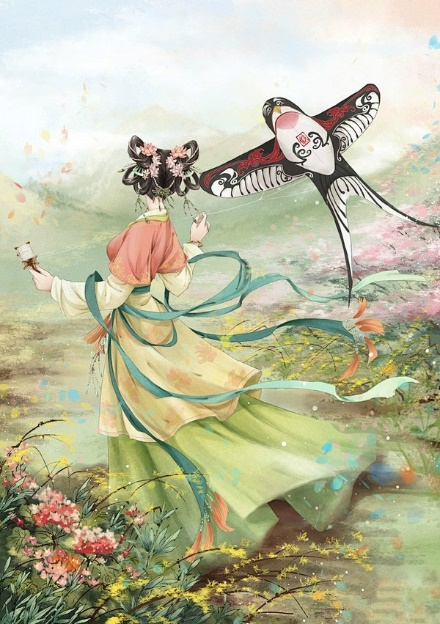

# Глава 47. Действовать в одиночку

Чэнь Пинъань и Нин Яо разошлись у двенадцатиногой мемориальной арки. Чэнь Пинъань направился в переулок Глиняных Кувшинов и постучал в дверь:

— Сун Цзисинь, ты дома?

Чжигуй, которая как раз зачерпывала воду черпаком из тыквы на кухне, несколько раз икнула, но, выпив воды, сразу почувствовала себя лучше. Она отложила черпак, неторопливо вышла из кухни и поспешила открыть ворота. Хотя ситуация показалась ей странной, она все же учтиво ответила:

— Моего молодого господина нет дома. Чэнь Пинъань, почему ты стучишь? Раньше ты всегда стоял в своем дворе и разговаривал с нами оттуда.

— Есть дело, — сказал Чэнь Пинъань через ворота.

— Редкий гость, редкий гость, — пошутила Чжигуй.

Взглянув на выражение его лица, она спросила:

— Зачем ищешь моего молодого господина? Если не срочно, я могу потом передать. А если срочно, наверное, придется идти искать его в канцелярии — ты же сам видел, у моего господина хорошие отношения с новым надзирающим чиновником господином Суном.

Заметив, что Чэнь Пинъань стоит как вкопанный, она закатила глаза:

— Да заходи же, чего встал там?! Это что, логово дракона и тигра, или за глоток воды с тебя возьмут серебряный лян? — Тут Чжигуй прикрыла рот и кокетливо засмеялась: — Для тебя, наверное, второе страшнее.

— Вообще-то я пришел к тебе, — натянуто улыбнулся Чэнь Пинъань и тихо добавил: — А так кричал, чтобы Сун Цзисинь не понял неправильно.

Чжигуй понимающе улыбнулась:

— Тогда говори, какое дело? Сразу предупреждаю — соседи соседями, дружба дружбой, но я всего лишь маленькая служанка в переулке Глиняных Кувшинов, живу под чужой крышей. Ни поднять, ни унести ничего не могу, большую помощь оказать не смогу. Но если тебе нужно одолжить денег — если проблему можно решить деньгами, тебе повезло, у меня есть небольшая идея.

— На самом деле дело не в деньгах, — горько усмехнулся Чэнь Пинъань. — Скажу прямо: Лю Сяньяна тяжело ранили у крытого моста. Старый управляющий лавки семьи Ян смотрел его, но ничем не смог помочь.

— Я об этом не слышала. С кем Лю Сяньян связался? — растерянно спросила Чжигуй.

— С приезжим, он с места под названием гора Истинного Ян, — беспомощно ответил Чэнь Пинъань.

— Так ты хочешь использовать связи, чтобы найти для Лю Сяньяна хорошее место для захоронения? — осторожно спросила Чжигуй. — Это нетрудно, я могу попросить моего молодого господина замолвить словечко надзирающему чиновнику, а потом через управляющего канцелярией или привратника обратиться к старику Вэю из переулка Персиковых Листьев, чтобы нашел место. Если только не занимать участок на казенной запретной земле, думаю, это несложно.

Лицо Чэнь Пинъаня, и без того смуглое, стало еще темнее.

Видимо, Чжигуй тоже поняла, что ошиблась в своих предположениях. По привычке она усмехнулась, показав ряд белоснежных ровных зубов. Прислонившись к стене с весенними парными надписями, она склонила голову набок и с игривой улыбкой спросила:

— Чэнь Пинъань, ты хочешь, чтобы я отплатила тебе за спасение моей жизни? Но я всего лишь служанка. Если даже старый хозяин лавки семьи Ян ничего не может поделать, что могу сделать я?

После внутренней борьбы Чэнь Пинъань медленно произнес:

— Ван Чжу, я знаю, что ты не обычный человек. В тот снежный день, когда я увидел тебя у ворот своего дома, я сразу понял, что ты отличаешься от нас. Позже ты первая заметила необычность камня змеиной желчи. Теперь, вспоминая, как ты смотрела на нас, соседей, понимаю, что твой взгляд по сути ничем не отличался от того, как сейчас приезжие смотрят на нас.

— На самом деле, отличие есть, — широко улыбнулась Чжигуй.

Она презирала не только простых смертных, но и всех этих так называемых бессмертных и монахов. Некоторые истины, очевидные для нее, другими воспринимались как высокомерие и строптивость.

— Я пришел к тебе узнать, есть ли возможность спасти Лю Сяньяна, — сказал Чэнь Пинъань. — Я использовал один лист софоры, но это лишь едва удерживает в нем последний вздох. Хоть польза и невелика, но она есть. Поэтому я хотел спросить, нет ли у тебя листьев софоры, особенно лишних?

— Ты спрашиваешь, есть ли листья софоры у моего молодого господина Сун Цзисиня или у меня, сироты-служанки? — Чжигуй указала на себя.

Чэнь Пинъань пристально посмотрел на Чжигуй:

— Даже если у Сун Цзисиня они есть, он мне их не даст. Я спрашиваю тебя, Ван Чжу. Если они у тебя есть, одолжишь ли ты их мне? А если нет, знаешь ли ты другие способы спасти Лю Сяньяна?

Девушка, которую все это время называли Ван Чжу, потирая подбородок одной рукой и легонько похлопывая себя по животу другой, покачала головой:

— Нет больше, правда нет, не обманываю тебя. Если бы ты пришел раньше, возможно, осталось бы несколько листьев. Что касается других способов — конечно же, их нет. Я же не небожитель, откуда мне знать способы воскрешения мертвых и наращивания плоти на костях, верно? Чэнь Пинъань, нельзя требовать невозможного. Эх, я действительно ошиблась в тебе, думала, ты отличаешься от них и не из тех, кто требует благодарности за услуги.

— Правда нет? — Чэнь Пинъань все еще не терял надежды. — Неважно, смогу я это сделать или нет, но ты можешь хотя бы рассказать.

— В любом случае, у меня нет! — решительно ответила Чжигуй и покачала головой.

— Я понял, — слегка улыбнулся Чэнь Пинъань. Он развернулся и ушел, его худощавая фигура быстро исчезла в переулке Глиняных Кувшинов.

Чжигуй стояла у дверей дома в переулке, глядя на удаляющуюся спину Чэнь Пинъаня. На ее лице отразились сложные чувства, словно она и сочувствовала его несчастью, и злилась на его неспособность бороться.

— С таким трудом добытый лист софоры, и ты вот так его растратил? — гневно произнесла она. — Тогда можешь отправляться умирать вместе с Лю Сяньяном. В конце концов, чем раньше умрешь, тем раньше освободишься. Если повезет, в следующей жизни снова станете братьями по несчастью. Все лучше, чем те несчастные, у которых даже следующей жизни не будет.

Вернувшись во двор, она споткнулась о порог и невольно снова громко рыгнула.

— Немного объелась, — насмешливо произнесла она.

Внезапно она ускорила шаг, бросилась вперед и с силой наступила ногой, затем медленно присела, уставившись на землисто-желтую четвероногую змею с рогом на голове:

— Берешь в долг и возвращаешь — снова возьмешь без труда. Вы, пять маленьких тварей, если в будущем посмеете брать в долг и не отдавать, смотрите, как я с вас шкуру спущу, жилы вытяну и в одном котле сварю!

Четвероногая змея под ее ступней отчаянно извивалась, издавая тихое шипение, словно умоляя о пощаде.

После ухода из переулка Глиняных Кувшинов Чэнь Пинъань побежал в школу, но старик, отвечающий за уборку, сообщил ему, что учитель Ци еще вчера отправился с тремя приезжими в горы за пределами городка, чтобы исследовать глушь и найти диковинки. Туда и обратно путь займет не менее трех дней. Когда разочарованный Чэнь Пинъань уже собирался уходить, старик с метлой вдруг что-то вспомнил и окликнул его:

— Ах да, перед уходом учитель Ци наказал: если кто-то из переулка Глиняных Кувшинов будет его искать, передать тому юноше, что он уже объяснял принципы, и неважно, будет он сегодня в школе или нет — это не изменит исхода.

Чэнь Пинъань, словно заранее зная такой ответ, смотрел потухшим взглядом. Как стоячая вода с едва заметной рябью, безжизненно. Но все же он поклонился в благодарности:

— Спасибо, почтенный господин.

— Не заслуживаю я такого обращения, — поспешно отступил в сторону старик и с улыбкой махнул рукой.

Старик заметил, как Чэнь Пинъань медленно уходил, и как пройдя некоторое расстояние, кажется, поднял руку, чтобы вытереть глаза.

Старик тихонько покачал головой, вспоминая молодых людей примерно того же возраста. Сравнивая двух других многообещающих учеников — Сун Цзисиня и Чжао Яо — с этим юношей, он видел, что их жизненные пути различались как небо и земля. Воистину, одним сопутствует весенний ветер удачи, а другим достается осень невзгод.

Чэнь Пинъань снова вернулся домой, взял последний мешочек медных монет, спрятанный в глиняном кувшине, и с тремя мешочками денег направился на улицу Благоденствия и Достатка к канцелярии надзирающего чиновника по делам печей.

Привратник, услышав, что сосед Сун Цзисиня из переулка Глиняных Кувшинов хочет встретиться с Сун Цзисинем и господином надзирающим чиновником Суном, немного растерялся.

Чэнь Пинъань тайком протянул ему заранее приготовленную медную монету из эссенции золота, не говоря ни слова. Привратник опустил голову, взвесил монету, потер ее пальцами и все понял, но не спешил давать ответ.

Чэнь Пинъань быстро протянул еще одну золотистую монету. Привратник улыбнулся, но не взял ее.

— Раз уж ты понимающий человек, я спокойно помогу тебе с представлением. Иначе, если из-за тебя я потеряю эту должность, то действительно окажусь в дураках. Придержи пока монету у себя. Если управляющий разрешит тебе войти, отдашь мне позже. Если нет — я ничем не смогу помочь, и будем считать, что эта монета была мне не суждена. Как тебе такое?

Чэнь Пинъань энергично кивнул.

Вскоре пожилой управляющий пришел вместе с привратником. Тот подал знак Чэнь Пинъаню, предупреждая, чтобы тот ни в коем случае не доставал сейчас монету — открытая взятка была серьезным преступлением. К счастью, юноша не совершил такой глупости и просто последовал за пожилым управляющим в задний зал.

Привратник вздохнул, недоумевая: почему управляющий, как только услышал о юноше по фамилии Чэнь из переулка Глиняных Кувшинов, сразу согласился? С каких это пор порог канцелярии стал таким низким?

Он чувствовал себя неловко. Когда он говорил с управляющим, то и прямо, и намеками советовал ему не создавать лишних проблем и не пускать юношу. Правда, он не сказал этого открыто, полагая, что старый управляющий с его многолетним опытом службы наверняка все поймет.

Изначально молодой привратник рассчитывал просто получить монету, не рискуя, причем с чистой совестью. Теперь он лишь надеялся, что этот бедный юноша не окажется источником неприятностей.

В главном зале заднего двора на почетном месте сидел Сун Чанцзин в длинном белом халате и пил чай.

Сун Цзисинь расположился слева в гостевом кресле. Одной рукой он играл бамбуковым складным веером, то раскрывая, то закрывая его, и с улыбкой смотрел на приведенного Чэнь Пинъаня.

Черные стулья и белоснежное одеяние создавали яркий контраст.

Когда управляющий удалился, Сун Чанцзин, сидевший на почетном месте, отставил чашку и с улыбкой обратился к Чэнь Пинъаню:

— Присаживайся где удобно. На самом деле мы уже встречались в переулке Глиняных Кувшинов, просто тогда я не узнал тебя, иначе непременно поздоровался бы.

Сун Цзисинь находил это забавным — только он знал, что когда этот мужчина говорил о себе «я», это звучало несколько неестественно.

Чэнь Пинъань сел на стул напротив Сун Цзисиня.

Сун Чанцзин сразу перешел к делу:

— Чэнь Пинъань, ты пришел сюда из-за избиения Лю Сяньяна?

Чэнь Пинъань встал.

— Я надеюсь, что господин Сун сурово накажет преступника с горы Истинного Ян, а не просто изгонит его за пределы города.

Сун Чанцзин слегка улыбнулся:

— На самом деле этот городок — место без закона, что означает отсутствие здесь каких-либо законов династии. Положение надзирающего чиновника довольно щекотливое, у него нет прав вмешиваться в местные дела. Кроме того, здесь издавна следуют принципу: если народ не жалуется, чиновники не расследуют. Неважно, убили ли в богатом доме служанку или слугу, или произошла драка со смертельным исходом между простолюдинами — никто не приходит в этуканцелярию бить в барабан и взывать к справедливости. Так что, Чэнь Пинъань, ты пришел со свиной головой не в тот храм и молишься не тому Будде[1].

[1] Идиома «提着猪头走错庙，拜错菩萨» означает обратиться не к тому человеку или не в то место за помощью, ошибиться адресатом.

Манеры и речь Сун Чанцзина были мягкими и приятными, без капли высокомерия или надменности.

Чэнь Пинъань достал три мешочка с медными монетами и положил их на высокий табурет рядом со стулом, затем обратился к невозмутимому мужчине:

— Господин Сун, я знаю, что вы очень сильный человек. Я хочу узнать, можете ли вы спасти Лю Сяньяна? А если спасти не получится, то хотя бы добиться для него справедливости, чтобы убийца, лишив человека жизни, не смог просто уйти из города, как будто ничего не произошло.

Сун Чанцзин рассмеялся:

— Я очень силен? Наверное, тебе это сказала та девушка в черном, что живет в твоем доме? Да, из этого видно, что у нее исключительный талант к боевым искусствам, даже лучше, чем у твоего друга Лю Сяньяна. По правде говоря, я умею только убивать, спасать людей у меня не очень получается. К тому же, с какой стати я должен нарушать правила, которым здесь следуют тысячу лет, ради юноши, которого видел всего один раз?

Дойдя до этого места в разговоре, он указал на три мешочка с медными монетами:

— Лю Сяньян, лишившийся драгоценного доспеха и «Канона Меча», сам по себе не стоит таких денег, а что касается попытки купить мою благосклонность — этих денег далеко не достаточно. Неужели Дали рассорится с горой Истинного Ян из-за трех мешочков монет? Это абсолютно невозможно. Если об этом узнают, мы станем посмешищем для всего Восточного континента Водолея. Чэнь Пинъань, ты, возможно, пока не совсем понимаешь эти слова, но если в будущем у тебя будет возможность выйти в мир и посмотреть его, то поймешь, что это чистая правда.

Стиснув зубы, Чэнь Пинъань произнес:

— Господин Сун, не могли бы вы сказать, при каких условиях вы согласитесь помочь? Даже если вы считаете, что я не смогу выполнить их ценой жизни, но все же скажите.

Сун Чанцзин с удивлением во взгляде слегка улыбнулся:

— Чэнь Пинъань, я не пренебрегаю тобой и не пытаюсь намеренно усложнить тебе жизнь. Напротив, я считаю тебя интересным человеком, поэтому и готов потратить время, чтобы спокойно обсудить с тобой дело, понимаешь?

Чэнь Пинъань кивнул.

Сун Цзисинь сидел в неподобающей позе, скрестив ноги на стуле, и слегка постукивал сложенным веером по колену. Он наблюдал за ситуацией со стороны, как смотрят на пожар с противоположного берега — не вмешиваясь в происходящее.

Сун Чанцзин не обращал внимания на несерьезное поведение Сун Цзисиня. В городке этот князь владел таким количеством информации, что уступал лишь Ци Цзинчуню. Наконец он раскрыл сокровенную тайну:

— Чэнь Пинъань, тебе совершенно не нужно чувствовать себя виноватым, ошибочно полагая, что твой друг умер из-за тебя. На самом деле Лю Сяньян давно уже попал в безвыходное положение. Пока он не соглашался отдать «Канон Меча», это был тупик, потому что гора Истинного Ян непременно желала его смерти. Ни Ци Цзинчунь, ни мастер Жуань не смогли бы помешать этому. Дело не в том, что никто не мог победить ту старую обезьяну, просто цена была бы слишком высока — невыгодно и не стоило того.

Отпив чаю, Сун Чанцзин неторопливо продолжил:

— Чэнь Пинъань, ты когда-нибудь задумывался, почему даже ты, наименее достойный получить благословение предков, получил лист софоры, в то время как Лю Сяньян, обладающий таким талантом и крепким духом, не получил ни одного? Задумывался ли ты об этом?

— Прошу прощения за беспокойство, господин Сун, — сказал Чэнь Пинъань.

Он собрал три мешочка монет и попрощался с надзирающим чиновником.

Хотя Сун Чанцзин и не пытался его удержать, он лично встал, чтобы проводить гостя. Сун Цзисинь только собирался неохотно подняться, но, увидев, как дядя слегка покачал головой, плюхнулся обратно в кресло, удобно откинувшись на спинку.

Когда Чэнь Пинъань достиг порога, Сун Чанцзин неожиданно произнес:

— Есть два дела, которые я мог бы сделать, но не могу. Если ты выполнишь хотя бы одно из них, я, пожалуй, подумаю о том, чтобы помочь тебе проучить ту старую обезьяну.

Чэнь Пинъань поспешно остановился и обернулся с торжественным выражением лица.

Сун Чанцзин равнодушно сказал:

— Первое дело — найти возможность похитить девочку с горы Истинного Ян, которая находится рядом со стариком Юанем, чтобы пошатнуть его душевное состояние и заставить его задержаться в городке. Еще одно дело — ночью тайно срубить то старое дерево софоры, а затем вытащить ту железную цепь из колодца. Ты можешь сделать оба дела или только одно из них. Если ты сделаешь что-то одно, я вмешаюсь и помогу тебе нанести тяжелое ранение преступнику, а если ты сделаешь оба дела вместе, я убью за тебя эту старую обезьяну с горы Истинного Ян.

Сун Чанцзин с улыбкой пообещал:

— Раз слово дано, не отступлюсь от него! — Затем могущественный князь Дали произнес загадочную фразу: — Чэнь Пинъань, я верю, что ты способен чувствовать правду и ложь в словах.

Чэнь Пинъань молча удалился.

Не услышав от юноши громких заверений с битьем себя в грудь, Сун Чанцзин, напротив, счел это нормальным. Стоя в дверях спиной к находившемуся в комнате Сун Цзисиню, он спросил:

— Ты лучше его знаешь, как думаешь, возьмется он за это дело?

Сун Цзисинь покачал головой:

— Трудно сказать. В обычной ситуации заставить его делать то, что противоречит его совести, практически невозможно, но ради Лю Сяньяна, вероятно, все может измениться.

Сун Чанцзин стоял, заложив руки за спину, глядя в небо:

— Предположим, юноша действительно преподнесет нам приятный сюрприз, и этот князь воспользуется случаем вмешаться. Будь то сближение с горой Истинного Ян или союз с садом Ветра и Грома, можно выбрать лишь что-то одно, и неизбежно придется враждовать с другой стороной. Как ты считаешь, что будет лучше для нашего Дали: если этот князь будет сторонним наблюдателем, позволяя Дали поддерживать прохладные отношения с этими двумя силами, никогда не сближаясь до самой смерти, или если мы выберем одну из сторон?

Сун Цзисинь встал, похлопывая сложенным веером по ладони, и, неспешно прохаживаясь, после некоторых размышлений сказал:

— В мирное и процветающее время выбирай второе, в смутные времена — первое. — Затем он рассмеялся: — Независимо от того, царит ли за пределами городка мир или смута, похоже ты, дядя, уже сделал свой выбор.

Сун Чанцзин насмешливо фыркнул:

— Что нам, военным, делать в мирное время? Быть сторожевыми псами, охраняющими дома и поместья книжников?

Он повернул голову и посмотрел на застывшее лицо Сун Цзисиня:

— Этот князь уже понял, что истинный узел в твоем сердце — этот юноша, и тебе будет трудно развязать его в ближайшее время. Если ты покинешь городок с этим узлом в сердце, это помешает твоему дальнейшему совершенствованию. Поэтому ты сможешь своими глазами увидеть, как простодушный юноша с чистым сердцем превратится в человека, полного злобы и пошлости. Тогда ты поймешь, что злиться на такого человека — пустая трата времени.

Сун Цзисинь открыл было рот, но не стал возражать, лишь погрузился в глубокую задумчивость.

Сун Чанцзин вернулся в комнату, сел на почетное место и, запрокинув голову, одним глотком допил чай из чашки.

— Самое важное, что, затевая эту скучную интригу, помимо того, чтобы найти какой-нибудь неуклюжий предлог и попутно половить рыбку в мутной воде, этот князь также хочет, чтобы ты усвоил одну истину: на пути совершенствования, который тебе предстоит пройти, кто угодно может оказаться твоим врагом… даже я, твой родной дядя, Сун Чанцзин.

Сун Цзисинь был ошеломлен.

Сун Чанцзин холодно рассмеялся:

— Если полностью не вырвать помрачающий сердце узел, последствия будут бесконечны, как сорняки в дикой степи, которые от весеннего ветра прорастают вновь.

Затем с презрением и насмешкой добавил:

— Сун Цзисинь, который вскоре станет его высочеством принцем Дали, ты, должно быть, полон горечи и гнева? Но что ты можешь сделать сейчас? Так чем же ты лучше Чэнь Пинъаня, которым так легко манипулируют?

Сун Цзисинь пристально смотрел на этого мужчину с безмятежным выражением лица, сжимая веер так, что костяшки пальцев побелели.

Сун Чанцзин сидел прямо на стуле, с глубоким взглядом смотрел наружу, словно разговаривая сам с собой:

— Чем больше людей ты встретишь в будущем, тем интереснее тебе покажется одна вещь: все эти разговоры о воздаянии за добро и зло, о мести и справедливости, о силе народного гнева, все эти истории о талантливых юношах и прекрасных девушках, о том, что влюбленные непременно соединятся — все это лишь отрадные фантазии никчемных людей. Поэтому твой собственный кулак должен быть крепким. Надеяться на этого князя? На твоих родителей? Советую тебе поскорее выбросить эти мысли из головы. Иначе увести тебя из городка будет все равно что отнести твой труп на кладбище для бедняков. В семье императора каждый сам отвечает за свою жизнь и смерть.

Сун Цзисинь, весь в поту, обессиленно опустился на стул.

Хотя после того, как он узнал о своем истинном происхождении, юноша глубоко скрывал свое самодовольство и вел себя в канцелярии совершенно как обычно. Но под взглядом князя Сун Чанцзина, словно держащего в руках волшебное зеркало, обнаруживающее демонов, он был подобен только что принявшему человеческий облик оборотню, которого можно уничтожить парой небрежных слов.

Сун Чанцзин смотрел вдаль, словно его взгляд достигал самого юга Восточного континента Водолея, до того далекого Старого Города Дракона.

Князь почему-то вспомнил одно изречение:

— Человеческое сердце подобно зеркалу — чем чище оно изначально, чем меньше на нем пылинок, тем менее оно выдерживает испытания и проверки.

Сун Чанцзин считал, что, хотя книжники при дворе и были невыносимо болтливы, вызывая отвращение у богов и демонов, но иногда они изрекают такие великие истины, до которых им, военным, даже проживи они с мечом в руках тысячу лет, не додуматься и не постичь их до конца.

Сун Чанцзин отбросил свои мысли и, указывая рукой на юг, словно держа копье, с видимой угрозой сказал:

— Сун Цзисинь, если ты считаешь, что этот князь сегодня говорит неправильно, можешь так думать, но терпи. Только когда мы в будущем окажемся в Старом Городе Дракона и поменяемся местами, этот князь подумает о том, чтобы внимательно выслушать твое мнение!

Принц Дали Сун Цзисинь, уже придя в себя, улыбнулся:

— Поживем — увидим.

У ворот канцелярии Чэнь Пинъань, как и договаривались, передал привратнику вторую медную монету.

※※※※

У двенадцатиногой мемориальной арки Чэнь Пинъань увидел силуэт Нин Яо и поспешил к ней.

Нин Яо стояла под табличкой «Ци, достигающая созвездия Северного Ковша» и спросила:

— Ну как?

Чэнь Пинъань покачал головой:

— Я посетил всех троих, двоих удалось встретить, учителя Ци не застал, хотя ответ я знал с самого начала. Благородный муж не спасает. Учитель Ци действительно говорил об этом раньше.

Нин Яо нахмурилась, не говоря ни слова.

Чэнь Пинъань, сказав Нин Яо «будь осторожна», стремительно убежал.

Сначала он отправился в лавку семьи Ян, где на медную монету из золотой эссенции купил у знакомого старика множество лекарственных пузырьков, мазей и трав для лечения ушибов, и внутренних травм. Чэнь Пинъань прекрасно знал, как использовать и готовить все эти снадобья. Работа у драконовой печи была опасным ремеслом, где часто случались разные происшествия. Хотя старик Яо и недолюбливал Чэнь Пинъаня, считая его лишь наполовину учеником, но не мог не признать, что юноша был расторопным и бесхитростным. Поэтому многие поручения, связанные с беготней и тратой денег, доверяли именно ему — например, покупку и приготовление лекарств для раненых работников печи.

Вернувшись в родовой дом в переулке Глиняных Кувшинов, Чэнь Пинъань закрыл дверь и первым делом начал готовить лекарство от внутренних травм. Пока следил за огнем, разложил на столе выстиранную добела, но еще крепкую одежду и разорвал ее на полосы для перевязки. Известный своей скупостью, сейчас он совсем не жалел об этом. Затем привязал к руке нож для разглаживания одежды, одолженный у Нин Яо, и обмотал свои голени и запястья слоями хлопковых полос.

Чэнь Пинъань снял со стены самодельный деревянный лук, поколебался, но все же решил не брать его с собой. Вместо этого взял с подоконника рогатку и мешочек с камешками.

Он поступал так, даже зная, что это невозможно, и не жалел о трех своих неудачах. Это было его особое упрямство — если не попробовать, останется чувство неудовлетворенности. Как тогда, когда он в последний раз умолял старого хозяина в кузнице дать ему еще один шанс.

Сначала он пошел к загадочной Чжигуй в надежде найти проблеск надежды для Лю Сяньяна. Затем отправился к учителю Ци, наивно надеясь, что тот восстановит справедливость. Наконец, пошел к так называемому мастеру боевых искусств и надзирающему чиновнику господину Суну, о котором говорила Нин Яо, готовый потратить все свое состояние на эту сделку.

Чэнь Пинъань с самого начала все ясно понимал, поэтому сейчас, хоть и был разочарован, но не чувствовал себя убитым горем.

На самом деле ни князь Сун Чанцзин, ни сосед Сун Цзисинь совершенно не понимали Чэнь Пинъаня. Некоторые вещи нужно делать, даже если придется умереть. Но есть и такие, которые нельзя делать даже под страхом смерти.

Чэнь Пинъань сидел на корточках в углу, тихо ожидая, пока сварится лекарство. Этот отвар был особенным — он не имел никакого другого действия, кроме как унимать боль. Однажды у драконовых печей работал человек, страдавший от странной болезни. Он пролежал в постели полдня, почти при смерти, и, что хуже всего, его лицо и конечности искривились от боли. Позже в лавке семьи Ян дали такой рецепт, и вскоре тот человек умер, но умер без мучений. У него даже хватило сил сесть, оставить последние распоряжения, а затем в сопровождении старика Яо в последний раз взглянуть на печи.

Чэнь Пинъань думал, что ему это тоже может пригодиться.

Заметив на столе еще несколько лоскутов, он снял с ног изношенные соломенные сандалии и достал новую пару обуви, которую все никак не решался надеть. Затем принес глиняный горшок и вынул из него осколки фарфора.

Примерно через два часа, закончив все приготовления, Чэнь Пинъань открыл дверь и бесшумно вышел из переулка Глиняных Кувшинов.

Близился закат, солнце уже не слепило глаза, а на горизонте громоздились слои пылающих облаков необычайной красоты.

Чэнь Пинъань направился к улице Благоденствия и Достатка. На мощеной синим камнем улице не было прохожих, юноша шел один.
