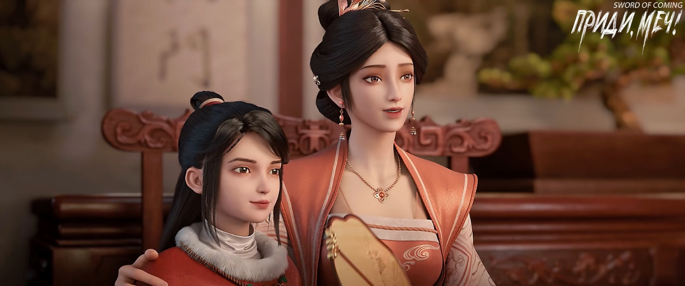
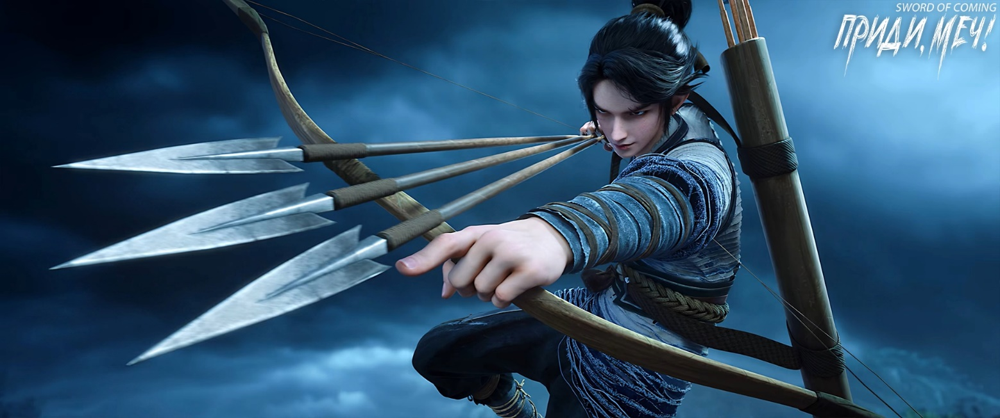

# Глава 48. Бумажный змей

П/п.: 纸鸢 — дословно «бумажный коршун» (традиционный китайский воздушный змей). Запуск змея ассоциируется с отпусканием оков, стремлением к свободе. Часто связан с детством, беззаботностью. А в даосской традиции попытка «достичь небес», символизирующая духовные поиски.

При переводе я использую разделение глав по старому, сетевому варианту книги, хотя сам текст использую из новой редакции (издательской, тщательно переработанной). В издательском варианте текст разделяется на арки, а не главы, и именно сейчас начинается новая, которая называется «Небо движется неуклонно», что является частью цитаты из «И Цзин» (Книги Перемен). Полная фраза: «天行健，君子以自强不息» — «Небо движется мощно и неуклонно; благородный муж совершенствует себя без устали». Цитата упоминается не просто так. Как вы помните, эти самые слова в 15 главе Ци Цзинчунь сказал Чжигуй, когда они обсуждали Чэнь Пинъаня и то, почему Ци Цзинчунь к нему «неблагосклонный».

※※※※

В эти дни Чэнь Пинъань часто разносил семейные письма по улице Благоденствия и Достатка и переулку Персиковых Листьев. Почти все привратники в каждом доме уже знали этого посыльного, поэтому его появление не вызывало подозрений. К тому же он держался естественно, как обычно бегал трусцой по мощеным улицам, и даже если прохожие замечали его, не придавали этому значения.

Чэнь Пинъань подошел к одному из особняков, перед воротами которого стояла каменная стела в половину человеческого роста, изображающая военачальника. Он знал, что это особняк семьи Ли. На улице Благоденствия и Достатка, где жили самые богатые и знатные семьи, почти у каждого дома были свои способы отгонять злых духов. Даже изображения духов-хранителей на воротах, делились на гражданских и военных[1], поэтому дома легко можно было различить.

[1] Духи-хранители ворот (门神) — парные изображения на дверях, защищающие дом от зла. Делятся на два типа: 文门神 — «гражданские» духи (часто ученые или божества с свитками); 武门神 — «военные» духи (воины в доспехах и с оружием).

Чэнь Пинъань быстро осмотрелся по сторонам и продолжил путь. Впереди находился дом семьи Сун, а за ним — канцелярия надзирающего чиновника по гончарным делам. На границе между большими особняками семей Ли и Сун, у внешней стены росла софора с узловатым стволом и пышной кроной. Хотя она и не могла сравниться с древней атмосферой старой софоры из городка, но с первого взгляда было ясно, что это дерево не совсем обычное.

Старшее поколение говорило, что эта софора связана с тем огромным старым деревом софоры в центре городка. То дерево называли «софорой предков», а то, которое видел перед собой Чэнь Пинъань — «софорой потомков».

Причина, по которой Чэнь Пинъань пришел к семье Ли, а не к семье Лу в городке, где находился Лу Чжэнчунь, крылась в разговоре со старым управляющим, который провожал его из канцелярии. Тот как бы невзначай поделился местными сплетнями: например, что подающий надежды молодой ученый Чжао Яо из семьи Чжао на этой улице уже покинул городок, и ему точно суждено стать первым на императорских экзаменах и занять высокий пост. Или что в соседнем доме семьи Сун есть девушка на выданье, которая даже не умеет хорошо шить и вышивать, а только и любит, что махать мечом — разве это подобает благородной девице, не смешно ли? Среди всей этой мелочной болтовни старик упомянул одну незначительную новость: в особняк семьи Ли только что прибыл гость с высоким статусом, а маленькая девочка была такой красивой, словно фарфоровая статуэтка императорского двора.

«Если она не изменится, когда ей исполнится восемнадцать, то определенно вырастет редкой красавицей. Интересно, какой семье повезет взять такую невестку в свой дом», — рассуждал он.

Чэнь Пинъань поначалу после выхода из заднего зала канцелярии только слушал и молчал, намеренно шел очень медленно, внимательно изучая планировку здания. Под конец он как бы невзначай задал пару вопросов, будто бедняк, любопытствующий о роскошной жизни знатных семей. Старый управляющий рассказал все, что знал — на примере соседней семьи Сун и более отдаленной семьи Ли объяснил юноше расположение построек в усадьбах богатых домов и различные правила. Истинные намерения управляющего были Чэнь Пинъаню прекрасно понятны. Однако с самого начала и до конца он не собирался действовать согласно их желаниям.

В этот момент Чэнь Пинъань медленно бежал вдоль улицы. Увидев, что вокруг никого нет, он внезапно ускорился и помчался прямо к старой софоре. Одним прыжком он сделал четыре последовательных шага вверх по стволу дерева, и только потом начал падать, но к тому моменту успел ухватиться за ветку. В одно мгновение Чэнь Пинъань, ловкий, как горная обезьяна, уже сидел на горизонтальной ветке, затем уверенно встал и продолжил карабкаться вверх. Через несколько мгновений он уже сидел на корточках на наклонной ветке софоры, которая возвышалась над стеной высотой в два чжана. Скрывшись за густой листвой, он затаил дыхание и прищурившись смотрел вдаль, совсем не торопясь проникнуть внутрь.

По пути назад от крытого моста в городок Чэнь Пинъань засыпал Нин Яо вопросами. Например, насколько быстро может бежать и как высоко прыгать старая обезьяна с горы Истинного Ян в пределах городка при обычных обстоятельствах? Насколько крепко его тело, что значит «медная кожа и железные кости»? «Если мой удар кулаком для старой обезьяны все равно что щекотка, то какой урон нанесет рогатка или деревянный лук с расстояния в двадцать и сорок шагов? Есть ли у этого так называемого бессмертного, старика Юаня с горы Истинного Ян, смертельные слабости, например, глаза, пах или горло? Если противник готов пожертвовать собой, чтобы убить меня, неизбежна ли моя смерть?» Тогда Нин Яо от его вопросов чуть не пожалела, что она не глухонемая.

По словам Нин Яо, чем выше уровень практики у совершенствующегося, будь то практик ци или чистый боец, тем большее давление он испытывает в этом месте. Это похоже на то, как железная конница может только обороняться насмерть при нападении на ворота, полагаясь исключительно на непрерывную поддержку ци. Как только они откроют рот, получат урон, подобный хлынувшей морской воде.

«Представь, что будет, если сделать маленькое отверстие в дамбе перед бушующим потоком?»

Однако окончательный вывод Нин Яо все равно был таков: в прямой схватке со старой обезьяной с горы Истинного Ян у него нет ни единого шанса на победу.

В тени софоры Чэнь Пинъань с решительным взглядом и холодным выражением лица тихо бормотал:

— Нельзя подпускать старую обезьяну ближе десяти шагов, десять шагов — минимальная дистанция, которую нужно держать.

Нин Яо сказала, что пока старая обезьяна не будет загнан в угол, у него есть шанс выжить. Но Чэнь Пинъань ответил, что нужно заставить старую обезьяну нанести ему смертельный удар, иначе в этом нет смысла.

Необходимо было разозлить старую обезьяну с горы Истинного Ян, заставить его использовать внутреннюю ци, только тогда можно будет действительно истощить накопленное за тысячу лет совершенствование. Возможно, старая обезьяна считает, что жизни таких горожан, как он и Лю Сяньян, ничего не стоят, но Чэнь Пинъаню очень хотелось узнать, будет ли старой обезьяне больно видеть, как исчезает его совершенствование, и будет ли он тогда считать это ценным. Конечно, все это при условии, что его самого не убьют одним ударом при первой же встрече.

Наблюдая сверху за людьми, снующими по павильонам и строениям особняка, он прошептал:

— Даже если не смогу убежать, нужно выдержать хотя бы несколько ударов.

Чэнь Пинъань даже не думал, что сможет убить старую обезьяну, и тем более не думал, что сможет выжить сам.

※※※※

В большом особняке семьи Ли маленькую девочку с горы Истинного Ян, прямую внучку патриарха семьи Тао, все домочадцы почитали как Бодхисаттву. Семья Ли выделила ей во внутреннем дворе несколько служанок первого и второго ранга. Эти молодые девушки, рожденные в семье слуг, были расторопные и умелые, но самое главное — их происхождение было ясным и безупречным, и их преданность семье Ли, возможно, передавалась из поколения в поколение, начиная с их предков.

Внутренний двор располагался в центре, не примыкая к улице Благоденствия и Достатка.

Девочку звали Тао Цзы, ласково называли Таоцзы[2]. Она была любимицей нескольких старых мастеров меча с горы Истинного Ян, конечно, не из-за своего милого и наивного нрава, а из-за ее будущих высот в искусстве меча, ради которых гора Истинного Ян не жалела огромных ресурсов.

[2] Тао Цзы (陶紫). Имя «Цзы» — «пурпурный», символ благородства и бессмертия. В даосизме пурпурный ассоциируется с высшими небесами. Таоцзы (桃子) буквально «Персик». Настоящее имя и прозвище звучат одинаково, но пишутся разными иероглифами. Это классический пример омофонического каламбура, подчеркивающего миловидность девочки (персик — символ юности и сладости). В китайских мифах персик бессмертия (仙桃) — плод с Дерева Бессмертия, растущего в садах Си Ванму. Возможен ироничный намек, что прозвище «Персик» может предвещать ее будущее «бессмертное» мастерство в мече.

За пятьсот лет «корень и кость», природный талант, характер и судьба — эти четыре качества Тао Цзы считались выдающимися даже среди патриархов разных пиков горы Истинного Ян всех поколений. Проще говоря, маленькая девочка была удивительным существом с множеством достоинств и без единого недостатка. Это действительно было явлением, случающимся раз в сто лет, а не обычной вежливой похвалой.

Сейчас, когда рядом с Тао Цзы не было Старой Обезьяны, Передвигающей Горы, и она оказалась одна в совершенно незнакомом месте, она не то чтобы боялась незнакомцев или робела, просто ей было скучно и немного досадно. Судя по словам дедушки Юаня, похоже, что отсюда невозможно унести гору. Это очень ее огорчало. Когда сестрица Су с горы Истинного Ян достигла среднего уровня пятой ступени совершенствования, патриарх подарил ей гору, ставшую ее личной территорией. Именно эту гору дедушка Юань лично принес на спине издалека и установил в северо-восточной части горы Истинного Ян. Хотя гора была небольшой, Тао Цзы всегда ей завидовала.

Почувствовав духоту в кабинете, она вышла в главный зал и, заложив руки за спину, с важным видом долго разглядывала табличку над входом. За ней неотступно следовали две изящные служанки, одну из которых семья Ли с детства выделила за незаурядные способности и целенаправленно обучала боевым искусствам, в которых она уже достигла некоторых успехов. Впрочем, для прямых потомков семьи Ли такое отношение было сродни содержанию цветов, птиц, рыб или насекомых — они вовсе не надеялись, что девушка в будущем станет мастером боевых искусств. За высокими стенами богатых домов случалось, что слуги притесняли хозяев, тем более что нередко за меру риса платят мерой вражды. Если у слуг и служанок кругозор слишком широк, а потенциал слишком велик, это не обязательно хорошо для наследования традиций следующим поколением семьи.

Тао Цзы направилась к главным воротам, прыгая и кружась по двору. Она не покидала двор самовольно, чтобы не ставить слуг в затруднительное положение. Дедушка Юань предупредил ее, что люди из сада Ветра и Грома тоже прибыли в городок, и до тех пор, пока он не разберется с ними, ей нельзя покидать этот двор. Хотя Тао Цзы была юной, но с детства была знакома с опасностями и интригами совершенствующихся на горе, к тому же получила строгое воспитание, поэтому не была своевольным ребенком, доставляющим беспокойство старшим.

В конце концов, заскучавшая Тао Цзы улеглась на каменный стол, на котором стояла клетка с птицей, похожей на ястреба-змееяда. Птица свесила голову, выглядела больной и вялой, ее перья были тусклыми и некрасивыми. Раньше, как бы она ни дразнила ястреба-змееяда, он не обращал на нее внимания, поэтому она находила его неинтересным, и теперь, совсем от безделья, она насвистывала этому жалкому пернатому созданию.

В клетке стояли две фарфоровые кормушки, изготовленные в частном порядке в драконовых печах семьи Ли — изящные и миниатюрные: одна простая для воды, другая яркая для еды. Но с тех пор, как змееяда поймали, он не пил ни капли воды и не ел ни крупинки риса уже почти два дня.

В городке змееядов удавалось поймать крайне редко, а в тех редких случаях, будь то птенцы или взрослые особи, все без исключения умирали от голодовки. Их невозможно было ни вырастить, ни приручить для охоты.

Видя, что змееяд по-прежнему не реагирует на ее свист, Тао Цзы окончательно потеряла терпение, встала и повернулась, чтобы уйти.

Внезапно раздался громкий хлопок — одна из кормушек в птичьей клетке разлетелась вдребезги.

Тао Цзы сначала на мгновение оцепенела, а затем почти инстинктивно схватила высокую служанку и поставила ее перед собой в качестве щита.

Высокая и пышнотелая служанка почувствовала, как ее запястье словно стянуло железной проволокой. Боль была такой сильной, что она чуть не закричала. Вторая служанка, невысокого роста и с острым взглядом, сразу сама встала перед Тао Цзы и быстро осмотрелась.

Вторая кормушка в клетке взорвалась, словно хлопушка на столе.

— Убийца! На крыше со стороны павильона Свежего Благоухания! — служанка, обученная боевым искусствам, наконец заметила силуэт на коньке крыши соседнего двора.

Служанка начала разбег — стены внутреннего двора были невысокими. Оттолкнувшись, она ухватилась за край и благодаря незаурядной силе рук быстро забралась наверх. На мгновение служанка заколебалась: этот двор находился недалеко от противоположного павильона Свежего Благоухания, но убийца засел на крыше главного здания, примыкавшего к улице Благоденствия и Достатка. Оттуда ему было легко перебраться через стену и скрыться. Она молниеносно приняла решение: не спрыгивая и не направляясь к павильону Свежего Благоухания, пригнувшись, побежала по стене и запрыгнула на крышу своего внутреннего двора. Все это время служанка не спускала глаз с убийцы, опасаясь внезапного нападения. Странно, но тот и не пытался помешать ей, и не спешил отступать.

Между карнизами двух дворов было расстояние примерно в три чжана. Служанка, не отрывая взгляда от убийцы, тихо отступала по карнизу, пока наконец не сделала глубокий вдох, готовясь к разбегу.

Сердце служанки дрогнуло — убийцей оказался худощавый юноша в потрепанной одежде! На его поясе были привязаны две маленькие сумки, но в руках не было видно никакого оружия — должно быть, он его уже спрятал. Служанка предположила, что, скорее всего, это была рогатка.

Она недоумевала: если бы он хотел попасть ей в голову — не то чтобы убить на месте, но точно нанести серьезную рану — то с его почти пугающей меткостью, ведь он дважды намеренно разбил кормушку для птиц, неужели он не смог бы попасть в нее или в ту девушку с горы Истинного Ян?

Во дворе Тао Цзы в гневе воскликнула:

— Дура! Осторожно, это может быть уловка «заманить тигра прочь от горы»! Быстро возвращайся!

Поймать убийцу и допросить под пытками, конечно, важно, но еще важнее было сохранить жизнь на случай непредвиденных обстоятельств.

Отпустив руку высокой служанки, Тао Цзы подняла ладонь и сильно ударила оцепеневшую от страха девушку по лицу, приводя ее в чувство:

— А ты быстро беги и подними тревогу! Знаешь ли ты, что если я умру, все в этом доме тоже умрут!

Служанка на крыше не сразу спрыгнула во двор, а громко крикнула:

— Убийца!

После этого она бросилась бежать и, оттолкнувшись от края карниза, взлетела по направлению к коньку крыши павильона Свежего Благоухания.

Юноша-убийца, оценив по движениям служанки ее силу рук, ног и общую выносливость, присел и поднял две черепицы. Его правая рука метнула их прямо в лоб служанки. Находясь все еще в воздухе, та инстинктивно скрестила руки перед головой. Раздались два глухих удара — не только пронзившая до костей боль, но и сила ударов оказалась далеко за пределами ее ожиданий. Весь ее порыв бежать вперед мгновенно остановился. Едва успев зацепиться за противоположный карниз и пожалев о своей самонадеянности, она получила удар кулаком в живот, от которого ее отбросило назад. Однако убийца почему-то схватил ее за лодыжку, на мгновение задержал и только потом отпустил. Приземление служанки вышло не самым удачным, но серьезных травм она не получила. В ее голове все перемешалось.

Юноша краем глаза осматривал окрестности и, заметив появившиеся вокруг черные точки, развернулся и бросился бежать. Его скорость, размашистые шаги и превосходный ритм, особенно в сочетании с точно рассчитанным дыханием — если бы та служанка могла это видеть, она бы непременно поняла, что юноша, как и она сама, много лет практиковал боевые искусства и явно не был новичком.

Силуэт юноши быстро исчез с крыши, подобно легкой птице или выпущенному из клетки ястребу-змеелову.

※※※※

Примерно через время, нужное для сгорания одной палочки благовоний[3], могучий старый Юань, излучая убийственную ауру, поспешно вернулся в большое поместье семьи Ли.

[3] П/п.: «Время, необходимое для того, чтобы сгорела палочка благовоний» — около 30 минут. «Один вздох» — 3 секунды, «одна чашка чая» — 15 минут, «один кувшин вина» — 2 часа. Это самые распространенные древнекитайские меры времени.

Начиная от главы семьи Ли — Ли Хуна, и заканчивая служанками в боковых помещениях — никто не смел даже громко дышать. Особенно та служанка, практиковавшая боевые искусства — она стояла на коленях с сильно опухшими щеками. Служанка не проронила ни слова и не осмеливалась выказать ни малейшего недовольства.

Тао Цзы, уже успокоившаяся, увидев старого Юаня, вздохнула и с укоризной произнесла:

— Дедушка Юань, похоже, все люди семьи Ли — просто никчемные. Как ты мог доверить меня им?

Горная Обезьяна, Двигающая Горы опустился на одно колено, но все равно оставался выше Тао Цзы, и с раскаянием произнес:

— Юная госпожа, это вина вашего старого слуги.

Старая обезьяна повернул голову и произнес низким голосом:

— Ли Хун!

Глава семьи Ли, который немного понимал классический язык Восточного континента Водолея, и, по счастливому совпадению, точно такой же язык использовали практики с горы Истинного Ян, был человеком, чье слово в семье имело непререкаемый авторитет. Он мог лишь горько усмехнуться и извиниться:

— В этот раз это действительно была оплошность нашей семьи Ли, и мы не можем это отрицать. Исходя из имеющейся у нас информации, это был юноша, скорее всего не совершенствующийся. Канцелярия пока не предоставила никаких полезных сведений, там лишь сообщили, что направит дополнительных способных людей для круглосуточной охраны усадьбы.

Тао Цзы немного подумала и сказала:

— Тот убийца, похоже, пришел не для того, чтобы убить меня. — Затем добавила: — По крайней мере, не сегодня.

Сердце главы семьи Ли, которое только начало успокаиваться, тут же снова подскочило к горлу.

Старая Обезьяна нахмурившись спросил:

— Этот юноша был худощавого телосложения, со смуглой кожей, ростом примерно вот до этого уровня?

Служанка, стоявшая на коленях, энергично закивала.

Старая Обезьяна оскалился в улыбке, его взгляд стал мрачным:

— Ну и дела! Значит, пришел бросить вызов! — Он махнул рукой. — В это дело вам лучше не вмешиваться. Я знаю, кто этот убийца — он обычный юноша из переулка Глиняных Кувшинов.

Тао Цзы тихо сказала:

— Дедушка Юань, не стоит недооценивать его.

Горная Обезьяна, Двигающий Горы немного поколебался, затем встал и приказал главе семьи Ли:

— Пусть канцелярия предоставит в поместье семьи Ли документы из архива домовладений и тщательно проверит все восемнадцать поколений предков этого юноши. Что касается охраны этого павильона — лучше меньше, да лучше, не нужно много разношерстной стражи!

Старая Обезьяна внезапно сделал голос тяжелее и холодно усмехнулся:

— Ли Хун, советую тебе пригласить сюда вашу главную опору, не стоит относиться к этому легкомысленно. Если с моей госпожой здесь что-то случится, даже я, старое животное в ваших глазах, этого не выдержу, а уж ваша боковая ветвь семьи Ли и подавно!

Ли Хун поспешно поклонился с извинениями и в тревоге произнес:

— Патриарх Юань, вы слишком преувеличиваете значимость семьи Ли.

Старая Обезьяна с горы Истинного Ян погрузился в размышления, бормоча:

— Неужели это мальчишка из сада Ветра и Грома ищет повод для ссоры? Или это замысел Сун Чанцзина из канцелярии?

В конце концов он покачал головой, находя это абсурдным и смешным:

— Кто бы ни подстрекал его идти на смерть, даже не нашел пешку получше. Тощий кузнечик, даже зубы нечем почистить! Ну и ладно, как раз не было повода убить кого-нибудь. Это хороший предлог — сначала убью того деревенщину из переулка Глиняных Кувшинов, а потом разберусь и с тобой, отродье из сада Ветра и Грома! — Старая обезьяна улыбнулся Тао Цзы: — Юная госпожа, этот старый слуга обязательно приведет все в порядок, больше никаких неожиданностей не будет.

Тао Цзы ослепительно улыбнулась и подняла кулак, подбадривая старую обезьяну с горы Истинного Ян.

Перед уходом он взглянул на главу семьи Ли, Ли Хуна.

— Я сейчас же пойду просить почтенного предка спуститься с горы, чтобы лично стать телохранителем юной госпожи Тао, — с горькой улыбкой сказал тот.

Старая обезьяна кивнул и широким шагом удалился. Он нарочито беспечно заглотил наживку и направился прямо по леске к переулку Глиняных Кувшинов.

«Я попался на крючок, приходи и убивай», — думал он.

За пределами городка эта горная обезьяна с горы Истинного Ян не осмелился бы быть столь высокомерным. Но в этом месте использование духовных техник, божественных сил и артефактов было строго запрещено, что давало ему огромное преимущество. Этим же объяснялось, почему гора Истинного Ян не отправила ни одного патриарха-мечника.

По пути к переулку Глиняных Кувшинов старая обезьяна внезапно задумался:

«Неужели тот юноша из переулка просто хотел отомстить за друга?»

До этого момента он размышлял о глубоких заговорах, скрытых связях и далеко идущих планах. Но когда эта мысль пришла ему в голову, она показалась особенно нелепой. Он рассмеялся, быстро поняв логику:

«Если так, то это имеет смысл. И правда, раз он не совершенствующийся, то и смерти не боится — для него это всего лишь жалкая жизнь».

Тем не менее, из осторожности он все же не стал входить в переулок Глиняных Кувшинов с парадного входа.

В любом случае, этот путь не будет напрасным. Тот маленький выродок, которого так ценили в саду Ветра и Грома, всего лишь проживет немного дольше, чем этот оборванец из переулка Глиняных Кувшинов.

Сделав большой крюк, старая обезьяна вошел в переулок Глиняных Кувшинов со стороны угла, ближе к дому Гу Цаня. На самом деле он сильно сомневался, хватит ли у того юноши-убийцы смелости остаться в родовом доме и ждать смерти. Если тот умен и труслив, то мог бы умереть после юноши из сада Ветра и Грома. Старая обезьяна ухмыльнулся, но его улыбка мгновенно застыла.

В сумерках переулок Глиняных Кувшинов уже казался темным и размытым. Крепкий старая обезьяна внезапно поднял голову — худощавый юноша каким-то образом оказался на возвышении в начале переулка. Упираясь ногами в недавно проделанные в стенах отверстия, он удерживал равновесие. Чэнь Пинъань с колчаном за спиной держал полностью натянутый деревянный лук, наконечник стрелы был направлен прямо в глаз старой обезьяны. Юноша замер в полной тишине: не только натянув лук подобно полной луне, но, казалось, даже его едва заметное дыхание исчезло. Настолько, что этот патриарх-защитник горы Истинного Ян смог обнаружить присутствие юноши над головой только благодаря своему острому чутью на опасность.

Не дав старой обезьяне времени на реакцию, стрела сорвалась с тетивы и со свистом понеслась вперед, обладая огромной силой и мощью. Выпустив стрелу, Чэнь Пинъань, не думая о втором выстреле, втянул шею, быстро закинул деревянный лук на плечо и, оттолкнувшись носками ног, начал перемещаться между стенами. Он взобрался на карниз крыши и исчез в мгновение ока.

Старая обезьяна убрал ладонь, которой прикрывал лоб — стрела вонзилась неглубоко, виднелась лишь небольшая рана, из которой сочилась кровь. Но его охватил запоздалый страх. Если бы в городке ему попали стрелой в глаз с такого близкого расстояния, это была бы настоящая трагедия, когда хоть к небу взывай, хоть к земле — никто не поможет.

Вырвав стрелу, он сломал ее и бросил на землю. Старая обезьяна сжал кулаки и запрокинул голову, глядя в небо. Его лицо посинело от гнева, горло задрожало, издавая низкий сдавленный звук, словно разъяренный древний хищный зверь. Он мгновенно вскарабкался на крышу, используя руки и ноги, но как только показалась его голова, подоспела вторая стрела. Уже готовый к этому, он просто поднял руку, позволив стреле лишь слегка вонзиться в предплечье, и с жестокой усмешкой сделал широкий шаг вперед. Чэнь Пинъань снова убрал деревянный лук и бросился бежать.

На крышах домов вдоль переулка раздался громкий треск. Старая обезьяна, чьи шаги были намного шире, чем у Чэнь Пинъаня, постепенно сокращал дистанцию. Без сомнения, он вскоре должен был догнать этого худощавого юношу, который, впрочем, двигался довольно ловко. Старая обезьяна внезапно напрягся, подпрыгнул в воздух и бросился вперед, протянув огромную руку размером с веер к голове Чэнь Пинъаня. Но казалось, будто у того были глаза на затылке — в критический момент он изогнулся, пригнулся и, развернувшись, прыгнул на крышу противоположной стороны переулка. Мягко приземлившись, он продолжил стремительный бег. Движения Старой обезьяны также были чрезвычайно проворными — он резко повернул вправо на другую сторону крыш переулка. Чэнь Пинъань внезапно остановился. Когда старая обезьяна осознал, что что-то не так, было уже слишком поздно.

Изначально в том доме с прохудившейся крышей уже давно никто не жил. Он был старым и ветхим, без надлежащего ухода совсем обветшал и развалился. Разве мог он выдержать прыжок старой обезьяны весом более двухсот цзиней? С грохотом и треском тот вместе с черепицей провалился внутрь дома.

Старая обезьяна с грохотом приземлился на землю. Опершись одной рукой о землю, он резко повернул голову, уклонившись от коварной стрелы. Стрела вонзилась прямо в землю. Было очевидно, что дело не в недостатке силы Чэнь Пинъаня, а в том, что шкура старой обезьяны была слишком толстой и грубой.

Чэнь Пинъань стоял на краю большой дыры в крыше, привычным движением убирая деревянный лук, показал старому обезьяне средний палец и выругался:

— Старая скотина! Еб твою мать![4]

Лицо Чэнь Пинъаня внезапно приняло странное выражение, он вдруг дал себе пощечину и пробормотал:

— Только сам себе еще хуже сделал!

Старая обезьяна резко поднялся, но Чэнь Пинъань уже снова был далеко.

※※※※

[4] П/п.: Да, Пинъань рисковый парень, он использовал именно такие грубые выражения. Некоторые культурные нюансы:

«老畜生» — дословно «старое животное» или «старый скот». В китайском это грубое оскорбление, сравнивающее человека с животным, что подразумевает отсутствие разума, морали или человечности. В контексте, что старик не человек, а обезьяна, эффект презрения только усиливается.

«干你娘» — дословно «трахни свою мать». Это очень вульгарное выражение, буквально означает «изнасилуй свою мать», аналогичное «еб твою мать». Это одно из самых грубых ругательств в китайском языке. Выражает крайнюю степень гнева и унижения через сексуальное оскорбление семьи, как я рассказывала ранее, в Китае любые оскорбления, затрагивающие родственников, самые грубые и ужасные. К примеру, на Тайване это считается национальным проклятием и табуировано.

Средний палец: В древнекитайском контексте жест мог не иметь современного значения, но в художественных произведениях (особенно для западной аудитории) его часто трактуют как универсальный символ презрения.
