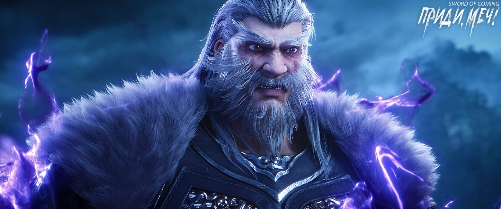
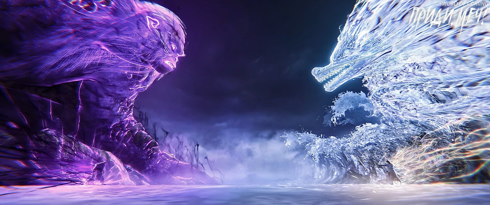

# Глава 49. Разбитый фарфор

Среди груды разбитой черепицы старая обезьяна, уловив легкий звук, шевельнул ушами. Ухмыльнувшись, он наклонился, поднял осколок и, взвесив его в руке, резко метнул. Черепица, словно нож сквозь тофу, с легкостью пронзила стену и крышу, со свистом рассекая воздух и устремляясь туда, откуда доносился звук.

К сожалению, старая обезьяна не смог заметить следов Чэнь Пинъаня. Оттолкнувшись кончиками пальцев ног, его могучее тело взмыло вверх. Он оттолкнулся от старой потолочной балки, высоко подпрыгнул через дыру в крыше и приземлился на коньке.

Вдалеке старая обезьяна увидел Чэнь Пинъаня с деревянным луком за спиной. Тот стоял на краю загнутого карниза крыши и мрачно смотрел на своего противника в белых одеждах. Обезьяна понял свою ошибку: брошенная черепица создала слишком много шума. Это спугнуло «грязноногого крысеныша» из переулка Глиняных Кувшинов, и тот окончательно отказался от мысли воспользоваться преимуществом дистанции своего лука. Старая обезьяна с улыбкой развел руками, показывая, что они пусты, затем поманил пальцем, давая понять Чэнь Пинъаню: пусть продолжает свои замысловатые трюки — он готов подыграть до конца и размять кости.

Было бы несправедливо заподозрить в обмане этого старого обезьяну с горы Истинного Ян, Горную Обезьяну, Двигающую Горы. Тысяча лет практики, истинное тело высотой в тысячу чжанов — его боевые навыки и техники по праву заслужили эпитет «упирающийся в землю и подпирающий небо».

За долгие годы совершенствования Горной Обезьяны, Двигающей Горы, особенно в ранние дни основания школы на горе Истинного Ян, когда маленькая школа была окружена врагами со всех сторон, словно тиграми и волками, после гибели патриарха-основателя через какие только смертельные битвы не прошел старая обезьяна, будучи главным генералом? Сегодняшняя «небольшая потасовка» на крышах в переулке была лишь эхом тех эпических сражений. В тех захватывающих дух великих битвах прошлого высшие мастера совершенствования и великие практики ци тоже держались на расстоянии от старой обезьяны с помощью духовных сокровищ и мощного оружия, избегая лобовых атак. Они действовали подобно легкой коннице кочевников Дацяна[1], не смевшей сталкиваться с тяжелой пехотой Дали, а методично истощавшей бронированные ряды, словно медленно снимая слои с железной бочки.

[1] П/п.: Здесь обыгрывается историческая аналогия: кочевые племена vs. регулярные армии оседлых государств.

Ныне старая обезьяна, наряду с князем Сун Чанцзином, стал одним из тех, кого местные законы небес сковывали сильнее всего. Тот мастер военного искусства с тигриной печатью, благодаря своему особому положению, пользовался «благосклонностью» местных небес, поэтому, несмотря на его выдающееся мастерство совершенствования, ограничения на него практически не влияли.

В этот момент, столкнувшись с юношей, который отличался от обычных жителей городка своей ловкостью, старая обезьяна неожиданно ощутил отголосок того упоения боем, что испытывал в прошлом.

Он не отрицал, что юноша преподнес ему много приятных сюрпризов: умел ловко предугадывать шаги, устраивать ловушки, использовать преимущества местности, и, что самое главное, обладал стальными нервами.

Старая обезьяна поднял голову, взглянув на небо. Солнце клонилось к закату, сумерки уже наступали, видимость становилась все хуже, а он совершенно не знал географии городка. Вероятно, это и было одним из преимуществ юноши, своего рода защитным талисманом.

Старая обезьяна начал стремительный бег, словно несущийся конь, каждым шагом преодолевая расстояние более чжана, что было поистине ужасающим зрелищем.

В тот момент, когда он двинулся с места, Чэнь Пинъань развернулся и бросился бежать. Он не направился на север по непрерывной череде крыш переулков, ведь там находились улица Благоденствия и Достатка и переулок Персиковых Листьев, где жили богатые семьи и скрывались могущественные мастера. Если бы кто-то вступился за старую обезьяну, Чэнь Пинъань не верил, что смог бы вырваться из окружения. Поэтому он решительно побежал на запад, поскольку в южном направлении, где находился крытый мост, местность была открытой, без укрытий. Судя по разнице в скорости между ними, Чэнь Пинъань полагал, что если лишится укрытий, вряд ли сможет уйти от погони Горной Обезьяны, Двигающей Горы.

К западу от городка простирались древние горы и леса, где пышно росли деревья и травы, а на многих тайных тропах охотники расставили свои ловушки.

Горные тропы были труднопроходимыми, а если идти не по проторенным дорогам, путь становился еще более тяжелым — это Чэнь Пинъань знал лучше всех. Его расчет был верен, но он недооценил старую обезьяну — ведь тот, будучи горной обезьяной с горы Истинного Ян, понимал горы намного глубже и основательнее, чем он.

Когда Чэнь Пинъань спрыгнул с последней крыши, при приземлении он согнул колени, умело погасив часть силы падения, быстро обернулся, бросив взгляд назад, и продолжил бежать вперед, пригнувшись. Во время бега деревянный лук и колчан куда-то исчезли.

В горах и лесах, как только Чэнь Пинъань решил покинуть тропинку, протоптанную поколениями предков, чтобы бежать куда глаза глядят, лук и колчан неизбежно стали бы обузой.

Видя, что юноша вот-вот ускользнет, как вьюн в воде, старая обезьяна почувствовал раздражение и оглянулся в сторону усадьбы семьи Ли на улице Благоденствия и Достатка. На самом деле, оказавшись в горах, старая обезьяна не мог сказать, что получит полное преимущество местности, но определенно чувствовал бы себя свободнее, чем гоняясь за этим щенком по всему городку.

Старая обезьяна принял решение, быстро взвесив все за и против. Он сделал глубокий вдох «свежего воздуха» — ни много ни мало, без большой погрешности, как раз достаточно, чтобы убить человека. В тот же миг его лицо покрылось сине-фиолетовой рябью, и могучая фигура без всякого предупреждения взмыла вверх, одним ударом ноги обрушив половину несчастного дома под ним. К счастью, на западной окраине городка жили бедняки, их дома были намного хлипче, чем на улице Благоденствия и Достатка — например, древесина, использованная для балок и столбов, была совсем никудышной. К счастью в несчастье, семья из четырех человек, жившая в том доме, в тот момент не находилась внутри.

Старая обезьяна высоко подпрыгнул, описав в воздухе огромную дугу, и приземлился прямо рядом с Чэнь Пинъанем, оставив на месте приземления две глубокие ямы и разбрызгав повсюду мягкую весеннюю грязь.

Он нанес удар кулаком в центр спины Чэнь Пинъаня.

На спине человека сосредоточены янские меридианы, поэтому все каналы и внутренние органы связаны со спиной. Особенно уязвимо место в центре спины — область «спинного сердца». Оно находится совсем близко от настоящего сердца, всего в нескольких цунях, и является наиболее хрупким и незащищенным.

В момент, когда жизнь висела на волоске, Чэнь Пинъань, услышав движение рядом, внезапно высвободил силу — его движения оказались даже на два-три порядка быстрее, чем когда он заманивал старого обезьяну на прогнившую крышу! Это означало, что с самого начала и до конца Чэнь Пинъань скрывал свои истинные возможности. Из-за этого удар старого обезьяны не только не пробил его спину, не раздробил сердце, но лишь «скользнул» по спине на цунь ниже центра. Хотя Чэнь Пинъань не принял удар в лоб, его все равно отбросило, как колокол от удара молота, и его ноги оторвались от земли.

В следующий момент Чэнь Пинъань продемонстрировал поразительную ловкость во всей красе. Несмотря на кровь, выступившую в уголках рта, после удара он не упал лицом вниз, как собака, а вытянул вперед обе руки, и в момент соприкосновения с землей согнул локти, затем оттолкнулся, в одном слитном движении перевернулся в воздухе, приземлился на ноги и, используя инерцию движения вперед, продолжил бежать с той же скоростью. Даже повидавший многое и опытный в боях Горная Обезьяна, Двигающий Горы, глядя на его стойкость, невольно поморщился.

Старая обезьяна поднял руку — костяшки были в крови. Эта рана была пустяком, и он лишь усмехнулся. Однако его решимость убить Чэнь Пинъаня стала еще тверже.

Причина ранения была проста.

Стояла холодная весна, и юноша из бедного переулка, обычно одетый легко, сегодня появился перед старой обезьяной заметно более укутанным. Помимо собственной одежды, он надел поверх старый просторный халат Лю Сяньяна, а между двумя слоями одежды скрывалась хитрость. Оказывается, Чэнь Пинъань сделал себе «деревянно-фарфоровый доспех»: шесть длинных досок обработанного дерева с просверленными отверстиями, связанных шелковым шнуром — три спереди и три сзади, а самое главное — этот примитивный деревянный доспех был усеян множеством мелких осколков фарфора.

Старая обезьяна чувствовал себя отвратительно, словно знатный вельможа, случайно наступивший в собачье дерьмо, от которого никак не удавалось избавиться.

Сжав кулаки, он затаил дыхание и замер на месте, пытаясь подавить бушующую внутри энергию ци. Фиолетово-синяя рябь на его лице на мгновение сменилась пурпурно-золотым оттенком.

Старая обезьяна пришел в ярость, когда из леса вылетел камешек. Он поймал этот особенно твердый камень размером с ноготь.

Затем послышался шорох, указывающий на то, что Чэнь Пинъань убегает вглубь леса.

Лицо старого обезьяны помрачнело, и он обернулся, взглянув на городок в ночной темноте. Он опасался, что это была настоящая уловка — заманить тигра прочь от горы. Но интуиция подсказывала, что лучше быстро прикончить юношу в горах.

※※※※

На софоре на улице Благоденствия и Достатка, по которой недавно карабкался юный убийца, на самой высокой ветке, способной выдержать вес человека, намного выше крыш, сидел незваный гость, а чуть ниже стоял еще один человек.

Внезапное появление этих двоих заставило встревоженную усадьбу семьи Ли сделать вид, что их не замечает, потому что человеком в белом халате был сам господин надзирающий чиновник. Он привел Сун Цзисиня на софору, сказав, что покажет ему интересное представление. Правда, уже смеркалось, и зрение Сун Цзисиня было недостаточно острым, поэтому он мог только слушать, как Сун Чанцзин рассказывает о нелепой погоне, начавшейся на крышах переулка Глиняных Кувшинов.

Сун Чанцзин сидел, положив одну руку на колено, а другой подперев подбородок, и глядел вдаль. В промежутках между рассказом о погоне он иногда вставлял неизвестные тайны городка или делился своими размышлениями о совершенствовании.

— Если не говорить о везении, а обсуждать только конкретные артефакты и сокровища, то знаменитый «Канон Меча», о котором давно ходят слухи, сейчас входит в тройку лучших в городке. Если же рассматривать всю трехтысячелетнюю историю городка, то попадание в первую десятку сомнительно, но в двадцатку — определенно. Не думай, что это низкое место — на самом деле очень высокое. Добавь к этому бородавчатый доспех. Если малыш Лю сумеет освоить эти дары, то, по мнению этого князя, его шансы ничуть не уступят вашим пятерым.

Сун Цзисинь не поднимал головы, поскольку чьи-то ноги свисали прямо над его головой. Он с любопытством спросил:

— Тогда почему старая обезьяна с горы Истинного Ян убил его одним ударом?

Сун Чанцзин спокойно усмехнулся:

— Слишком большая удача вызывает зависть, а без покровителя… Разве это сложно понять?

Сун Цзисинь с недоумением спросил:

— Тогда почему ты тогда в переулке Глиняных Кувшинов более основательно не привлек его на свою сторону?

Князь династии Дали, сидевший над головой Сун Цзисиня, расхохотался с явным удовольствием и, насмеявшись, сказал:

— Что касается этих талантов с гор… В общем, когда выйдешь отсюда и услышишь одно из прозвищ этого князя, тогда поймешь причину.

Сун Чанцзин внезапно встал, посмотрел вдаль, его выражение слегка изменилось, одна рука легко поглаживала нефритовый пояс на талии, взгляд горел.

В глазах этого великого мастера боевых искусств, который был подобен «вершине среди вершин», на крайнем западе городка, после того как Горная Обезьяна, Двигающая Горы нарушил правила, в одно мгновение энергия ци пришла в хаос, отчего в той области потоки ци стали беспорядочными, словно осколки разбитого фарфора.

Сун Чанцзин медленно произнес:

— Возможно, тебе странно, почему эти чужаки смотрят на других как на муравьев. Ты действительно думаешь, что это просто их природное высокомерие, что они задирают нос? Характер — лишь малая часть причины, в основном это веление времени. Ты никогда не покидал городок и не знаешь, какое исключительное положение занимают эти мастера во внешнем мире.

Сун Цзисинь ответил:

— А я совсем не удивляюсь.

— Как же утомительно разговаривать с образованными людьми, — Сун Чанцзин не выказал удивления и продолжил рассуждать сам с собой. — Потому что существует граница между вами и ими. Эта граница не то чтобы велика — для некоторых она меньше канавы, они могут просто перешагнуть через нее, как ты, и прежний Лю Сяньян, и Чжао Яо — тот книжный росток, которого заприметил великий мастер даосской школы с другого континента. Но и не мала — для подавляющего большинства жителей городка эта граница подобна небесной пропасти, они даже не смеют мечтать ее преодолеть.

— Разница между людьми по обе стороны этой границы настолько велика… это как… все равно что между людьми и растениями, не меньше чем между инь и ян, а может даже больше, — говоря это, князь династии Дали Сун Чанцзин вдруг удивленно воскликнул, а затем со злорадной усмешкой сказал: — Этому старому скоту не повезло на этот раз, надо же было нарваться на такого ежа, который так глубоко притаился. Сун Цзисинь, теперь я начинаю понимать тебя — любому было бы неприятно столкнуться с таким противником. Кроме как чисто и быстро убить его одним ударом, это просто отвратительная морока.

Лицо Сун Цзисиня помрачнело.

В недалекой усадьбе семьи Ли раздались громкие крики, и даже скрытый там влиятельный человек в гневе вступил в бой.

Как и ожидалось, у Чэнь Пинъаня были союзники, и не простые.

Сун Чанцзин усмехнулся, и даже когда тень убийцы промелькнула под софорой, этот князь совершенно не собирался вмешиваться.

В поле зрения появилась массивная фигура старой обезьяны, возвращающегося большими шагами с запада. Он перемещался прыжками по городку, не заботясь о том, обрушит ли крыши домов при приземлении или испортит чьи-то дворы. Похоже, старая обезьяна с горы Истинного Ян нашел себе объект для выплеска гнева.

Сун Чанцзин внезапно нахмурился, затем расслабился, и в следующий миг в нем вспыхнул боевой дух.

У воина династии Дали Сун Чанцзина было три пристрастия в жизни: возводить курганы из черепов, убивать талантов и сражаться с небожителями.

В следующий момент Сун Цзисинь широко раскрыл глаза — Сун Чанцзин, только что находившийся над его головой, уже оказался на улице Благоденствия и Достатка и без затей, почти грубо, бросился навстречу приближающейся массивной фигуре старой обезьяны.

Князь династии Дали и старая Горная Обезьяна, Двигающая Горы, обменялись ударами кулаков, попав друг другу в грудь.

Сун Чанцзин вместо отступления шагнул вперед, а старая обезьяна отступил на шаг. Снова обменялись ударами, на этот раз попав друг другу в середину лба между бровей.

Сун Чанцзин широко шагнул вперед, и на этот раз только он нанес удар. Тяжело ступив вперед, слегка согнув колени, он вытянул левую руку, а правую с зажатым кулаком отвел назад.

Его белое одеяние и широкие рукава развевались, а под ногами крошились каменные плиты. Когда он нанес прямой удар кулаком, старая обезьяна смог лишь выставить ладонь, чтобы блокировать удар. В пространстве дважды раздался едва уловимый треск. Старая обезьяна проскользил назад на десяток чжанов, оставив в каменных плитах глубокую борозду.

Сун Чанцзин легко взмахнул рукавом, заложил одну руку за спину, другой придерживал белый нефритовый пояс, и с улыбкой сказал:

— Ци Цзинчунь, ты даже не выйдешь, чтобы остановить это? Неужели решил пустить все на самотек? Не надо, продержись еще немного.

Старая обезьяна выдохнул мутный воздух.

Сун Чанцзин поднял ладонь, покачал ею и усмехнулся:

— Подеремся после того, как этот князь выйдет отсюда, а сейчас каждый займется своими делами.

Старая обезьяна оскалился в улыбке:

— Сун Чанцзин, тогда тебе лучше победить меня, иначе южной пограничной армии Дали придется несладко.

Сун Чанцзин с улыбкой ответил:

— Как пожелаешь.

Старая обезьяна холодно фыркнул и вошел в усадьбу семьи Ли. Увидев, что юная госпожа Тао Цзы цела и невредима и даже не напугана, старая обезьяна понял, что это был лишь неуклюжий трюк. Немного поразмыслив, он со злорадной усмешкой направился на запад городка.

На охоту в горы.