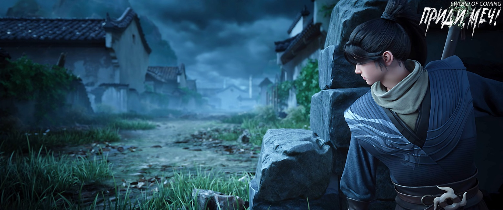
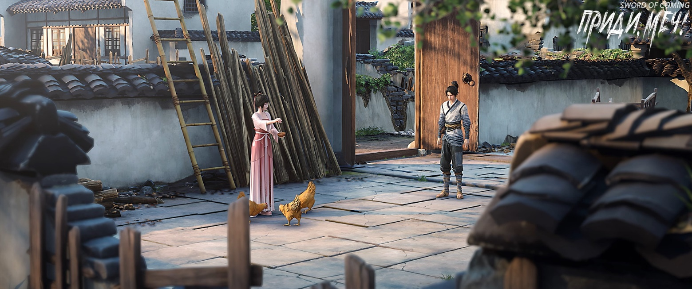
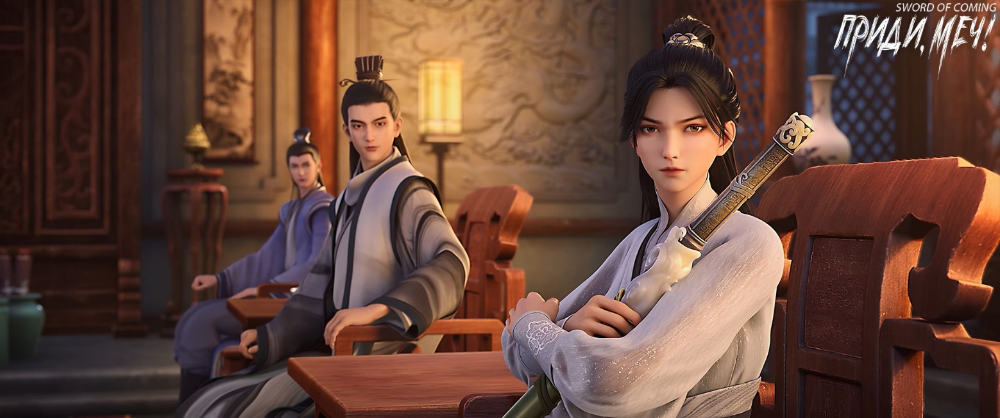
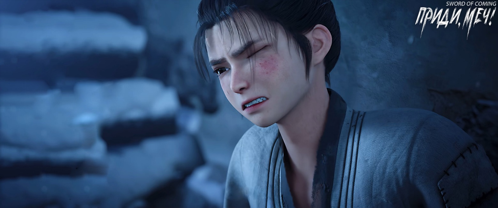
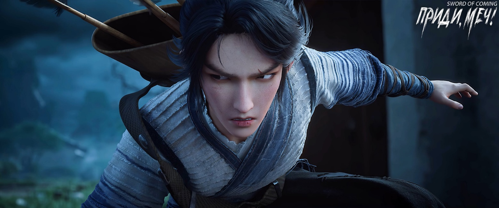

# Глава 50. Небеса движутся неуклонно

В ночной темноте Чэнь Пинъань убегал в глубь гор, несясь со всех ног. Вскоре он добежал до бамбуковой рощи с особенно мягкой почвой и начал намеренно тяжело ступать.

Примерно через полпалочки благовоний, когда он почти выбежал из бамбуковой рощи, Чэнь Пинъань внезапно вскарабкался на бамбуковый ствол слева, раскачался и перепрыгнул на другой бамбук неподалеку. Он двигался более ловко, чем Горная Обезьяна, Двигающая Горы с горы Истинного Ян. Повторив это несколько раз, он наконец легко приземлился, присел и стер рукой следы ног. Оглянувшись и увидев, что находится в пяти-шести чжанах от первого бамбука, он продолжил бежать.

Не сгорело и одной палочки благовоний, как уже стал слышен шум ручья. Чэнь Пинъань, бежавший большими шагами, не только не остановился, но даже высоко подпрыгнул и рухнул в воду. Вскоре он встал — оказалось, что он приземлился на огромный камень. Отлично знакомый с этой местностью Чэнь Пинъань, напрягая зрение, благодаря своему острому глазу и выдающейся памяти, начал прыгать по камням в ручье, убегая вниз по течению. Этот путь вел к Спине Синего Быка у ручья на юге городка, затем к крытому мосту, и наконец к кузнице мастера Жуаня. Однако Чэнь Пинъань не стал слишком приближаться к Спине Синего Быка, а выбрался на правый берег там, где ручей, выходя из гор, внезапно сужался, словно талия девушки.

Вскоре послышался тихий голос Нин Яо:

— Чэнь Пинъань, сюда.

Чэнь Пинъань тяжело дыша быстро присел, и вытер рукой пот со лба.

Нин Яо тихо спросила:

— Действительно сможешь заманить старую обезьяну в горы?

Чэнь Пинъань горько ответил:

— Стараюсь изо всех сил.

Нин Яо, также пришедшая окольным путем с улицы Благоденствия и Достатка, спросила:

— Ранен?

Чэнь Пинъань покачал головой:

— Пустяки.

Нин Яо испытывала сложные чувства и сердито сказала:

— Как ты посмел так рисковать? Если бы тогда старая обезьяна тебя не прикончил, считай, тебе крупно повезло!

Чэнь Пинъань улыбнулся:

— Старая скотина уже однажды нарушил правила. Но если бы ты вмешалась чуть позже, думаю, мне бы не поздоровилось.

Нин Яо на мгновение растерялась, а потом радостно воскликнула:

— Так у тебя получилось? Неплохо, Чэнь Пинъань!

Чэнь Пинъань тихонько рассмеялся.

Нин Яо закатила глаза и спросила:

— Что дальше?

Чэнь Пинъань задумался:

— Общий план, который мы наметили, остается прежним, но некоторые детали придется изменить — он слишком силен.

Нин Яо шлепнула Чэнь Пинъаня по голове и рассмеялась:

— Ты только сейчас это понял?

Чэнь Пинъань вдруг сказал:

— Юная госпожа Нин, повернитесь спиной, мне нужно приложить немного лечебных трав. И заодно присмотрите за ручьем.

Нин Яо без стеснения повернулась к нему спиной, лицом к верховьям ручья.

Чэнь Пинъань снял верхнее одеяние, принадлежавшее прежде Лю Сяньяну, затем снял «доспех», достал из полотняного мешочка на поясе фарфоровый флакон из лавки семьи Ян и вылил немного густой мази на правую ладонь. Левой рукой он приподнял одежду, а правой начал втирать мазь в спину.

Несмотря на свою выносливость к боли, он покрылся холодным потом.

Хотя Нин Яо не оборачивалась, она спросила:

— Больно?

Чэнь Пинъань усмехнулся:

— Это пустяки.

Нин Яо скривила губы — к чему эта бравада?

※※※※

В самом западном доме городка женщина сидела на земле, громко рыдая и колотя себя в грудь. Ее тонкая одежда, казалось, вот-вот разорвется. Рядом с ней растерянно стояли двое ее маленьких детей, перепачканные с ног до головы. У дома на корточках сидел простодушный мужчина, вздыхая и качая головой с беспомощным выражением лица. В крыше непонятно откуда появилась дыра, и хотя весенний холод еще не отступил, он-то сам выдержит, но как теперь его жена и дети будут жить?

Неподалеку собрались соседи, обсуждая произошедшее. Кто-то говорил, что тоже слышал шум на крыше своего дома, но сначала подумал, что это просто дикие кошки шалят, и не придал этому значения. Другие рассказывали, что сегодня в западной части городка было неспокойно — дети якобы видели какого-то старого мудреца в белых одеждах, который парил в воздухе, и один его шаг был равен десяти шагам простых людей. Он мог ходить по крышам и стенам. Никто не знал, то ли это божество земли покинуло свой храм, то ли горный дух спустился с гор.

Молодой мечник из сада Ветра и Грома сидел один на корточках с мрачным выражением лица. Лю Бацяо раньше беседовал с Цуй Минхуаном в канцелярии надзирающего чиновника, и когда услышал о происшествии в большом доме семьи Ли, что-то заподозрил. Однако даже этот выдающийся талант из сада Ветра и Грома, при всей своей самоуверенности, не осмелился бросить вызов старой Горной Обезьяне, Двигающей Горы. Он лишь надеялся понаблюдать за ситуацией со стороны и, возможно, если представится случай, исподтишка навредить. Поэтому Лю Бацяо забрался на изогнутый карниз башни одного из больших домов, обозревая городок в поисках старой обезьяны. Вскоре он заметил странное движение в районе переулка Глиняных Кувшинов на западе, и будучи от природы смелым, начал тайно следить.

В тот момент, когда горная обезьяна с горы Истинного Ян не пожалел сил, чтобы активировать свою ци, Лю Бацяо, получивший ранение, почувствовал, как его летающий меч судьбы, который был вынужден переместиться для восстановления в полость Светлого Зала[1], начал беспокойно двигаться, почти готовый «вырваться из ножен». В этих странных землях сила подавления Небесного Дао была прямо пропорциональна уровню совершенствования. В этом странном мире сила подавления Небесного Дао была прямо пропорциональна уровню совершенствования.

[1] Полость Светлого Зала — узел Минтан, находится во лбу между бровями.

По оценкам Лю Бацяо, горной обезьяне было нелегко, даже если он мог насильно управлять и менять ци, а затем использовать свою мощную физическую форму или высшие способности, чтобы подавить кипение ци, вызванное Небесным Дао. Однако количество такого «жульничества» не могло быть слишком большим, иначе он рисковал столкнуться с катастрофой, подобной прорыву плотины, и его тысячелетние достижения могли быть уничтожены в одночасье. Более того, каждый раз, когда он действовала как «бессмертный» за пределами этого мира, это было равносильно потере жизненной силы, подобно тому, как обычные люди теряют годы жизни.

Но когда Лю Бацяо увидел, как старая обезьяна, провалившись через крышу, приземлился, оставив два огромных кратера на месте, где он сейчас стоял, этот гений меча из сада Ветра и Грома начал радоваться, что не действовал опрометчиво. Иначе он бы навлек на себя беду. Судя по той мощи свежей ци, которую демонстрировал старая обезьяна, если бы не движение в большом доме семьи Ли на улице Счастья из-за которого пришлось проверить безопасность маленькой девочки с горы Истинного Ян и преследовать того хитрого, как лиса, юношу, то, возможно, у него не было бы стопроцентной уверенности в успехе. Но если бы целью был сам Лю Бацяо — это была бы верная смерть.

Конечно, старая обезьяна не был ни слепым, ни глупцом, и наверняка заметил присутствие Лю Бацяо в тот момент, когда его меч судьбы готов был вырваться наружу. Хотя Лю Бацяо и побывал у врат преисподней, несмотря на испуг, он не испытывал особого страха перед старой обезьяной. Между садом Грома и Молнии и горой Истинного Ян, какой бы ни была разница в силе, все было хорошо, пока не вступали в бой. Но стоило одной стороне начать действовать, это превращалось в борьбу не на жизнь, а на смерть, и человек более низкого уровня совершенствования никогда не стал бы умолять противника о пощаде. Это был факт, доказанный бесчисленными жизнями за пятьсот лет существования двух святых мест меча на Восточном континенте Водолея. К тому же у Лю Бацяо был запасной план в городке.

Лю Бацяо медленно встал и, вместо того чтобы вернуться прямо в канцелярию, направился к самому западному ветхому домишке. Остановившись за низкой глинобитной стеной, он громко крикнул:

— Эй! — и когда мужчина с женой повернулись к нему, небрежно бросил монету из эссенции золота заплаканной женщине со словами: — Сестрица, прошу, перестань рыдать, мне даже издалека аж жутко становится!

Женщина поймала золотистую монету, взглянула на нее — похожа на обычную медную монету, только цвет другой. В замешательстве она тихо спросила:

— Золото?

Лю Бацяо расхохотался:

— Нет. Но стоит намного дороже золота…

Женщина сначала опешила, а потом пришла в ярость. Она с силой швырнула золотистую монету в Лю Бацяо, вскочила, подбоченилась и начала ругаться:

— Пошел прочь! Будь это золото, я бы еще поверила, а то дороже золота? Думаешь, я совсем темная?! Я своими руками серебро держала. Черепашье яйцо[2] безусое, даже не потрогав своего головастика в штанах, осмелился прикидываться господином передо мной! Мой муж еще не помер!

[2] «王八蛋» — ублюдок. Дословно — «черепашье яйцо». В китайской культуре черепаха ассоциируется с трусостью и обманом (отсылка к мифу, где черепахи не знают своих отцов).

Тут женщина разозлилась еще больше, быстро подошла — ее толстая, ненамного тоньше бочки талия, неожиданно изогнулась с особой грацией — и пнула молча сидевшего на корточках мужа так, что тот повалился набок. Мужчина не только не посмел дать сдачи, но даже возразить не осмелился, и, согнувшись, как кошка, уполз подальше, где снова сел на корточки с обиженным взглядом.

Женщина, указывая на своего мужа, продолжала ругаться:

— Бесхребетный трус, что мертвец, что ты — никакой разницы! Как случится беда, сразу прикидываешься мертвым. Целыми днями только и знаешь, что слоняться без дела, рыбу ловить да змей хватать, как малое дитя в штанах с прорехой, хуже собственного сына! Малыш Хуай хотя бы… подбирает что-нибудь домой. Ты же, отец семейства, почему от места подручного в лавке семьи Ян отказался? Может, ты богат до неприличия? Зачем с деньгами враждуешь? Целый год не видно, чтобы ты занимался чем-то путным…

Тут женщина, чья грудь вполне заслуживала эпитета «внушительная», вдруг усмехнулась:

— Если бы ты ночами не был так хорош, разве стала бы я с тобой жить?!

Соседи, наблюдавшие за сценой, разразились хохотом, а некоторые молодые мужчины начали свистеть и отпускать скабрезные шуточки.

Наконец женщина снова обратила свой гнев на главного виновника:

— Ты еще не ушел? Еще от груди не отлучили?

Лю Бацяо никогда не сталкивался с такой деревенской простотой и не только не счел это вульгарным, но даже нашел забавным. Он с удовольствием наблюдал за этим представлением и, несмотря на оскорбления женщины, не рассердился, а рассмеялся.

После каждой ссоры в своей школе, саду Грома и Молнии, он чувствовал одиночество, понимая, что при всем своем боевом мастерстве не имеет достойного противника. Кто бы мог подумать, что сегодня он наконец нашел где применить свои навыки. Ухмыляясь, он сказал:

— Что с того, что не отлучили? Может, сестрица, поможешь?

Женщина приподняла бровь и насмешливо ответила:

— Боюсь, ненароком задушу тебя. Иди-ка ты лучше к бабушке Ма в переулок Цветущих Абрикосов! Она тебя досыта накормит!

Толпа разразилась оглушительным смехом.

Хотя Лю Бацяо и не знал, кто такая бабушка Ма, но по реакции зрителей понял, что потерпел сокрушительное поражение.

Лю Бацяо поднял большой палец вверх и с сияющей улыбкой сказал:

— Сестрица, признаю твою победу.

В этот момент он зажал монету из эссенции золота между пальцами и помахал ею:

— Точно не возьмешь?

Женщина заметно колебалась, с подозрением глядя на монету.

В этот момент издалека раздался чей-то голос:

— Бацяо, господин Цуй велел тебе срочно возвращаться.

Лю Бацяо обернулся на голос — это был Чэнь Сунфэн, ученик семьи Чэнь из округа Драконового Хвоста, рядом с ним стояла высокая холодная красавица с пустыми руками, без оружия. Внешность у девушки была неприметная, зато фигура безупречная, особенно длинные ноги, что весьма привлекало Лю Бацяо. Она была дальней родственницей Чэнь Сунфэна, хотя насколько дальней, Чэнь Сунфэн никогда не упоминал, да и девушка обращалась к нему просто по имени. Путешествуя вместе, все трое общались, и Лю Бацяо не находил девушку надменной, просто у нее был от природы холодный характер.

Поскольку это было распоряжение Цуй Минхуана, Лю Бацяо не осмелился задерживаться и направился с ними на улицу Благоденствия и Достатка, хотя уходя, невольно бросил еще один взгляд на опечаленного мужчину средних лет.

Какой-то неопрятный мужчина, смешавшийся с толпой, после некоторых колебаний, когда соседи начали расходиться, направился к дому.

Женщина собиралась вести детей к своим родителям, хотя ей очень не хотелось этого делать. Ее родные были меркантильными людьми и с презрением относились к выбранному ею мужу. Поэтому в последние годы они редко общались, кроме праздников. Столкнувшись с бедой, у женщины не было выбора. Она хотела бы проявить гордость и пожить с детьми несколько дней в гостинице или ресторане, побыть богатой женой, но, к сожалению, кошелек был пуст — даже звона монет не было слышно. Придется, скрепя сердце, вернуться в родительский дом и терпеть их презрительные взгляды. Все больше злясь, женщина перед уходом сильно ущипнула мужа за бок и остановилась, только когда его лицо перекосилось от боли. Дети, привыкшие к таким сценам, не только не беспокоились о ссоре родителей, но даже тихонько посмеивались.

Женщина, у которой был острый глаз, заметила неряшливого мужчину, прячущегося у ворот, и тут же начала ругаться:

— Эй ты, по фамилии Чжэн! Опять пришел красть мое белье? Ты что, собака? Даже заяц не ест траву у своей норы. Как бы мне ни не хотелось признавать, но, видно, я в прошлой жизни нагрешила, раз стала твоей невесткой. Как у тебя рука поднимается воровать?

Неряшливый мужчина чуть не плакал, готовый провалиться сквозь землю:

— Невестка, видят небо и земля, я просто забыл купить конфет вашему малышу Хуаю, поэтому он такое наговорил! Невестка, как же ты могла поверить?

Маленький мальчик смотрел с невинным видом.

Женщина, конечно, больше верила своему ребенку и замахнулась, чтобы ударить мужчину. Тот быстро отскочил в сторону, втянув голову в плечи, и закричал сидящему на корточках мужчине:

— Старший брат, ты бы хоть невестку успокоил!

Мужчина глухо ответил:

— Не смею.

Неряшливый мужчина горестно вздохнул:

— В этом мире честному человеку житья нет.

Женщина, держа детей за руки, направилась к воротам, но вдруг обернулась, кокетливо подмигнула и с улыбкой сказала:

— Чжэн, в следующий раз приноси больше денег, невестка продаст тебе, всего по пятьдесят вэней за штуку, идет?

— Дороговато, нет? В лавках переулка Цветущих Абрикосов новая одежда из лучшей ткани столько же стоит…

Женщина сменила выражение лица быстрее, чем переворачивается страница, и разразилась бранью:

— Так у тебя правда такие грязные мысли?! Сдохни, так и будешь всю жизнь холостяком! Пропащий человек, сдохнешь у восточных ворот — никто даже твой труп не подберет…

После того как женщина с детьми ушла, неряшливый мужчина легко подпрыгнул и уселся на стену двора, сердито сказал:

— Старший брат, не то чтобы я тебя осуждаю, но ты действительно был как свиным жиром ослеплен, когда выбрал такую сварливую бабу в жены.

Оказалось, этот неряшливый мужчина был привратником у восточных ворот городка, холостяк по фамилии Чжэн.

Простодушный мужчина, все еще сидевший на корточках во дворе, выдавил:

— Мне нравится.

Привратник, который отвечал за сбор денег с приезжих, помолчал немного и сказал:

— Старый учитель просил тебя пока сдерживаться и не ввязываться в драки.

Привратник поднял голову, взглянул на жалкую крышу и вдруг рассмеялся:

— Учитель еще сказал, если совсем невмоготу станет, иди к жене пар выпускать. Все равно невестка не боится твоих выходок, ей это даже нравится.

Мужчина, из которого и десятью палками слова не выбьешь, поднял голову и посмотрел на неряшливого мужчину на низкой стене. Тот поспешил поправиться:

— Ладно-ладно, это я, Чжэн Дафэн[3], сказал такое, учитель ничего подобного не говорил.

[3] Чжэн Дафэн (郑大风). Фамилия Чжэн одна из древнейших китайских фамилий. Символизирует стабильность и традиции. Общее значение «Великий, как ветер, меняющий мир».

Простодушный мужчина встал — коренастый, с бронзовой кожей и вздутыми мышцами на руках, которые натягивали рукава. Он был слегка сутулым и недовольно сказал привратнику:

— Если учитель когда-нибудь скажет тебе больше десяти слов, я возьму твою фамилию.

Привратник мысленно повторил слова учителя, посчитал на пальцах — и правда, не набралось десяти слов! Он сначала выругался, потом сник, опечалился и, впервые в жизни проявив искренние чувства, стал выглядеть особенно жалким.

Сутулый мужчина спросил:

— Что-то еще?

Привратник кивнул:

— Учитель велел тебе разобраться с тем человеком.

Сутулый мужчина нахмурился и по привычке снова присел на корточки лицом к обветшалому дому, мрачно спросил:

— С какой стати?

Чжэн Дафэн закатил глаза:

— Так учитель приказал, хочешь — делай, не хочешь — не надо.

Мужчина подумал:

— Иди. Если еще раз увижу, что воруешь вещи у жены брата, переломаю тебе три ноги[4].

Нечесаный Чжэн Дафэн в ярости воскликнул:

— Ли Эр[5]! Объясни-ка мне! Кто крал одежду твоей бабы?! И ты веришь в такую чушь? У тебя что, вода в башке?[6]

[4] «三条腿» («три ноги») — слэнговый эвфемизм для обозначения мужского достоинства (собственно «достоинство» + две настоящие ноги). В китайской просторечной лексике фразы вроде «打断你的第三条腿» («сломаю третью ногу») — распространённая шутка-угроза, особенно в мужских диалогах.

[5] Ли Эр (李二). Фамилия Ли символизирует плодородие (иероглиф связан со сливой). Имя 二 (Èr) — «второй», «два». В традиции китайских имен числа часто указывают на порядок рождения (например, второй ребенок в семье). «Второй из рода Ли» — имя звучит неформально, возможно, используется чисто в деревенской среде или как сокращение.

[6] «你脑子进水» — «вода в мозгу», аналог «ты сошел с ума», «проблемы с головой».

Ли Эр повернул голову и молча, с мрачным лицом, посмотрел на своего взбешенного младшего соученика. Чжэн Дафэн, словно обиженная злопамятная госпожа, с горечью и отчаянием произнес:

— Я больше никогда не осмелюсь. Доволен?!

Привратник поднялся на ноги и, оттолкнувшись кончиками пальцев, словно лист софоры, выпорхнул на улицу. Лишь отбежав подальше, он осмелился громко выкрикнуть:

— Ли Эр, я сейчас пойду к твоей жене покупать ее нижнее белье!

Чжэн Дафэн выкрикивал угрозы, убегая быстрее собаки. Однако Ли Эр даже не собирался вставать и лишь выплюнул одно слово:

— Трус.

※※※※

Когда трое вернулись в канцелярию, конфуцианский благородный муж Цуй Минхуан из Академии Озерного Созерцания уже давно ждал их в главном зале. Увидев незнакомую женщину, Цуй Минхуан встал и кивнул в знак приветствия. Женщина также кивнула в ответ, сохраняя холодное выражение лица, которое, как говаривал Лю Бацяо в частных беседах, выглядело так, будто «весь мир задолжал ей кучу серебра».

После того как все трое сели, Цуй Минхуан с улыбкой сказал Лю Бацяо:

— Хорошо, что ты сдержался и не вмешался, иначе точно случилась бы большая неприятность. Ты бы видел, как только что наш надзирающий чиновник господин Сун и старая обезьяна с горы Истинного Ян обменялись тремя мощными ударами на улице Благоденствия и Достатка! Шуму было немало. Честно говоря, что бы ни случилось дальше, какая бы редкая возможность ни представилась, я советую тебе не вмешиваться и не искать в этом выгоды.

Лю Бацяо с любопытством спросил:

— Неужели эта старая скотина уложила Сун Чанцзина тремя ударами? Неужели Сун Чанцзин оказался бесполезен, как расшитая подушка? Разве не говорили, что он уже достиг порога десятого уровня и ему оставался всего полшага до этого царства?

Цуй Минхуан с досадой ответил:

— Мы все-таки гостим у господина Суна, не мог бы ты выражаться повежливее?

Чэнь Сунфэн с восхищением заметил:

— Господин Сун действительно имел некоторое преимущество.

Даже не имея никакого отношения к князю Дали, любой практикующий боевые искусства не мог не восхищаться таким подвигом! Простой воин, полагаясь только на свое тело, выстоял против Горной Обезьяны, Двигающей Горы! И главное — он даже смог получить преимущество!

Женщина сидела рядом с закрытыми глазами, естественно положив руки на колени. Услышав об этом происшествии, она слегка пошевелила пальцами. Чэнь Сунфэн нашел ее в спешке, а изначально она планировала продолжить прогулку по городку. То, что она не настояла на своем и последовала за Чэнь Сунфэном, чтобы найти Лю Бацяо и вернуться в канцелярию, было лишь данью местным обычаям. Что касается того, удастся ли Чэнь Сунфэну получить выгоду от той старой софоры и сколько листьев софоры предков ему достанется, женщину по фамилии Чэнь это не беспокоило. Впрочем, когда Чэнь Сунфэн нашел ее, она все еще могла ясно чувствовать его намеренно сдерживаемое возбуждение — похоже, урожай был богатым, и количество опавших листьев софоры превзошло ожидания патриарха семьи Чэнь из округа Драконового Хвоста.

Лю Бацяо внезапно расхохотался, держась за живот:

— Старая скотина на этот раз крупно опозорился, радость-радость! Обычный юноша водил его за нос полгородка, словно собаку на прогулке, а обезьяну — на представлении! Ха-ха, эта потрясающая история будет обсуждаться в саду Ветра и Грома целых десять лет! Когда эти деревенщины с горы Истинного Ян обязательно выскочат и заявят, что мы в саду Ветра и Грома только клевещем, и потребуют доказательств… Да пошли вы со своими доказательствами! Если бы в городке не было запрета на использование духовных искусств, и цена за нарушение правил не была бы столь высока, я бы даже ценой жизни запечатлел эту сцену в Зеркале Облика и Голоса.

Внезапно выражение лица Цуй Минхуана изменилось, и он строго окликнул:

— Бацяо!

Женщина почти одновременно открыла глаза.

Лю Бацяо только хотел спросить, в чем дело, как вдруг закрыл рот.

Вскоре появился мужчина в белом халате, который неспешно перешагнул через порог и с улыбкой спросил у Лю Бацяо:

— Что же такого смешного? Веселье в одиночку не сравнится с весельем вместе, так может, позволишь и этому князю повеселиться?

Цуй Минхуан, уже вставший на ноги, хотел было предложить князю династии Дали главное место, но Сун Чанцзин с улыбкой покачал головой этому ученому из Академии Озерного Созерцания, показывая, что не стоит соблюдать такие церемонии. Он просто взял стул и сел рядом с Лю Бацяо, оказавшись напротив Чэнь Сунфэна и женщины.

Хотя Лю Бацяо производил впечатление человека с небрежным и ленивым характером, находясь так близко к воину, который, возможно, достиг легендарного десятого уровня, да еще и печально известному — одно дело сложить башню из черепов, но его пристрастие к убийству талантов по-настоящему заставляло кровь стыть в жилах. Поэтому, как бы Лю Бацяо ни называл запросто «Сун Чанцзин» в его отсутствие, сейчас он чувствовал себя очень неуверенно. К счастью, Лю Бацяо никогда особо не заботился о сохранении лица и с заискивающей улыбкой сказал:

— Великий мастер Сун, я как раз рассказывал о вашей грандиозной битве со старой скотиной с горы Истинного Ян — это было поистине потрясающе! Ваши удары, господин князь, были подобны драконам, и если бы вы не проявили милосердия, та Горная Обезьяна, Двигающий Горы непременно бы погиб прямо на улице Благоденствия и Достатка. Высота боевого мастерства господина Суна и его благородство в бою — это то, до чего такому младшему поколению как я не дотянуться, даже если льстить изо всех сил!

Сун Чанцзин молча улыбался. Со лба Лю Бацяо стекал холодный пот, спина была совершенно мокрой, и он наконец замолчал, не в силах произнести больше ни слова.

Сун Чанцзин внезапно повернулся к сидящей напротив женщине и с любопытством в глазах спросил:

— Ты тоже из семьи Чэнь округа Драконового Хвоста?

Женщина покачала головой и медленно ответила:

— Нет.

Сун Чанцзин произнес «О» и погрузился в раздумья.

Атмосфера стала неловкой, пока в дверях не появился Сун Цзисинь. Увидев, что в комнате не осталось свободных стульев, он непринужденно сел на порог и оглядел присутствующих.

Сун Чанцзин, не придавая этому значения, с улыбкой сказал Лю Бацяо:

— На самом деле ты один из благодетелей, благодаря которому юноша остался жив.

Если бы старая обезьяна с самого начала не решил, что Чэнь Пинъань ищет ссоры по чьему-то наущению, а в этом городке те, кто осмеливается строить козни горе Истинного Ян, не глупцы и всегда действуют по плану, то старая обезьяна не подумал бы, что за «богомолом, ловящим цикаду, должна быть иволга», и что эта «иволга» определенно имеет высокий статус и отличные боевые навыки. Именно поэтому старая обезьяна, не желая выдать ни малейшей слабости, выглядел довольно неуклюже в районе переулка Глиняных Кувшинов. И только дойдя до дома на крайнем западе городка и убедившись, что вокруг нет притаившихся убийц, он наконец немного расслабился и нанес удар в спину Чэнь Пинъаню.

Лю Бацяо натянуто усмехнулся:

— Хоть это и правда, но я бы предпочел не быть таким благодетелем.

Сун Чанцзин лишь улыбнулся в ответ.

Женщина повернула голову и мельком взглянула на красивого юношу, сидящего на пороге. Сун Цзисинь слегка улыбнулся ей. Женщина отвернулась с бесстрастным лицом. Сун Цзисинь скривил губы и начал откровенно любоваться ее длинными ногами. Женщине было лет двадцать пять-двадцать шесть, внешность у нее была неплохая, но Сун Цзисинь находил в ней что-то особенно привлекательное.

Женщина повернулась к нему и холодно спросила хриплым голосом:

— Жить надоело?

Сун Цзисинь указал на себя с крайне наивным и довольно раздражающим выражением лица:

— Мне?

Затем указал на князя династии Дали Сун Чанцзина:

— Тогда тебе сначала придется спросить у него разрешения.

Только женщина хотела встать, как глаза Сун Чанцзина сузились. По всему залу на головы присутствующих обрушился мощный поток давления, подобный ливню — укрыться было негде. На коже всех присутствующих возникла реальная колющая боль, и только Сун Цзисинь у дверей, казалось, ничего не чувствовал.

Чэнь Сунфэн с трудом, но твердым голосом произнес:

— Князь, эта девушка не с нашего Восточного континента Водолея, поэтому прошу вас быть осмотрительным в своих действиях!

Женщина усмехнулась и встала:

— Ты осмелишься убить меня? Не боишься, что ваша Дали будет уничтожена?

Цуй Минхуан только собирался вмешаться, как вдруг женщина отлетела назад, при этом стул позади нее рассыпался в воздухе в пыль, а ее стройное тело почти полностью вошло в стену, словно вмурованный в нее предмет.

Сун Чанцзин загадочным образом оказался у стены, стоя со сложенными за спиной руками, слегка запрокинув голову, и с улыбкой глядя на женщину, у которой кровь текла из всех отверстий:

— Девочка, ты думаешь, раз твой отец или патриарх такой могущественный, у тебя есть право передо мной… как там это слово?

Князь повернулся с улыбкой к своему племяннику, и Сун Цзисинь с ухмылкой ответил:

— «Пустословить».

Сун Чанцзин усмехнулся и снова повернулся к женщине. Несмотря на выражение боли на лице, ее взгляд оставался непреклонным, без малейших признаков мольбы или слабости. Сун Чанцзин сказал:

— В следующей жизни постарайся не встречаться с этим князем.

Чэнь Сунфэн, с налитыми кровью глазами и разрывающимися от сложных эмоций внутренностями, охваченный одновременно великим гневом и великим страхом, только хотел заговорить, как Цуй Минхуан уже сделал шаг вперед и, поклонившись с извинением, искренне произнес, опустив голову:

— Князь, не могли бы вы ради меня не принимать ее слова близко к сердцу.

Сун Чанцзин дернул уголком рта с явной насмешкой. Женщина, встретившись взглядом с князем династии Дали, внезапно, словно смирившись с судьбой, закрыла глаза.

В этот момент Сун Цзисинь, стоявший у порога, расхохотался:

— Дядя! Хватит. Издеваться над женщиной — это может навредить твоей репутации, если об этом узнают.

Движения Сун Чанцзина едва заметно замедлились — настолько незаметно, что даже Цуй Минхуан и Лю Бацяо видели лишь неподвижно застывшего бога смерти. Сун Чанцзин слегка наклонил голову и небрежно щелкнул двумя пальцами, словно стряхивая пыль с плеча. Лю Бацяо, лучший среди молодого поколения сада Ветра и Грома, застыл как истукан. Цуй Минхуан почувствовал невероятное облегчение, а Чэнь Сунфэн будто оказался в тумане.

Сун Чанцзин с улыбкой посмотрел на Лю Бацяо:

— Неплохо, мальчишка, этот князь видит в тебе потенциал.

Женщина открыла глаза, высвободилась из стены и, приземлившись, пошатнулась. Глядя ему вслед, она произнесла:

— Сегодняшний урок Чэнь запомнит всем нутром.

Сун Чанцзин, не обращая на нее внимания, обратился к Лю Бацяо:

— Когда покинешь городок, найди этого князя в столице Дали. У меня есть кое-что для тебя, вот только сможешь ли ты это взять и унести — другой вопрос.

Лю Бацяо выпалил:

— Меч-талисман!

Все совершенствующиеся знали, что мечи-талисманы были одним из главных духовных инструментов даосов. Если же меч прямо называли талисманным, и все об этом знали, можно было представить, насколько он был удивителен.

Когда Сун Чанцзин и Сун Цзисинь вышли из особняка, Сун Чанцзин с улыбкой спросил:

— Ну что, выпустил всю злость из груди?

Сун Цзисинь кивнул:

— Более-менее.

Ранее, в деле с Чэнь Пинъанем, этот тип даже своего родного племянника подставил, поэтому Сун Цзисинь, конечно, был полон гнева и обиды.

Сун Цзисинь вдруг нахмурился и спросил:

— Эта женщина явно непростого происхождения. Дядя, ты не боишься, что побьешь младшего, придет старший, побьешь старшего, придут старые пни? Если местные записи уезда не врут, я знаю, насколько страшны эти старые ублюдки. Справится ли наш Дали тогда?

Сун Чанцзин одной фразой успокоил Сун Цзисиня:

— Ты слишком недооцениваешь вес этих трех иероглифов — Сун Чанцзин.

※※※※

В главном зале Цуй Минхуан сел на свое место, сохраняя невозмутимость.

Лю Бацяо обессиленно откинулся на спинку стула и, все еще не оправившись от испуга, сказал:

— Черт возьми, неужели между седьмым, восьмым и девятым уровнем такая большая разница?

В саду Ветра и Грома было по одному воину седьмого и восьмого уровня, и оба хорошо ладили с Лю Бацяо.

Цуй Минхуан покачал головой:

— Даже среди игроков девятого дана в вэйци есть сильные и слабые, разница между ними может быть огромной. Что уж говорить о Сун Чанцзине, который является сильнейшим среди тех, кто достиг девятого уровня.

Затем Цуй Минхуан повернулся к девушке по имени Чэнь Дуй и с беспокойством спросил:

— Юная госпожа Чэнь, вы в порядке?

Чэнь Дуй тоже была не из робкого десятка. Несмотря на бледное лицо, она спокойно улыбнулась:

— Ничего страшного.

Чэнь Сунфэн, казалось, беспокоился больше, чем сама пострадавшая.

Цуй Минхуан мысленно вздохнул:

—Роду Чэнь из округа Драконового Хвоста теперь вряд ли удастся выделиться в грядущей большой смуте.

Лю Бацяо цокая языком произнес:

— Одним щелчком пальцев смог отбросить мой летающий меч обратно в полость Светлого Зала, не повредив ни капли моего духовного сознания. Это и вправду невозможно постичь разумом.

Цуй Минхуан подколол его:

— Теперь понимаешь, что за горами есть горы, а над людьми — люди?

Как собаке не изменить привычки жрать дерьмо, так и Лю Бацяо не изменял своей натуре. Он злорадно ухмыльнулся:

— «Над людьми — люди»? Господин Цуй, вы совсем не благородный муж!

Цуй Минхуан не знал, плакать ему или смеяться, и решил проигнорировать этого грубияна.

Лю Бацяо, подумав, решил утешить девушку со странным именем чтобы та в порыве отчаяния не бросилась бить яйцом о камень, вызывая Сун Чанцзина. Иначе всем в доме пришлось бы уносить ноги.

— Старшая сестра Чэнь, хоть, говоря так, я и придаю уверенности другим, умаляя собственное достоинство, но встретив Сун Чанцзина, склонить голову и отступить на шаг — в этом нет позора.

Чэнь Сунфэн хотел что-то сказать, но промолчал.

Чэнь Дуй[7] слегка кивнула и спокойно ответила:

— У Сун Чанцзина действительно есть право так себя вести, я не то чтобы не признаю этого, просто на душе горько.

[7] Чэнь Дуй (陈对). «Тот, кто следует истине» или «Устойчивый в противостоянии» — имя может отражать пожелание твердых моральных принципов или силу духа.

Лю Бацяо беззаботно сказал:

— На самом деле и переживать не стоит. Посмотрите на меня — я сейчас счастлив как черт! Когда вернусь в сад Ветра и Грома, у меня будет тема для хвастовства на целых десять лет. Подумать только, я скрестил мечи с самим Сун Чанцзином из Дали! Пусть всего один удар, но я, Лю Бацяо, вышел без единой царапины! А если заполучу тот меч-талисман из столицы Дали — век не замолчу!

Мысли Чэнь Дуй унеслись в сторону. Она невольно вспомнила того юношу, сидевшего на пороге — того, кто одной фразой остановил Сун Чанцзина от убийства.

※※※※

Старый управляющий лавки семьи Ян, вернувшись в городок, сразу направился во двор позади своей лавки. Двор был ни большой, ни маленький — как раз подходящий для проживания трех работников.

Хозяин лавки распахнул дверь главного дома во внутреннем дворе и увидел пожилого мужчину, сидящего в кресле и возящегося со своей старой табачной трубкой. Закрыв за собой дверь, хозяин окликнул:

— Старина Ян!

Мужчина поспешно отложил бамбуковую трубку, налил чашу чая и с улыбкой спросил:

— Управляющий, кто-то срочно нуждается в снадобье? Прикажете мне отправиться в горы под покровом ночи?

Пожилой управляющий посмотрел на старика примерно такого же возраста, как он сам, покачал головой, поднял чашку чая и со вздохом сказал:

— Сегодня у мастера Жуаня осмотрел больного, юношу по фамилии Лю. Его ударом кулака чуть не убил какой-то приезжий. У меня на душе неспокойно, вот и решил зайти к тебе посидеть, успокоиться немного.

Старина Ян, чье лицо было покрыто морщинами, словно кора старой софоры, улыбнулся:

— Управляющий, просто сиди сколько хочешь, мы же свои люди.

Управляющий вдруг вспомнил кое-что:

— Да, старина Ян, тот ребенок, которому ты много лет назад помогал, из переулка Глиняных Кувшинов, тот бедный малыш, который в юном возрасте собирал травы для своей матери — его ведь звали Чэнь Пинъань?

Старина Ян немного удивился, кивнул и сказал:

— Да, мать того мальчика все же ушла. Если не ошибаюсь, не пережила ту зиму. После этого я встречал мальчика еще несколько раз, но не часто. Я тогда просто не мог смотреть на это и дал ему простой народный рецепт, ничего особенного. А что? Этот мальчик пострадал от кого-то?

Управляющий Ян отпил чаю и с горькой усмешкой сказал:

— Я же только что говорил, тот юноша был по фамилии Лю. Эх, старина Ян, ну и память у тебя!

Старина Ян громко рассмеялся, не придав этому значения.

Старый хозяин лавки осторожно и с намеком спросил:

— Старина Ян, может, нашей лавочке стоит что-нибудь предпринять?

Старик Ян взял свою старую трубку из тонкого бамбука[8] покачал головой и ответил: 

— Управляющий, ничего делать не нужно — и так сойдет.

[8] 小楠竹 — «бамбук наньчжу»: особый сорт тонкого бамбука, традиционно используемый для изготовления курительных трубок. Упоминание материала подчеркивает простоту и практичность старика — он ценит вещи не за роскошь, а за функциональность.

Старый управляющий, обретя душевное спокойствие, кивнул:

— Вот и хорошо, вот и хорошо. Ну, старина Ян, занимайся своими делами, я пойду.

Старина Ян только собрался встать, чтобы проводить гостя, но старый управляющий поспешно сказал:

— Не провожай, не провожай.

Спустившись с крыльца, старый управляющий обернулся — старина Ян как раз собирался закрыть дверь. Их взгляды встретились, старина Ян улыбнулся, и старый управляющий поспешно отвернулся и ушел.

Когда старый управляющий в среднем возрасте принимал лавку, его отец на смертном одре оставил странное завещание:

— Если в лавке случится что-то серьезное, найди старого Яна и делай, как он скажет. Эти слова, кажется, передаются со времен твоего прадеда. Когда будешь передавать лавку следующему поколению, не забудь рассказать об этом, ни в коем случае не забудь!

Тогда старый управляющий усердно кивал, соглашаясь, и только после этого его отец испустил последний вздох и спокойно закрыл глаза.

Ночь сгущалась, старина Ян зажег масляную лампу. Посасывая трубку, он вспоминал некоторые давние события — всего лишь мелочи, до которых никому уже не было дела.

※※※※

В родовом доме, что передавался из поколения в поколение, было на удивление чисто и аккуратно — совсем не похоже на обычные дома в переулке Глиняных Кувшинов.

Простодушный и честный мужчина, присев на корточки у ворот двора, смотрел на миловидного ребенка и с улыбкой спросил:

— Сынок, после Нового года ты уже стал взрослым?

Ребенок поднял руку и по-детски живо ответил:

— Папа, мне уже пять лет по лунному календарю, я уже взрослый!

Мужчина улыбнулся с легкой грустью:

— Тогда, когда папы не будет рядом, сможешь ли ты заботиться о маме?

Ребенок тут же выпрямил спину:

— Смогу!

Мужчина с улыбкой протянул свою большую, покрытую мозолями руку:

— Давай поклянемся.

Ребенок быстро протянул свою белую маленькую ручку и радостно сказал:

— Клянемся на сто лет, нельзя нарушать!

Отец и сын сцепили мизинцы, а затем прижали большие пальцы друг к другу.

После того как мужчина отпустил руку, он медленно встал, обернулся, посмотрел на изящный силуэт женщины, хлопотавшей в главном доме, и вдруг широким шагом ушел.

Позади ребенок крикнул:

— Папа, карамельные яблоки вкусные!

У мужчины задрожали губы, он обернулся и выдавил улыбку:

— Знаю!

Ребенок, будучи не по годам понятливым, моргнул:

— Маленькие еще вкуснее.

Мужчина быстро отвернулся, не осмеливаясь больше смотреть на своего сына, и продолжил идти, бормоча:

— Сынок, папа ушел!

※※※※

В лавке семьи Ян мальчик, который через день приходил покупать лекарства, в этот раз был грубо вытолкнут нетерпеливым приказчиком. Молодой приказчик ругался:

— Сколько раз тебе говорить — на эти крохи серебра даже отходов лекарств не купишь! Кто еще может быть таким надоедливым, торчать здесь полдня! Это лавка, мы здесь торгуем, а не храм, где ты можешь молиться Будде! Если бы не твой малый возраст, я бы тебя отлупил. Пошел вон, вон отсюда!

Мальчик крепко сжимал тощий кошелек, хотел плакать, но сдерживался изо всех сил, повторяя в сотый раз одно и то же:

— Моя мама ждет, когда я принесу лекарство, уже так долго ждет… У нас правда совсем нет денег, но мама очень сильно больна…

Молодой приказчик схватил метлу, делая вид, что хочет ударить. Мальчик, стоявший за порогом, испуганно присел, обхватив голову руками, но левой рукой все равно продолжал крепко сжимать кошелек. Спустя некоторое время ребенок поднял голову и увидел стоящего перед ним хмурого старика, который смотрел прямо на него. Молодой приказчик уже неохотно отложил метлу и вернулся к своим делам.

Старик протянул руку:

— Платить деньги за товар, а торговцу получать прибыль — это естественный порядок вещей. А сколько прибыли брать — дело совести, но работать в убыток тоже неправильно. Поэтому дай мне свой кошелек, я возьму твои серебряные монеты, а лекарства, которые сегодня нужны твоей маме, дам тебе в долг. Но потом ты должен вернуть деньги, ни одной монетки не должен остаться должен лавке. Малыш, понимаешь?

Мальчик моргнул, не совсем понимая, но все же протянул кошелек. Наконец старик, с трудом наклонившись над прилавком, чтобы разглядеть макушку маленького ребенка, спросил:

— Знаешь, как готовить лекарство?

Мальчик закивал, как цыпленок клюет зерно:

— Знаю!

Старик нахмурился:

— Точно знаешь?

На этот раз ребенок осмелился только легонько кивнуть.

Молодой приказчик рассмеялся издалека:

— Наш мастер Лю тогда ходил в переулок Глиняных Кувшинов, осмотрел его мать и научил мальчика. Потом, беспокоясь, лично проследил, как он готовит отвар. Удивительно, такой мелкий пацан, а справился без ошибок. Это сам мастер Лю сказал, так что ошибки быть не может.

В этот день старик махнул рукой мальчику:

— Иди.

Мальчик, счастливый до небес, схватил большой сверток с лекарственными травами, завернутыми в желтую промасленную бумагу, и быстро побежал обратно в переулок Глиняных Кувшинов.

Войдя в дом на цыпочках, мальчик обнаружил, что мама все еще спит на деревянной кровати. Он потрогал ее лоб и, обнаружив, что жара нет, с облегчением вздохнул, а затем осторожно уложил ее руку обратно под одеяло.

Выйдя во внешнюю кухню, мальчик начал готовить лекарство в глиняном горшке, а в перерывах готовил еду. Для всего этого ему приходилось вставать на маленькую скамеечку.

Изо всех сил орудуя поварешкой и задыхаясь от горячего пара, он продолжал бормотать себе под нос:

— Должно получиться вкусно, обязательно должно! Иначе у мамы опять не будет аппетита…

※※※※

Мальчику было всего пять лет, когда он с корзиной, почти больше его самого, отправился в горы за пределами городка.

Это был его второй поход в горы, в первый раз его водил старина Ян из лавки семьи Ян. Учитывая слабые ножки ребенка, старина Ян шел медленно, да и просто показал мальчику, какие травы нужно собирать, а корзину нес сам, поэтому тот поход оказался для ребенка довольно легким. Сегодня все было иначе — мальчик шел под палящим солнцем с корзиной за спиной, чувствуя жгучую боль в спине. Он шел вперед, плача и стиснув зубы.

В тот день мальчик вернулся в лавку семьи Ян только с наступлением темноты, а в корзине был лишь тонкий слой лекарственных трав. Старина Ян пришел в ярость. Мальчик сквозь слезы объяснил, что дома у него только мама, и он боялся, что она проголодается, иначе бы набрал больше трав, и что он может пойти в горы рано утром следующего дня. Старик молча повернулся и ушел, сказав только, что дает ему еще один шанс. Менее чем через два месяца руки и ноги мальчика уже были покрыты мозолями.

※※※※

Однажды пошел внезапный ливень, и мальчик, забывший о времени за сбором трав в горах, оказался отрезан потоком воды.

Глядя на бурлящий поток, мальчик громко рыдал под проливным дождем. Когда он уже не мог терпеть и собирался прыгнуть в бурный поток, на противоположном берегу вдруг появился старина Ян. Одним шагом он перешел ручей, а следующим вернулся, держа мальчика. Хотя капли дождя размером с соевые бобы били по телу, мальчик всю дорогу с горы не переставал радостно улыбаться.

Выйдя из гор, старик сказал:

— Сяо Пинъань, сделай мне курительную трубку, а я научу тебя маленькой хитрости, как карабкаться по склонам без устали.

Мальчик, беспорядочно вытирая ладонью дождевую воду с лица, улыбнулся во весь рот:

— Хорошо!

※※※※

Мальчик весело прыгал, возвращаясь в переулок Глиняных Кувшинов. Сегодня он нашел редкое и ценное лекарственное растение, за которое лавка семьи Ян выдала ему больше лекарств для мамы.

Не евший целый день мальчик шел, как вдруг почувствовал резкую боль в животе. В тот момент он понял, что съел что-то не то в горах.

Боль начиналась в животе, растекалась по рукам и ногам, и наконец добралась до головы. Он сначала осторожно присел, снял корзину, затем глубоко вдохнул, пытаясь справиться с болью. Его то бросало в жар, то колотило от холода, и вскоре он от боли уже катался по переулку. Все это время мальчик не осмеливался кричать. Даже когда его голова беспорядочно ударялась о стены переулка, он не издал ни звука. Дом был слишком близко, и он боялся встревожить маму, лежащую в постели. В полубессознательном состоянии он ощущал только биение своего сердца, похожее на грохот близкого барабана: «бум-бум-бум».

※※※※

В переулке Цветущих Абрикосов мальчик снова присел недалеко от лотка с карамельными яблоками. Он каждый раз останавливался ненадолго, но владелец лотка уже запомнил это смуглое детское личико.

Однажды торговец снял одно яблоко и с улыбкой сказал:

— Возьми, бесплатно.

Мальчик поспешно встал, покачал головой, застенчиво улыбнулся и убежал. После этого торговец больше никогда его не видел.

※※※※

Той зимой женщина на смертном одре была уже истощена до костей, ее лицо высохло и поблекло.

Мальчик, только что вернувшийся после молитвы у разрушенной статуи божества, принес воды из колодца с железной цепью в переулке Цветущих Абрикосов. Подойдя к кровати и сев на маленькую скамеечку, он увидел, что мама проснулась, и нежно спросил:

— Мама, тебе лучше?

Женщина с трудом улыбнулась:

— Намного лучше. Совсем не больно.

Мальчик безмерно обрадовался:

— Мама, просить бодхисаттв помогло!

Женщина кивнула и дрожащей рукой потянулась к сыну, который поспешно схватил ее ладонь.

С огромным трудом и болью она повернулась на бок и, вглядываясь в лицо своего ребенка, вдруг засияла счастьем, несмотря на все мучения болезни, и прошептала:

— Как же на свете может быть такой хороший ребенок, и как же так вышло, что он именно мой сын?

※※※※

В ту зиму женщина все же не дожила до Нового года. Она умерла прежде, чем сын успел наклеить весенние парные надписи и изображения духов-хранителей ворот.

Перед тем как закрыть глаза, в городке как раз начал падать снег, и она попросила сына выйти посмотреть на него.

Женщина, слушая звук шагов сына, выбегающего из дома, закрыла глаза и благоговейно прошептала:

— Разбитое — к миру, разбитое — к спокойствию, разбитое к миру и спокойствию. Мой маленький Пинъань, пусть каждый год будет мирным, год за годом, из года в год, в мире и безопасности…[9]

С того дня Чэнь Пинъань стал сиротой, только вот из ребенка он превратился в юношу.

※※※※

[9] П/п.: Не перестаю восхищаться магией китайских слов. В этом традиционном новогоднем благопожелании, что произносится при разбивании предметов присутствует игра слов, связывающая фонетику иероглифов с именем Чэнь Пинъань (陈平安). Вот как это работает:

1. Фонетическая игра: 碎 (suì) — «разбивать», «раздроблять». 岁 (suì) — «год». Оба иероглифа произносятся одинаково (suì), но имеют разное значение. В традиционных китайских благопожеланиях 碎碎平安 (suì suì píng ān) изначально звучит как «разбитое — к миру» (например, при разбитии посуды). Однако здесь автор заменяет первый иероглиф 碎 (разбивать) на 岁 (год), сохраняя звучание, но меняя смысл на 岁岁平安 — «мир каждый год».

2. Связь с именем «Пинъань» (平安): Имя означает «мир и спокойствие». В тексте женщина повторяет: «我家小平安，岁岁平安/ Суй суй пин, суй суй ань» — «Мой маленький Пинъань, пусть каждый год будет мирным». Здесь 平安 (пинъань) становится не только именем, но и ключевым элементом благопожелания. Фраза 岁岁平安 (Суй суй пин ань) — «мир каждый год» — фонетически перекликается с 碎碎平安 (Суй суй пин ань) — «разбитое к миру», а имя сына 平安 встраивается в этот ритм, словно оберег.

3. Ритуальный смысл. Женщина намеренно соединяет: Разбитое (碎) — как метафору преодоления бед (разбивая плохое, привлекают удачу). Годы (岁) — пожелание долгой жизни. Имя сына (平安) — акцент на его безопасности.

Таким образом, она создает магическую формулу, где звучание «суй» связывает разрушение (разбитое) с циклом лет (годы), а имя Пинъань становится центром, гарантирующим исполнение пожелания. В итоге игра слов здесь — это фонетическая магия, характерная для китайской культуры. Через омонимы и повторения женщина усиливает защиту сына, вплетая его имя в сакральный текст. Это подчеркивает ее материнскую любовь и веру в то, что само имя «Пинъань» способно принести ему благополучие.

Конец 1 тома
